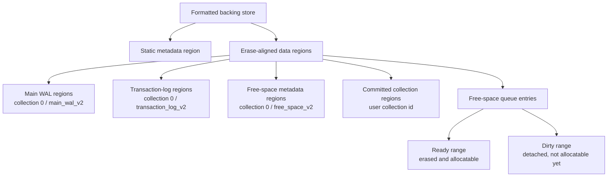
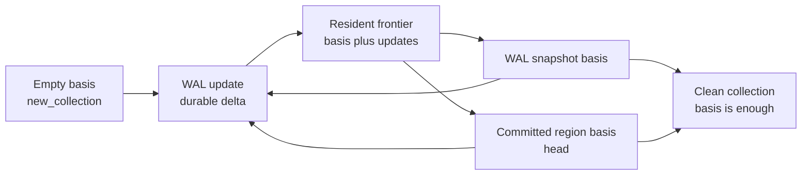
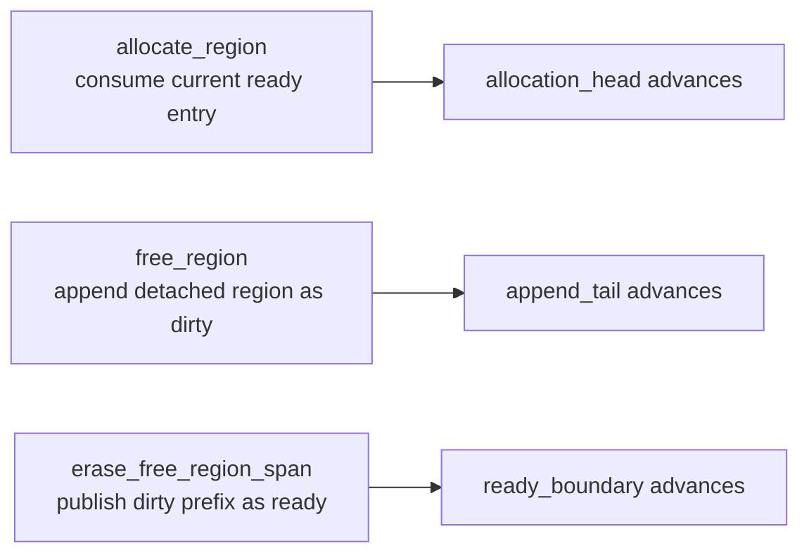
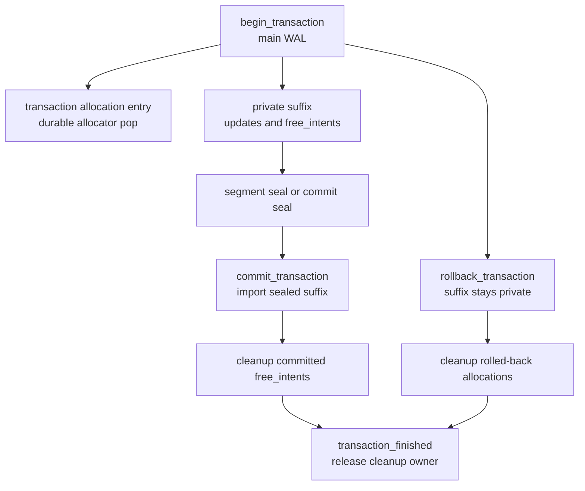
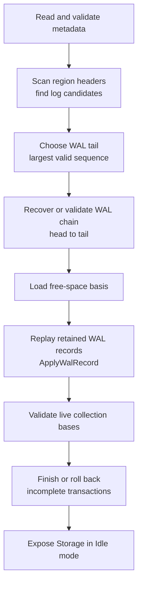

# Core Storage Concepts

This guide is a non-normative introduction to Borromean's low-level
storage model. It is meant to give spec readers a working mental model
before they read the detailed ring specification, disk layouts, or
transaction recovery model. If this guide and a numbered requirement ever
disagree, the requirement is the source of truth.

Borromean is a bounded-memory, log-structured storage layer for flash-like
media. It divides the backing store into erase-aligned regions, records
durable state changes in write-ahead logs, and reconstructs runtime state
by replaying retained durable facts after reset. Collections such as the
map sit above this layer and define their own payload formats, but the
storage core owns ordering, allocation, reclaim, transactions, and
startup recovery.

The detailed rules live in the ring spec starting at
[spec/ring/00-introduction.md](../spec/ring/00-introduction.md). The
transaction/free-region safety argument is also modeled in
[models/transaction_free_recovery.qnt](../models/transaction_free_recovery.qnt).

## The Moving Parts

The storage core has a small set of concepts that repeat everywhere:

- **Regions** are the fixed-size erase and allocation unit. They are never
  partially allocated.
- **The main WAL** is the single replay order for collection, allocator,
  WAL-chain, reclaim, and transaction-control decisions.
- **Collections** are log-structured state machines. A collection has a
  durable basis plus optional newer WAL updates loaded into an in-memory
  frontier.
- **The free-space collection** is the storage-private FIFO allocator. It is
  itself reconstructed from a durable basis plus later allocator records.
- **Transaction logs** hold private transaction work until a main-WAL commit
  imports it.
- **Startup replay** scans durable media and rebuilds the same runtime state
  that foreground operations had reached before reset.



A physical data region changes role only through durable ordering. For
example, a committed collection region does not become free just because a
newer collection head exists. It first has to become detached from live
reachability, then appear in the free-space collection as dirty, then be
erased and published as ready.

## Regions And Ownership

The storage metadata region describes immutable geometry: region size,
region count, storage version, WAL encoding parameters, and reserve
settings. All other persistent storage lives in data regions.

A data region is live while replay might still need it. Common live reasons
include:

- it is reachable from the main WAL chain or a transaction-log chain
- it is the committed basis for a user collection
- it is referenced by a collection-defined manifest or auxiliary structure
- it stores free-space metadata
- it is reserved by an unfinished storage-core operation or transaction
- it appears in the unconsumed free-space queue

That reachability rule is what prevents double allocation and leaks. Reclaim
is allowed only after the new durable state makes the old region unnecessary
for replay.

## Collections: Basis Plus Frontier

For a user collection, Borromean core does not interpret collection payload
bytes. The core tracks the durable state shape and leaves payload meaning to
the collection specification.

A live collection has one active durable basis:

- an empty basis from `new_collection`
- a WAL-resident `snapshot`
- a committed region `head`

Updates newer than that basis are appended to the WAL and loaded into a
bounded in-memory frontier. Reads merge the basis with the frontier using
collection-specific rules. For map-like collections, the frontier wins over
older committed state.



The clean/dirty distinction is about whether the retained durable basis is
enough to load the collection. Clean means the basis is sufficient. Dirty
means replay must apply retained post-basis updates and rebuild the frontier.
If the frontier would exceed the configured bounded capacity, the collection
flushes to a new committed basis or snapshots the current logical state.

Committed regions are immutable once live. A flush writes new region state
and then publishes it with a `head` record. The old basis becomes reclaimable
only after no live collection state references it.

## The WAL: Ordered Durable Facts

The main write-ahead log is the ordering spine of the system. Every
replay-visible decision is represented as a durable fact in the main WAL or
is imported into main-WAL order by a transaction commit record.

Normal foreground operation follows this pattern:

1. Validate the operation against current runtime state.
2. Write and sync the WAL record or committed region data needed for the
   operation.
3. After the durability boundary, apply the decoded record through the same
   state transition used by replay.

That shared transition boundary is the `ApplyWalRecord` concept from the
ring spec. It is important because foreground apply, startup replay, recovery
writes, and WAL-head reclaim must not drift into different interpretations of
the same durable bytes.

WAL regions form a chain. The **head** is the oldest retained WAL region
needed for replay. The **tail** is where new records append. When the tail
runs out of space, storage allocates a new private log region, writes a
`link`, initializes the new region, and then appends there. If reset happens
partway through rotation, startup recovery can finish the rotation from the
durable prefix.

WAL reclaim advances the head only after preserving every record or state
summary still needed to produce the same replay result. Reclaim may copy live
records, rewrite an empty basis as a retained snapshot, preserve free-space
state, commit a new WAL head, and then free the old head region through the
ordinary cleanup path.

## The Free-Space Queue

Free space is not stored as links inside free regions. It is a storage-private
collection under `collection_id = 0` and `collection_type = free_space_v2`.
Replay reconstructs its basis and then applies later allocator records.

The free-space queue is FIFO for wear leveling. Three cursors split it:

```text
[ consumed ) [ ready and erased ) [ dirty and not ready ) [ unused storage in queue buffer )
0            allocation_head      ready_boundary          append_tail
```

The invariant is:

```text
allocation_head <= ready_boundary <= append_tail
```

The ranges mean:

- entries before `allocation_head` have already been consumed
- entries from `allocation_head` to `ready_boundary` are ready regions and
  may be allocated immediately
- entries from `ready_boundary` to `append_tail` are dirty regions that have
  been detached but are not allocatable yet



Allocator WAL commands are self-checking cursor transitions. An allocation
names both the region expected at the current ready head and the next
`allocation_head` position. A free names the next `append_tail` position. An
erase publish names the count erased and the resulting `ready_boundary`.
Replay rejects records whose region or cursor does not match the current
recovered free-space state.

Freeing and erasing are intentionally separate. A freed region enters the
dirty range first. Only after erase maintenance physically erases it and
publishes `erase_free_region_span` can allocation consume it again.

## Transactions And Cleanup

Transactions let multi-step collection changes become visible atomically
while preserving allocator recovery. They are needed when a collection writes
new regions and frees old ones, or when rollback must return transaction-owned
allocations without publishing private collection state.

The key split is between allocation recovery and collection visibility:

- Durable transaction allocation entries advance allocator recovery as soon
  as they are written.
- Allocated data regions remain transaction-owned and are not collection-live
  before commit.
- Transaction-private collection updates and `free_intent` entries live in a
  transaction-log suffix.
- A main-WAL `commit_transaction` imports sealed private suffix bytes at one
  replay position.
- A main-WAL `rollback_transaction` keeps the suffix non-visible and starts
  cleanup for transaction-owned data allocations.



Commit makes the new collection state visible, publishes transaction-owned
data allocations as collection-owned, and detaches committed free intents
from collection live state. Cleanup then appends one `free_region` record for
each detached region.

Rollback discards private collection state. Any data regions allocated by the
transaction are never made collection-live, and cleanup returns them to the
dirty free-space range.

Cleanup is serialized by a main-WAL cleanup owner. While a transaction owns
cleanup, other main-WAL actions that could affect free-space append order must
wait, and erase maintenance must not advance `ready_boundary` over the cleanup
suffix. This gives recovery an ordered slot for each cleanup free:
`cleanup_start_tail + cleanup_index`. If reset happens during cleanup, startup
can check the expected slot, continue if it is already present, append it if
missing, or report corruption if a different region appears there.

## Startup Replay

Borromean has no special clean-shutdown state. Opening a store is always a
recovery pass from durable media.



Startup reconstructs:

- WAL head, tail, and append position
- free-space queue entries and cursors
- collection basis and retained post-basis updates
- transaction-log cursors and transaction recovery descriptors
- storage-core private allocation reservations
- collection frontiers that must be resident after replay

Torn or corrupt WAL tail spans are handled by scan rules. Later valid tail
records after a torn span require a `wal_recovery` boundary record. Incomplete
WAL rotation and transaction cleanup are recovered by writing only the missing
durable edges needed to reach another replayable prefix.

## Core Invariants

These are the practical invariants to keep in mind when reading or changing
the storage core:

- Every physical region is either live, unconsumed free space, or retained by
  unfinished recovery state. It must not disappear from all three.
- No physical region can be both collection-live and in the unconsumed
  free-space range.
- Replay-visible runtime state advances only after the corresponding durable
  WAL fact, transaction-log allocation entry, or committed head is synced.
- Foreground apply, startup replay, recovery, and WAL reclaim use the same
  WAL record semantics.
- User collections are log-structured. Live committed collection regions are
  not rewritten in place.
- A transaction allocation is recoverable before commit, but a data allocation
  is not collection-live until commit imports the transaction range.
- A committed `free_intent` is detached from collection live state before its
  cleanup `free_region` is appended.
- Cleanup frees are ordered, serialized, appended as dirty, and made
  allocatable only by later erase publication.
- WAL reclaim must preserve the same replay result for collections,
  free-space cursors, WAL-chain reachability, transaction recovery state, and
  storage-core allocation reservations.
- The ready-region reserve must leave enough space for WAL rotation, reclaim
  bookkeeping, and crash recovery to make forward progress.

## Where To Read Next

- [Ring introduction](../spec/ring/00-introduction.md) defines the glossary and
  chapter map.
- [Theory of operation](../spec/ring/01-theory.md) explains the design
  constraints and core requirements.
- [Storage state machines](../spec/ring/02-state-machines.md) defines the
  runtime states, active modes, and `ApplyWalRecord` table.
- [WAL records](../spec/ring/04-wal-records.md) defines physical and logical
  WAL record formats.
- [Startup and replay](../spec/ring/06-startup-replay.md) defines open-time
  recovery.
- [Reclaim and freeing](../spec/ring/07-reclaim.md) defines WAL reclaim,
  free-region cleanup, and transaction cleanup recovery.
- [Transaction free recovery model](../models/transaction_free_recovery.qnt)
  models the transaction allocation and cleanup invariants.
