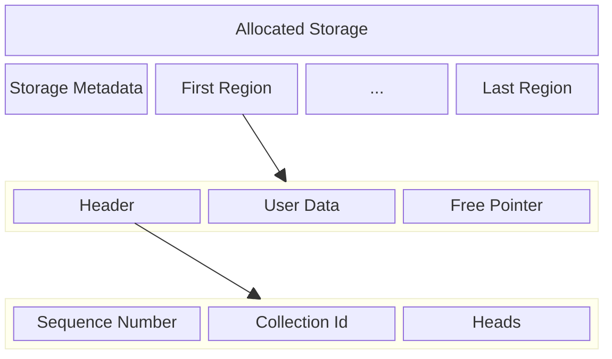

## Motivation

When using the built in flash storage on small microcontrollers some
sort of database or file system is needed. This both allows the
management of multiple objects in flash but also preforms ware
leveling on the flash to increase longevity of the storage.

Some RTOSes include a file systems, and there embedded databases such
as [ekv](https://github.com/embassy-rs/ekv),
[tickv](https://github.com/tock/tock/tree/master/libraries/tickv), and
[sequential-storage](https://github.com/tweedegolf/sequential-storage),
but none of these options fit the needs of
[finder](https://github.com/moore/finder).

For finder we need to support many different instances of many types
of collections: maps, queues, set, logs, etc. For each of these types
we require efficient query, allocation and truncations.

If we used an RTOS this might be achievable using a file system but in
finder we plan on using embassy/bare metal approach without this option.

## Overview

To solve these challenges borromean works by dividing the flash up
into equal size regions. Each collection is implemented as a append
only data structure where new writes are added to the head region and
data can only be freed by truncating the tail. For each collection
stored in the borromean database there is a current head region, and a
collection id which is tracked by the storage system. The use of the
data in each region is left to the implantation of the specific
collection type.

The storage system also keeps a free list of regions that are
available to satisfy new allocations. This list is a FIFO (First In
First Out) list which provides for ware leveling.

### Storage Structure

The storage on disk starts with a static storage meta region that
describes the version and other configuration parameters of the
storage that can not be changed after initialization.

The rest of the database is made of of regions. Each region has a
header, user data, and a free pointer. The header describes the region
as well as contains pointers to the free list and heads of other
collections. The free pointer us used to store the location of the
next free region in each region that has been freed.



### Challenges

The core design constraint is that we can not have any stable
locations that get repeatedly rewritten or those regions of the flash
will fail before the rest of the device. This leads to two main
conclusions:

 1. We should alway attempt to free the oldest regions first.
 2. All data structures should be log structured/append only.

Freeing the oldest first will have to be preformed on a per collection
basis as each collection is responsible for it's own data and is
opaque to borromean.

The requirement that data structures be append only implicates not
just the implementation of collection types but also the management
of:

 1. The current heads of each collection instance.
 2. The tracking of free regions.
 3. The tracking of the root of the database.

Each of these are solved by tracking this information in the head of
thne most reasently written region. Each time the data base is opend
all regions must be scanned to find the newest headder. The age of
thhe header is tracked in a monotonic 64 bit counter which can not
overflow.
 
## Storage Metadata

```alloy
one sig StorageMetadata {
	storage_version: int,
	region_size: int,
	region_count: int,
}
```

The `StorageMetadata` struct describes the version of the storage as
well as the size of each region in bytes and the number of regions in
the database.

## Region

The core type of the database is the `Region`. The available storage space
is divided up into equal size regions that are ease block aligned.

```alloy
sig Region {
	header: one Header,
	// ...User data...
	free_pointer: lone FreePointer,
}

fact {
	all r: Region | {
		r.header.free_list_head != r
		r.header.free_list_tail != r
		one h: Head | {
	 		h in r.header.heads
			h.collection_id = r.header.collection_id
			h.region = r
		}
	}

	// A header belongs on a single
	// region.
	all r1, r2: Region, h1, h2: Header | {
		r1 != r2
		r1.header = h1
		r2.header = h2
		h1 = h2
	} implies r1 = r2

}
```

Each `region` has a `header` that both describes the contents of the
region as well lists the current head of each collection. Every region leaves he last page empty to leave space for the free pointer.

## Free Pointer

<!-- could | use the freepointer combinded as a doubbly linked
skiplist to mak finding the curent head fast?  -->

```rust
struct FreePointer {
   header_hash: [u8; 32]
   next_tail: u32,
}
```

```alloy
sig FreePointer {
    header_hash: lone headder,
    next_tail: lone Region,
}
```

The `next_tail` points to the region  added to the free list after this one. It is therefor written not when the region containing the free pointer is written but when the next region is freed.


## Header

```rust
struct Header {
   sequance: u64,
   collection_id: u64,
   collection_type: CollectionType,
   free_list_head: u64,
   free_list_tail: u64,
   heads: Vec<u64>,
}
```

The `Header` is the first data in the region.

The `sequance` filed is a monotonic sequance that is used to fine the
newest header when the database is opned.

The `colliction_id` defines which collection this region belongs to,
and the `collection_type` the type of the collection.

The `free_list_head` and `free_list_tail` point to the first and last
entry of the free list.

The `heads` vec contains a pointer to the crrent head of each collection.

```alloy
sig Header {
	sequence: one Sequence,
	collection_id: one Collection,
	collection_type: one CollectionType,
	heads: some Head,
	free_list_head: lone Region,
	free_list_tail: lone Region,
}

fact region_rules {
	// All header belong to a single
	// region
	all s1, s2: Sequence, h1, h2: Header | {
		h1 = h2
		h1.sequence = s1
		h2.sequence = s2
	} implies s1 = s2

	// All headers belong to a regin.
	all h: Header | one r: Region | r.header = h
}
```

## Oppperations

### Init

When the database is initilized the metadata is written. All but the
first region have a dummy headder written and there free pointers set
to build a list containing all but the first region. The first reagion
is initlized with a WAL collection type and a sequance of zero.


## Sequence

```alloy
sig Sequence {
	parent: lone Sequence,
}

fact sequence_rules {
	one s: Sequence | no s.parent
	all s: Sequence | s not in s.^parent
	all s1, s2: Sequence | s1 != s2 implies {
		s1 in s2.^parent || s2 in s1.^parent
	}

}
```

```alloy
sig Collection {}
```


```alloy
pred show_region {}

run show_region for 4 but exactly 4 Region
```
