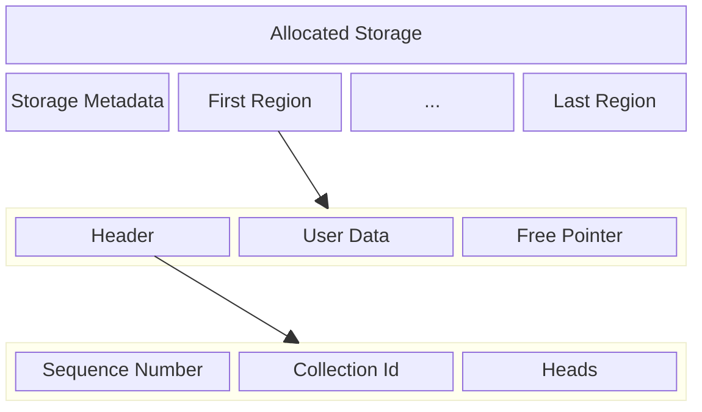

## Motivation

When using the built in flash storage on small microcontrollers some sort of database or file system is needed. This both allows the management of multiple objects in flash but also preforms ware leveling on the flash to increase longevity of the storage.

Some RTOSes include a file systems, and there embedded databases such as
[ekv](https://github.com/embassy-rs/ekv), [tickv](https://github.com/tock/tock/tree/master/libraries/tickv), and [sequential-storage](https://github.com/tweedegolf/sequential-storage), but none of these options fit the needs of [finder](https://github.com/moore/finder).

For finder we need to support many different instances of many types of collections: maps, queues, set, logs, etc. For each of these types we require efficient query, allocation and truncations.

If we used an RTOS this might be achievable using a file system but in
finder we plan on using embassy/bare metal approach without this option.

## Overview

To solve these challenges borromean works by dividing the flash up 
into equal size regions. Each collection is implemented as a append only data structure where new writes are added to the head region and data can only be freed by truncating the tail. For each collection stored in the borromean database there is a current head region, and a collection id which is tracked by the storage system. The use of the data in each region is left to the implantation of the specific collection type.

The storage system also keeps a free list of regions that are available to satisfy new allocations. This list is a FIFO (First In First Out) list which provides for ware leveling.

### Storage Structure

The storage on disk starts with a static storage meta region that describes the version and other configuration parameters of the storage that can not be changed after initialization.

The rest of the database is made of of regions. Each region has a header, user data, and a free pointer. The header describes the region as well as contains pointers to the free list and heads of other collections. The free pointer us used to store the location of the next free region in each region that has been freed.



### Challenges

The core design constraint is that we can not have any stable locations that get repeatedly rewritten or those regions of the flash will fail before the rest of the device. This leads to two main conclusions:

 1. We should alway attempt to free the oldest regions first.
 2. All data structures should be log structured/append only.

Freeing the oldest first will have to be preformed on a per collection basis as each collection is responsible for it's own data and is opaque to borromean.

The requirement that data structures be append only implicates not just the implementation of collection types but also the management of:

 1. The current heads of each collection instance.
 2. The tracking of free regions.
 3. The tracking of the root of the database.

========

The goal is to build a system that given a linear range of storage can store multiple collections of data with different types (list, map, log, etc) in a way were allocation are fast and writes are preformed with ware leveling so it can be used with flash backed storage.

This approach will divide the problem up in to two levels. The management of a set of regions, and the implementation collections types on top of the regions.

Free regions are maintained in a linked list, but because all allocation are for a fixed size region the head of the list can always satisfy an allocation request making allocation fast.

The meta data about the storage is stored in each region when it is allocated. This includes the head of the free list as well as the most recently allocated region for each collection. Along with this whole storage level information the each region stores the id and type of the data contained in it.

When the database is opened if the head is not known that all regions must be scanned looking in for the one with the larges sequence number.


The idea is that we divide up the available storage in to equal sized `Region`s each of which has a header which describes the over all state of storage when it was written and the type of data held in the `Region`. The last page of the `Region` hold a pointer to the next free `Region`. The next free pointer page in written when the following `Region` is freed so that when the current `Region` is reused that `Region` becomes the head.

The information in the head is the type of data stored in the region, the id for the data set stored in the region and a list of the head regions for each data set stored in the storage by id.

## Storage Metadata

```alloy
one sig StorageMetadata {
	storage_version: int,
	region_size: int,
	region_count: int,
}
```

The `StorageMetadata` struct describes the version of the storage as well as the size of each region in bytes and the number of regions in the database.

## Region

The core type of the ring is the `Region`. The available storage space is divided up into
equal size regions that are ease block aligned. 

```alloy
sig Region {
	header: one Header,
	// ...User data...
	free_pointer: lone FreePointer,
}

fact {
	all r: Region | {
		r.header.free_list_head != r
		r.header.free_list_tail != r
		one h: Head | {
	 		h in r.header.heads
			h.collection_id = r.header.collection_id
			h.region = r
		}
	}

	// A header belongs on a single
	// region.
	all r1, r2: Region, h1, h2: Header | {
		r1 != r2
		r1.header = h1
		r2.header = h2
		h1 = h2
	} implies r1 = r2

}
```

Each `region` has a `header` that both describes the contents of the region as well lists the current head of each collection.

## Free Pointer

```alloy
sig FreePointer {
	next_tail: lone Region,
}
```

The `next_tail` points to the region  added to the free list after this one. It is therefor written not when the region containing the free pointer is written but when the next region is freed.


## Header

```alloy
sig Header {
	sequence: one Sequence,
	collection_id: one Collection,
	heads: some Head,
	free_list_head: lone Region,
	free_list_tail: lone Region,
}

fact region_rules {
	// All header belong to a single
	// region
	all s1, s2: Sequence, h1, h2: Header | {
		h1 = h2
		h1.sequence = s1
		h2.sequence = s2
	} implies s1 = s2

	// All headers belong to a regin.
	all h: Header | one r: Region | r.header = h
}
```

## Sequence

```alloy
sig Sequence {
	parent: lone Sequence,
}

fact sequence_rules {
	one s: Sequence | no s.parent
	all s: Sequence | s not in s.^parent
	all s1, s2: Sequence | s1 != s2 implies {
		s1 in s2.^parent || s2 in s1.^parent
	}

}
```

```alloy
sig Collection {}
```

```alloy
sig Head {
	collection_id: one Collection,
	region: one Region,
}
```


```alloy
pred show_region {}

run show_region for 4 but exactly 4 Region
```
