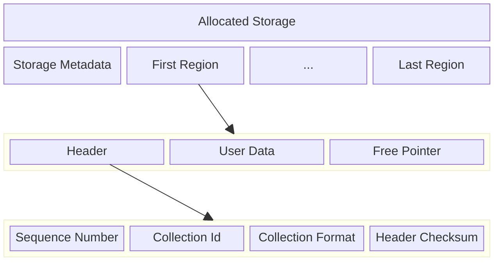

# Low Level Storage

## Motivation

When using built-in flash storage on small microcontrollers, some
kind of database or file system is needed. This allows management of
multiple objects in flash and enables wear leveling to increase
storage longevity.

Some RTOSes include file systems and there are embedded databases
such as [ekv](https://github.com/embassy-rs/ekv),
[tickv](https://github.com/tock/tock/tree/master/libraries/tickv), and
[sequential-storage](https://github.com/tweedegolf/sequential-storage),
but none of these options fit the needs of
[finder](https://github.com/moore/finder).

For finder we need to support many instances of many collection types:
maps, queues, sets, logs, etc. For each of these types we require
efficient queries, allocations, and truncation.

If we used an RTOS this might be achievable with a file system, but
finder is planned for an embassy/bare-metal approach without that
option.

## Overview

To solve these challenges, borromean divides flash into equal-size
regions. Each collection is implemented as an append-only data
structure where new writes are added to the head region and data can
only be freed by truncating the tail. For each collection, borromean
tracks a collection id and current head. 

Before being written to storage, updates to a collection are kept in
memory. To persist mutations before a full region flush or snap shot, each mutation is also
written to a global write-ahead log (WAL) shared by all collections.
Per-collection WAL entries contain a collection id and opaque bytes.

A collection head may refer either to
a committed region or to a WAL-resident snapshot. The data payload in
each region is defined by the collection type implementation.

A collection can be flushed either as a full region write or
as a partial state snapshot into the WAL. Allowing snapshots to the wall prevents many partially filled regions and low effective storage utilization becouse partial snapshots can be intermxed with other WAL entries and more easily collected when stale.

Furter snapshoting to a WAL allows bounded RAM usage with an unbounded number of collections. If an update
targets a collection that does not currently have a free in-memory
buffer, the system may evict the least-frequently-used buffered
collection by flushing its current state snapshot to the WAL and
marking that WAL snapshot as the collection's current head.

When a WAL region is filled, its last record points to the next WAL
region.

A WAL region can be reclaimed when the number of live records drops
below a configurable threshold. During reclaim, we write the current live state for
each affected uncommitted collection into a new WAL region by snapshoting the collection in it to the head wall region. If the collection's data is not in memory that implies that that it's current snapshot is in the WAL. If a current snapshot is in the region being collected it can directly be copied to a the tail of the WAL allong with updating the head pointer to the new location.

Once collection data is flushed from a WAL head being reclaimed, any current head records are moved to the WAL tail, a WAL head record is
written pointing to the new head, and the old wall head of the WAL is added to the free list.

Any reclaim that frees a region is a WAL-tracked transaction. Before
removing a region from live collection or WAL state, borromean writes
and syncs `reclaim_begin(region_id)`. After the region is no longer
live, it is appended to the free list. Reclaim completes only after
`reclaim_end(region_id)` is written and synced. Startup replay treats
any `reclaim_begin` without a matching `reclaim_end` as an incomplete,
idempotent reclaim operation that must either be completed or proven
unnecessary before open succeeds.

The storage system also keeps a free list of regions that are
available to satisfy new allocations. This list is FIFO (First In,
First Out), to support wear leveling. The durable free-list head
is tracked in WAL replay order so every durable region allocation
advances the free-list cursor exactly once. Any WAL command that
writes a newly allocated region must persist the post-allocation
free-list head in the same WAL record, otherwise that region write and
its allocation are not considered durable.

### Storage Structure

Storage starts with a static metadata region that describes the
version and configuration parameters that cannot change after
initialization.

The rest of the database is made up of regions. Each region has a
header, user data, and a free pointer. The header describes the
region's sequence number, collection id, collection format, and a
checksum over the header itself.

The sequence number is a monotonically increasing value assigned each
time a new region is written. This lets us scan regions and identify
the newest region for each collection. This is primarlly used to find the head tail of the WAL which is used to open the database.

The collection format defines how user data is encoded in the User Data section. Storing the format in each region allows format evolution over time.

The free pointer stores the location of the next free region for
regions that have been freed the reagion in question is in the free list. This page is written not when the region is freed but when the next region is freed. This is the mechinisem we use to make the free list a FIFO.


```mermaid
block-beta
 columns 4
 Storage["Allocated Storage"]:4
 Meta["Storage Metadata"]
 R1["First Region"]
 e1["..."]
 R2["Last Region"]
 space:4
 block:exp:4
  h1["Header"]
  d1["User Data"]
  a1["Free Pointer"]
 end
 space:4
 block:header:4
  s1["Sequence Number"]
  cid["Collection Id"]
  type["Collection Format"]
  check["Header Checksum"]
 end
 R1 --> exp
 h1 --> header
```

### Challenges

The core design constraint is that we cannot have any stable
locations that get repeatedly rewritten or those regions of the flash
will fail before the rest of the device. This leads to two main
conclusions:

 1. We should always attempt to free the oldest regions first.
 2. All data structures should be log structured/append only.

Freeing the oldest first must be performed on a per-collection basis,
as each collection is responsible for its own data and is
opaque to borromean at a high level.

The requirement that data structures be append only affects not
just the implementation of collection types but also the management
of:

 1. The current heads of each collection instance.
 2. The tracking of free regions.
 3. The tracking of the root of the database.

Each of these is solved by tracking this information in the WAL.
The WAL is collection 0. At startup we scan regions to find the WAL
region with the largest sequence number (the current WAL tail). The
start of each WAL region records the WAL head at the time that region
was created. We must also scan the tail region looking for any changes to the head due to collecting a head WAL region. Startup uses this metadata plus WAL replay to reconstruct
uncommitted state in memory and the current free-list head.

## WAL Record Types

All WAL records are append-only and ordered by physical write order
within the WAL region chain.

Each record includes:

1. `record_type`: one of `update`, `snapshot`, `head`, `link`,
`reclaim_begin`, `reclaim_end`
2. `collection_id`: required for `update`, `snapshot`, and `head`
3. `payload_len`: payload size in bytes
4. `payload`: opaque bytes defined by `record_type`
5. `free_list_head_after`: required for WAL records that consume a free
region by writing a newly allocated region (currently `head` and
`link`); omitted for `update` and `snapshot` because they append
inside the current WAL region and do not consume a free-list entry
6. `record_checksum`: checksum covering the full record

The record payloads are:

1. `update`
Collection-local mutation delta. Applied in WAL order during replay.

2. `snapshot`
Full logical state for one collection at a point in time. Supersedes
older `update` records for that collection that appear before the
snapshot.

3. `head`
Commits a collection to a new durable region head. Payload contains
the target `region_id`.
The record also stores `free_list_head_after`, the next free region
after allocating `region_id`.

4. `link`
Points from a full WAL region to the next WAL region. Payload contains
`next_region_id` and `expected_sequence` for the next WAL region
header.
The record also stores `free_list_head_after`, the next free region
after allocating `next_region_id`.

5. `reclaim_begin`
Marks the start of reclaim for `region_id`. The payload contains the
region being freed. This record does not itself make the region free;
it only makes the reclaim intent durable before any live references to
that region are removed.

6. `reclaim_end`
Marks successful completion of reclaim for `region_id`. The payload
contains the same `region_id` as the matching `reclaim_begin`.

Ordering and validity rules:

1. A valid `snapshot` record is itself a durable WAL-snapshot head for
that collection.
2. A `head(region)` record is the commit point for a region flush.
3. A `link` is only valid as the last complete record in a WAL region.
When traversed, its target must have a valid WAL header with sequence
equal to `expected_sequence`.
4. Any WAL record that writes a newly allocated region is invalid if
its
`free_list_head_after` is missing or corrupt.
5. Region-write durability is coupled to WAL durability: a region
write that consumes a free-list entry advances allocator state only if
the same WAL record's `free_list_head_after` is durable.
6. Replay stops at the first invalid checksum or torn record in the
tail region.
7. `reclaim_begin(region_id)` and `reclaim_end(region_id)` must appear
in WAL order and are matched by `region_id`.
8. `reclaim_end(region_id)` is only valid if preceded by a valid
`reclaim_begin(region_id)`.

Assumption for replay correctness:

1. A WAL region must be erased before reuse.
2. Replay's "stop at first invalid/torn record" rule depends on this
erase-before-reuse guarantee so stale bytes from prior use cannot be
misinterpreted as new valid records.

BUG: When consuming a free region we must erase the whole reagion includeing the next free pointer. This means if we crash after this erase we would leek the whole free list. To fix this we should add a start use free head command in to the WAL that records the free region being consumed as well as the new free list head. On start up if we find such a message in the WAL and no subsequent command using the consumend the free region we can store an in memory record of that regin being "ready to use" and use that record the next time a free region is needed.

## Collection Head State Machine

Each collection has exactly one logical current head after replay.

States:

1. `InMemoryDirty`
Latest state is in RAM; WAL has prior durable state.

2. `WALSnapshotHead`
Latest durable head points to a WAL `snapshot` record.

3. `RegionHead`
Latest durable head points to a committed collection region.

Transitions:

1. `InMemoryDirty -> WALSnapshotHead`
Write `snapshot`.
Durable after the `snapshot` record is durable.

2. `InMemoryDirty -> RegionHead`
Write collection region, then write `head(region, free_list_head_after)`.
Durable after the `head` record is durable.

3. `WALSnapshotHead -> InMemoryDirty`
Load snapshot into RAM and apply new updates.

4. `WALSnapshotHead -> RegionHead`
Materialize snapshot (plus any RAM updates) into a new region, then
write `head(region, free_list_head_after)`.

5. `RegionHead -> InMemoryDirty`
Load region into RAM and apply new updates.

BUG: We don't need to load completed regions in to memory. The format for the region should be able to interpret new updates in the in memory data as superseeding the data persisted in regions. Examples of such data strcuturs are logs or Log Strcutured Merge tables (LSM).

Invariants:

1. The active durable head for a collection is the last valid head
decision in replay order, where a head decision is either a
`snapshot` or `head(region)` record.
2. `snapshot` and `head(region)` records totally order durability
decisions per collection.
3. Any `update` or `snapshot` older than the active head basis for that
collection is reclaimable.

## Startup Replay Algorithm

Startup recovery reconstructs three things:

1. Durable collection heads
2. In-memory working state for collections with uncommitted updates
3. Durable free-list head

Algorithm:

1. Read `StorageMetadata` and validate static geometry (`region_size`,
`region_count`, and storage version support).
2. Scan all regions and collect candidate WAL regions
(`collection_id == 0`) with valid headers.
3. Select WAL tail as the WAL region with the largest valid sequence.
4. Read the WAL-head pointer stored at the start of that tail region.
5. Walk the WAL region chain from head to tail using `link` records.
If a `link` is missing/invalid before reaching the known tail, return
an error (corrupted WAL chain).
If the known tail contains a trailing `link` whose target header is
missing/corrupt or has the wrong sequence, treat this as an incomplete
rotation. Use the known tail as replay tail.
For incomplete rotation recovery, if the known tail ends with a durable
`link(next_region_id, expected_sequence, free_list_head_after)` and the target WAL header is
missing/corrupt/wrong sequence, finish initializing the target region:
erase target region if needed, write a valid WAL header with
`collection_id = 0` and `sequence = expected_sequence`, write WAL
region prologue metadata, and sync. If this recovery init fails,
startup fails with error. After successful recovery init, use the
target region as the active append tail.
6. Parse records in WAL order (region order, then offset order).
For the tail region, stop at first invalid checksum or torn record.
7. Maintain replay state:
per collection `last_head` and `pending_updates`, plus global
`last_free_list_head`, and ordered pending region reclaims.
8. On `update(collection_id)`:
append to `pending_updates` for that collection.
9. On `snapshot(collection_id)`:
set durable `last_head` to this snapshot and clear older pending
updates for that collection at WAL positions up to and including this
snapshot.
10. On `head(collection_id, region_id, free_list_head_after)`:
set durable `last_head` to that region and clear WAL updates/snapshots
older than this head decision.
set durable `last_free_list_head` to `free_list_head_after`.
11. On `link(next_region_id, expected_sequence, free_list_head_after)`:
set durable `last_free_list_head` to `free_list_head_after`.
12. On `reclaim_begin(region_id)`:
append `region_id` to pending reclaims unless a later matching
`reclaim_end` removes it.
13. On `reclaim_end(region_id)`:
mark the matching pending reclaim as finished.
14. For any WAL record format extension that writes a newly allocated
region:
validate and apply its `free_list_head_after` exactly once in replay
order.
15. After replay, for each collection:
if `last_head` is `region`, load region state; if `last_head` is
`wal_snapshot`, load snapshot state; then apply remaining
`pending_updates` in WAL order to build in-memory working state.
16. Initialize allocator state from `last_free_list_head`.
17. For each pending reclaim in WAL order:
if the target region is still reachable from any live collection head
or the WAL chain, leave it allocated because the reclaim did not reach
the detach point durably.
If the target region is unreachable from live state and not yet in the
free-list chain, complete the free-list append using the Region
Reclaim procedure.
If the target region is already reachable from the free-list chain,
finish the reclaim transaction by appending `reclaim_end(region_id)`.


## no_std Tracker Types (Rust)

The replay and allocator terms above map to the following explicit
`no_std` tracker state. These structs are runtime state, not on-disk
layout.

```rust
#![no_std]

use heapless::Vec;

// BUG: we should update these to tuple structs
// so they are unique types.
pub type RegionId = u32; // BUG: this should be region index.
pub type CollectionId = u64; // BUG: should this be a u16 counter or a u64 nonce?
pub type WalSequence = u64;
pub type WalOffset = u32;

#[derive(Clone, Copy, Debug, PartialEq, Eq)]
pub struct WalPosition {
  pub sequence: WalSequence, //BUG: this should be RegionId
  pub offset: WalOffset,
}

#[derive(Clone, Copy, Debug, PartialEq, Eq)]
pub enum DurableHead {
  Region { region_id: RegionId },
  WalSnapshot { wal_pos: WalPosition },
}

#[derive(Clone, Copy, Debug, PartialEq, Eq)]
pub struct CollectionReplayState {
  pub collection_id: CollectionId,
  pub last_head: DurableHead,
  pub basis: WalPosition, // BUG: what is this?
}

#[derive(Clone, Copy, Debug, PartialEq, Eq)]
pub struct PendingUpdateRef {
  pub collection_id: CollectionId,
  pub wal_pos: WalPosition,
}

#[derive(Clone, Copy, Debug, PartialEq, Eq)]
pub struct FreeListTracker {
  // Durable allocator cursor reconstructed from replay decisions.
  pub last_free_list_head: Option<RegionId>,
  // Runtime-only convenience for append-on-free operations.
  pub free_list_tail: Option<RegionId>,
}

pub struct ReplayTracker<
  const MAX_COLLECTIONS: usize,
  const MAX_PENDING_UPDATES: usize,
> {
  pub free_list: FreeListTracker,
  pub collections: Vec<CollectionReplayState, MAX_COLLECTIONS>,
  pub pending_updates: Vec<PendingUpdateRef, MAX_PENDING_UPDATES>,
}
```

`heapless` dependency form:

```toml
[dependencies]
heapless = { version = "0.8", default-features = false }
```

Field mapping to this spec:

1. `CollectionReplayState.last_head` maps to replay `last_head`.
2. `CollectionReplayState.basis` is `B(c) = P(H(c))`.
3. `FreeListTracker.last_free_list_head` maps to replay
`last_free_list_head`.
4. `FreeListTracker.free_list_tail` is runtime state needed to link
`t_prev.next_tail = r` during reclaim.

## WAL Reclaim Eligibility

Reclaim operates on WAL regions but correctness is defined per record.
A record is reclaimable only when replay no longer needs it to rebuild
the same `last_head`, `pending_updates`, and `last_free_list_head`
state.

Per-collection cutoff:

1. Let `H(c)` be the last durable head decision for collection `c`
(`snapshot` or `head(region)`).
2. Let `P(H(c))` be the WAL position of `H(c)`.
3. `B(c) = P(H(c))` is the collection's durable basis position.

Per-record liveness rules:

1. `head(region)` record:
live only if it is `H(c)` for collection `c`; older `head(region)`
records are reclaimable.
2. `snapshot` record:
live only if it is `H(c)` for collection `c`;
otherwise reclaimable.
3. `update` record for collection `c`:
live only if its WAL position is greater than `B(c)`; updates at or
before `B(c)` are reclaimable.
4. `link` record:
live only while required to maintain a valid WAL chain from current
WAL head to current WAL tail.
5. `free_list_head_after` decision carried by `head` or `link`:
live only if it is the last valid free-list-head decision in replay
order; older free-list-head decisions are reclaimable once superseded.

WAL-region reclaim preconditions:

1. The candidate region is the head of the WAL.
2. For every live record in the candidate, an equivalent live state is
already represented durably outside the candidate (typically by newer
`snapshot`, or by `head(region)` plus newer updates).
3. After planned metadata updates, startup replay can still walk a
valid WAL chain from head to tail.

WAL-region reclaim postconditions:

1. No collection's `H(c)`, `B(c)`, or live post-basis updates depend on
bytes in the reclaimed region.
2. The recovered free-list head matches pre-reclaim allocator state.
3. WAL chain integrity remains valid (no broken `link` path).
4. The reclaimed region is erased before reuse.
5. If reclaim allocates any replacement WAL regions, replay-visible
records for those allocations carry `free_list_head_after` so replay
reconstructs the same allocator position.

Safety invariant:

1. Reclaim must not change replay result: the recovered `last_head` and
`pending_updates` for every collection, and the recovered
`last_free_list_head`, after reclaim must match the pre-reclaim
logical state.

Example timeline (`collection_id = 7`):

1. WAL appends `update(u1)`, `update(u2)`.
2. WAL appends `snapshot(s1)`.
`u1` and `u2` are now reclaimable.
3. WAL appends `update(u3)`.
`u3` is live because it is after basis `B(7) = pos(s1)`.
4. Collection flushes to region `r44`, then WAL appends
`head(region, r44, free_list_head_after=f9)`.
Now `s1` and `u3` are reclaimable because
`head(region, r44, free_list_head_after=f9)` becomes
the new basis.

## Durability and Crash Semantics

Durability boundary:

1. A write is durable only after both:
the bytes are written, and a sync/flush that covers those bytes
completes.
2. Write ordering without sync ordering is not sufficient for
durability guarantees.
3. Replay must treat partially written records as torn and ignore
them using checksum validation and tail truncation rules.

Notation:

1. `W(x)`: write bytes for `x`.
2. `S(x)`: sync/flush that guarantees durability for `x`.

Required write and sync ordering:

1. `update` durability:
`W(update_record) -> S(update_record) -> acknowledge update durable`.
2. `snapshot` head transition:
`W(snapshot) -> S(snapshot)`.
3. `region` head transition:
`W(region header+data) -> S(region) -> W(head(region, ref=region_id, free_list_head_after)) -> S(head)`.
4. WAL rotation:
`W(link(next_region_id, expected_sequence, free_list_head_after)) -> S(link) -> W(new_wal_region_init(sequence=expected_sequence)) -> S(new_wal_region_init)`.
5. Reclaim:
`W(reclaim_begin(region_id)) -> S(reclaim_begin) -> W(replacement_live_state_and_new_links) -> S(replacement_state) -> append old region to free list (write+sync) -> W(reclaim_end(region_id)) -> S(reclaim_end)`.

General region-write allocation rule:

1. For any WAL command that writes a newly allocated region, durability
of both the region write and the allocator advance requires durability
of the same record's `free_list_head_after`; otherwise replay must
treat allocator state as not advanced.

Crash-cut outcomes:

1. Crash before `S(snapshot)`:
snapshot may be missing/torn and is ignored.
2. Crash after `S(snapshot)`:
snapshot transition is durable and acts as the collection WAL head.
3. Crash before `S(region)`:
new region is not considered durable.
4. Crash after `S(region)` but before `S(head(region))`:
region exists but is not committed as collection head, and its
`free_list_head_after` is not yet durable.
5. Crash after `S(head(region))`:
region head transition and `free_list_head_after` are durable.
6. Crash after `W(link)` but before `S(link)`:
link may be torn/missing and old tail remains active.
7. Crash after `S(link)` but before `S(new_wal_region_init)`:
startup validates the link target sequence/header; if target is
missing/corrupt/wrong sequence, rotation is incomplete and startup
finishes initialization using `expected_sequence`.
8. Crash during tail-record write:
replay stops at first invalid/torn tail record; earlier complete
records remain valid.
9. Crash after `S(reclaim_begin)` but before the region is detached
from all live state:
startup sees an incomplete reclaim, but the region is still live and
must not be freed.
10. Crash after the region is detached from live state but before
`S(reclaim_end)`:
startup sees an incomplete reclaim and must complete the free-list
append idempotently if the region is not already free.

## Storage Metadata

```alloy
one sig StorageMetadata {
  storage_version: Int,
  region_size: Int,
  region_count: Int,
}
```

The `StorageMetadata` struct describes the version of the storage as
well as the size of each region in bytes and the number of regions in
the database.

## Header

```rust
struct Header {
  sequence: u64,
  collection_id: u64,
  collection_type: CollectionType,
  header_checksum: [u8; 32],
}
```

The `Header` is the first data in the region.

The `sequence` field is a monotonic value that is used to find the
newest header when the database is opened.

The `collection_id` defines which collection this region belongs to,
and the `collection_type` the type of the collection.

The `header_checksum` validates header integrity.

## Operations

### Init

When the database is initialized the metadata is written. All but the
first region have a dummy header written and their free pointers set
to build a list containing all but the first region. The first region
is initialized with a WAL collection type and a sequence of zero.

### Format Storage (On-Disk Initialization)

Formatting creates a valid empty store that can be opened by normal
startup replay without special recovery paths.

Preconditions:

1. Backing storage is writable and erasable at region granularity.
2. `region_count >= 1`.
3. Region `0` is reserved as the initial WAL region.

Procedure:

1. Erase metadata area and all data regions.
2. Write `StorageMetadata` (`storage_version`, `region_size`,
`region_count`) and sync metadata.
3. Initialize region `0` as WAL:
write valid `Header` with `collection_id = 0` and `sequence = 0`,
write WAL-region prologue with WAL head pointing to region `0`, then
sync region `0`.
4. For each region `r` in `[1, region_count - 1]`:
write a valid free-region header, write `r.free_pointer.next_tail`
to the next region id (`r + 1`) or `none` for the last region, and
sync `r`.
5. Formatting is complete only after metadata and all initialized
regions are durable.

Postconditions:

1. WAL head and WAL tail are both region `0`.
2. No user collection durable heads exist.
3. Free list contains every non-WAL region in ascending region-id
order.
4. If `region_count = 1`, the free list is empty.

### First Open After Fresh Format

Opening a freshly formatted store uses the same startup replay
algorithm as any other open.

Expected replay outcome on first open:

1. Region scan finds WAL tail at region `0` (`sequence = 0`).
2. WAL chain walk yields a single-region chain (`head = tail = 0`).
3. No `update`, `snapshot`, `head`, or `link` records are replayed.
4. Replay therefore yields:
`last_head = none` for all user collections,
`pending_updates = empty`,
and no replay-driven `last_free_list_head` decision.

Initial in-memory tracker bootstrap (`ReplayTracker`) on this path:

1. `free_list.last_free_list_head = Some(1)` when `region_count > 1`,
otherwise `None`.
2. `free_list.free_list_tail = Some(region_count - 1)` when
`region_count > 1`, otherwise `None`.
3. `collections = empty`.
4. `pending_updates = empty`.

This bootstrap is only for the no-record fresh-format case. Once WAL
records exist, allocator and collection-head state must come from
normal replay decisions.

### Region Reclaim

Region reclaim appends a newly freed region to the tail of the free
list. If the free list was non-empty, reclaim must update the previous
tail region's `next_tail` pointer so the chain now ends at the newly
reclaimed region. Because reclaim removes a region from live metadata
before making it reachable from the free-list chain, it is always
modeled as a WAL-tracked transaction.

Normative append semantics:

1. Let `t_prev` be the value of `free_list_tail` before reclaim starts.
2. If `t_prev != none`, reclaim must durably write
`t_prev.free_pointer.next_tail = r` when freeing region `r`.
3. If `t_prev = none`, reclaim must not write any predecessor link and
must set `free_list_head = r` and `free_list_tail = r`.
4. Reclaim is not complete until the predecessor-link write (when
required) is durable; otherwise `r` is not yet a durable member of the
free list.

Preconditions:

1. `reclaim_begin(r)` is durable in the WAL before any live metadata is
updated to stop referencing `r`.
2. After the detach step, the reclaimed region `r` is no longer
reachable from any live collection head or live WAL state.
3. `r` is not already reachable from the free-list chain, unless this
procedure is being re-entered during crash recovery.
4. If a current free-list tail exists, call it `t_prev`.

Procedure:

1. Ensure `reclaim_begin(r)` is durable. On the initial reclaim
attempt this means append and sync `reclaim_begin(r)`. On recovery
re-entry the existing durable record satisfies this step.
2. Durably perform any collection-head or WAL-head updates needed so
that `r` has no remaining live references.
3. If recovery finds that `r` is already reachable from the free-list
chain, skip to step 10.
4. Erase region `r` before reuse.
5. Initialize `r.free_pointer.next_tail = none`.
6. Sync `r` so its free-pointer state is durable before linking it.
7. If `t_prev` exists, write `t_prev.free_pointer.next_tail = r`.
This is the operation that links the previous free tail to the new
tail.
8. If `t_prev` exists, sync `t_prev` after writing `next_tail`.
9. If `t_prev` exists, update in-memory `free_list_tail = r`.
If no tail existed before step 7, set both in-memory
`free_list_head = r` and `free_list_tail = r`.
10. If recovery found `r` already reachable from the free-list chain,
update in-memory free-list state so it reflects `r` as the current
tail when needed.
11. Append and sync `reclaim_end(r)`.

Postconditions:

1. The free-list chain remains acyclic and FIFO-ordered.
2. Exactly one new region (`r`) is appended to the tail.
3. If a prior tail existed, its `next_tail` pointer now references
`r`.
4. `r.free_pointer.next_tail = none` after reclaim.
5. If a prior tail existed, replay of free pointers follows
`... -> t_prev -> r -> none`.
6. If a prior tail existed, the only new durable predecessor link for
`r` is `t_prev.next_tail = r`, where `t_prev` is the free-list tail
from before reclaim.
7. Replay either finds a matching `reclaim_end(r)` or can safely
re-enter the procedure and derive the same result without duplicating
`r` in the free-list chain.

Crash-safety ordering requirement:

1. `reclaim_begin(r)` must be durable before any live metadata stops
referencing `r`.
2. `r` must be erased/initialized and synced before any durable write
that makes it reachable from `t_prev.next_tail`.
3. If `t_prev` exists, the `t_prev.next_tail = r` write must be synced before
`reclaim_end(r)` is acknowledged.
4. The reclaim procedure must be idempotent across crashes between any
two steps above.
