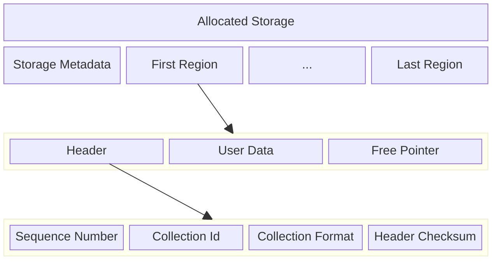
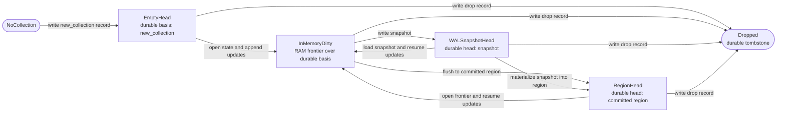
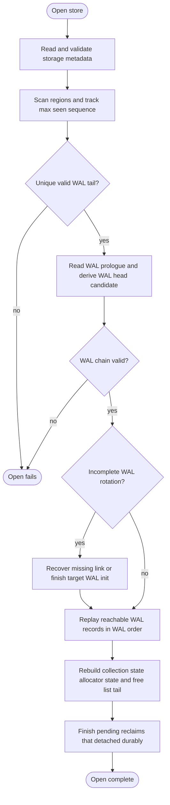
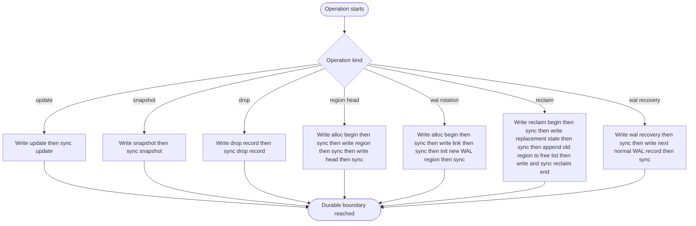
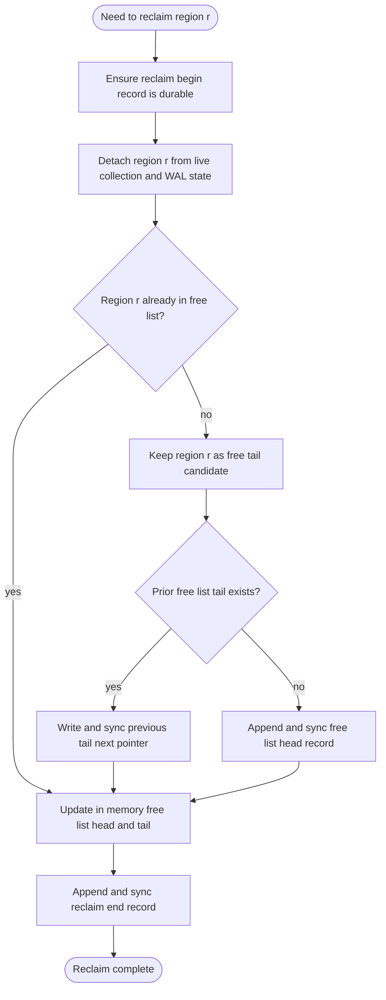

# Low Level Storage

## Motivation

When using built-in flash storage on small microcontrollers, some
kind of database or file system is needed. This allows management of
multiple objects in flash and enables wear leveling to increase
storage longevity.

Some RTOSes include file systems and there are embedded databases
such as [ekv](https://github.com/embassy-rs/ekv),
[tickv](https://github.com/tock/tock/tree/master/libraries/tickv), and
[sequential-storage](https://github.com/tweedegolf/sequential-storage),
but none of these options fit the needs of
[finder](https://github.com/moore/finder).

For finder we need to support many instances of many collection types:
maps, queues, sets, logs, etc. For each of these types we require
efficient queries, allocations, and truncation.

If we used an RTOS this might be achievable with a file system, but
finder is planned for an embassy/bare-metal approach without that
option.

## Requirements Format

This specification keeps normative requirements adjacent to the text
that motivates them. Each normative requirement starts with a stable
identifier such as `RING-WAL-ENC-001` and uses explicit normative
language such as `MUST`, `MUST NOT`, `SHOULD`, or `MAY`.

These identifiers are intended to be the primary Duvet traceability
targets. The surrounding narrative is informative unless it also
includes a requirement identifier.

## Overview

To solve these challenges, borromean divides flash into equal-size
regions. Region starts and sizes must be aligned to the backing
flash's erase-block size so every region can be erased independently.
Each collection is implemented as an append-only data
structure where new writes are added to the head region and data can
only be freed by truncating the tail. For each collection, borromean
tracks a collection id and current head.

Before being written to storage, updates to a collection are kept in
memory. To persist mutations before a full region flush or snapshot,
each mutation is also written to a global write-ahead log (WAL)
shared by all collections.
Per-collection WAL entries contain a stable collection id and bytes
whose meaning is defined by the corresponding collection-specific
specification; those bytes are opaque to borromean core. Collection ids
are opaque 64-bit nonces that are assigned when
a collection is created by `new_collection(collection_id,
collection_type)`. Collection
id `0` is reserved for the WAL; all user collection ids are nonzero
and are not recycled. Borromean core also reserves
`collection_type = wal` for `collection_id = 0`; user collections must
not use that collection type.

A collection may be removed durably by appending
`drop_collection(collection_id)` to the WAL. Once that record is
durable, the collection is no longer live, no later WAL record for
that collection id is valid, and its older durable bytes may be
reclaimed once they are no longer physically reachable from live
storage state.

A collection head may refer either to
a committed region or to a WAL-resident snapshot. The data payload in
each region is defined by the corresponding collection specification.
For user collections, append-time validity requires a successful
`new_collection(collection_id, collection_type)` before any later
record for that collection may be appended. WAL reclaim may later
remove that `new_collection` record once a newer durable basis for the
collection survives elsewhere in the WAL or in committed regions.
Replay therefore distinguishes historical validity from retained
basis: after reclaim, the earliest retained basis record for a user
collection may be `snapshot`, `head`, or `drop_collection` even though
`new_collection` was required historically.

Borromean tracks the current collection type for each live collection
in WAL replay state. Any durable record that carries
`collection_type` (`new_collection`, `snapshot`, or `head`) is
authoritative for that collection. For a user collection, the earliest
retained type-bearing record seen during replay establishes the
replay-tracked `collection_type`, and that type does not change for
the lifetime of the live collection. Every later valid type-bearing
record for that collection must carry the same `collection_type`. A
drop-only retained tombstone does not by itself re-establish a live
`collection_type`; it only reserves the dropped `collection_id`.

A collection can be flushed either as a full region write or
as a partial state snapshot into the WAL. A WAL snapshot is a durable
staging point: when that collection is mutated again, the snapshot is
loaded into RAM, later mutations are still appended to the WAL as
`update` records, and the in-memory state is allowed to accumulate
enough change to eventually justify writing a full region. Allowing
snapshots to the WAL prevents many partially filled regions and low
effective storage utilization because partial snapshots can be
intermixed with other WAL entries and more easily collected when
stale.

Further snapshotting to the WAL allows bounded RAM usage with an
unbounded number of collections. However, each collection's mutable
in-memory update frontier is bounded. If applying another update would
overflow that frontier, the implementation flushes the current logical
frontier into a newly allocated collection region, commits that region
as the new durable head, clears the in-memory frontier, and continues
accepting later updates into RAM over the new region head. Collections
therefore remain log-structured: a flush creates a new immutable
append-only region segment, analogous to an LSM SSTable, instead of
rewriting an existing live region in place.

In a completed WAL rotation, the last record of the old WAL tail is
`link(next_region_index, expected_sequence)`, which points to the next
WAL region. A crash may leave an incomplete rotation whose durable
tail ends earlier; startup recovery finishes that rotation before
resuming normal appends.

A WAL region can be reclaimed when the number of live records drops
below a configurable threshold. During reclaim, we write the current
live state for each affected uncommitted collection into a new WAL
region by snapshotting that collection into the current WAL tail
region, rotating to a new tail region first if needed. If a
collection's data is not in memory, that implies its current snapshot
is already in the WAL. If a current snapshot is in the region being
collected, it can be copied directly to the WAL tail while updating
the head pointer to the new location. Here "WAL head" means the
logical oldest live WAL region in the chain; new WAL records are always
appended at the WAL tail.

Once collection data is flushed from a WAL head being reclaimed, any
current user-collection basis records that must remain live are
rewritten to the WAL tail. If reclaim advances the WAL head, a normal
`head(collection_id = 0, collection_type = wal, region_index =
new_head)` control record is appended in the current WAL tail pointing
to the new WAL head, and the old WAL head is added to the free list.
Startup step 4 derives the WAL head only from the current tail
region's `WalRegionPrologue` plus the last valid tail-local
`head(collection_id = 0, ...)` override, so reclaim and rotation must
preserve the effective WAL head in one of those two forms before the
older representation becomes unreachable. The WAL does not have a
separate WAL-only head-record type; it uses the same `head` record as
every other collection.

Any reclaim that frees a region is a WAL-tracked transaction. Before
removing a region from live collection or WAL state, borromean writes
and syncs `reclaim_begin(region_index)`. After the region is no longer
live, it is appended to the free list. Reclaim completes only after
`reclaim_end(region_index)` is written and synced. Startup replay treats
any `reclaim_begin` without a matching `reclaim_end` as an incomplete,
idempotent reclaim operation that must either be completed or proven
unnecessary before open succeeds.

The storage system also keeps a free list of regions that are
available to satisfy new allocations. This list is FIFO (First In,
First Out), to support wear leveling. The durable free-list head
is tracked in WAL replay order so every durable allocator-head change
is replayed exactly once. Allocations advance the durable free-list
head through `alloc_begin(..., free_list_head_after)`. Reclaim or
recovery steps that make a region the new free-list head without
consuming one use an explicit `free_list_head(region_index_or_none)`
record. Any operation that writes a newly allocated region must first
durably reserve that region with
`alloc_begin(region_index, free_list_head_after)`. The later `head` or
`link` record that uses that region consumes the reservation. That
reservation exists to prevent a free region from being leaked across a
crash between allocation and consumption; once the region has been
durably consumed, replay no longer needs the historical `alloc_begin`
for region-consumption validity.

Borromean must also maintain a configured `min_free_regions` reserve.
Let `max_in_memory_dirty_collections` be the maximum number of dirty
collections that may simultaneously have in-memory working state.
Each such dirty in-memory collection must be preservable using at most
one newly allocated region before reclaim frees any region: either by
writing a WAL snapshot if that snapshot fits in the available WAL
space, or by writing a normal collection region instead if the
snapshot would not fit efficiently in the WAL.
Under that assumption, `min_free_regions` must be at least
`max_in_memory_dirty_collections + 1`. The extra `+1` region is
reserved so WAL rotation, reclaim bookkeeping, or crash recovery can
still make forward progress before the first region is freed.
Ordinary foreground allocations must not consume the last
`min_free_regions` free regions; those regions are reserved so reclaim,
WAL rotation, and crash recovery can always make forward progress
instead of deadlocking while trying to free space. If an ordinary write
would require consuming that reserve, the implementation must first try
to reclaim regions. If, after such reclaim attempts, the free-list
still contains fewer than `min_free_regions` free regions, the database
must be treated as full for purposes of accepting further ordinary
writes. At that point, more drastic action such as dropping or
truncating collections, or migrating/reformatting onto a larger backing
store, is required before additional ordinary writes may be accepted.

### Core Requirements

1. `RING-CORE-001` Region starts and region sizes MUST be aligned to
the backing flash erase-block size so every region can be erased
independently.
2. `RING-CORE-002` Each collection MUST be implemented as an
append-only data structure whose new writes are added to the head
region and whose storage can only be freed by truncating the tail.
3. `RING-CORE-003` Borromean MUST reserve `collection_id = 0` for the
WAL, and all user collection identifiers MUST be nonzero stable 64-bit
nonces that are never recycled.
4. `RING-CORE-004` Borromean core MUST reserve
`collection_type = wal` for `collection_id = 0`, and user collections
MUST NOT use that collection type.
5. `RING-CORE-005` For user collections, append-time validity MUST
require a successful earlier
`new_collection(collection_id, collection_type)` before any later
record for that collection may be appended.
6. `RING-CORE-006` For a live user collection, the earliest retained
type-bearing record seen during replay MUST establish the
replay-tracked `collection_type`, and every later valid type-bearing
record for that collection MUST carry the same `collection_type`.
7. `RING-CORE-007` A `drop_collection(collection_id)` record that is
durable MUST tombstone that collection, MUST forbid later WAL records
for that `collection_id`, and MUST make older durable bytes reclaimable
once they are no longer physically reachable from live state.
8. `RING-CORE-008` Borromean MUST model WAL-head movement as ordinary
`head(collection_id = 0, collection_type = wal, region_index = ...)`
records rather than a WAL-specific head record type.
9. `RING-CORE-009` Any reclaim that frees a region MUST be tracked as a
WAL transaction bounded by durable `reclaim_begin(region_index)` and
`reclaim_end(region_index)` records.
10. `RING-CORE-010` The durable free list MUST be FIFO so allocations
consume the oldest free regions first.
11. `RING-CORE-011` Any operation that writes a newly allocated region
MUST first durably reserve that region with
`alloc_begin(region_index, free_list_head_after)`.
12. `RING-CORE-012` The implementation MUST maintain
`min_free_regions >= max_in_memory_dirty_collections + 1`.
13. `RING-CORE-013` Ordinary foreground allocations MUST NOT consume
the last `min_free_regions` free regions.
14. `RING-CORE-014` If reclaim cannot restore at least
`min_free_regions` free regions, the database MUST treat ordinary
writes as out of space until space is freed or the store is migrated.
15. `RING-CORE-015` Each collection's mutable in-memory update frontier
MUST have a bounded configured capacity.
16. `RING-CORE-016` If applying another update would exceed that
capacity, the implementation MUST flush the collection's current
logical frontier into a newly allocated region, durably commit that
region as the collection head, and clear the in-memory frontier before
accepting further updates for that collection.
17. `RING-CORE-017` After such a frontier-capacity flush, later updates
for that collection MUST accumulate in a fresh in-memory frontier
layered over the newly committed region head.

### Storage Structure

Storage starts with a static metadata region that describes the
version and configuration parameters that cannot change after
initialization.

The rest of the database is made up of regions. Each region has a
header, user data, and a free pointer. The header describes the
region's sequence number, collection id, collection format, and a
checksum over the header itself.

The sequence number is a monotonically increasing value assigned each
time a new region is written. This lets startup identify the newest WAL
region and order physical region writes. Logical collection heads are
recovered from WAL `head(...)` records rather than by choosing the
newest region for a collection. During startup region scanning,
borromean records `max_seen_sequence`, the largest `sequence` value
found in any valid region header. Each newly allocated region, whether
for a user collection or for a newly initialized WAL region, must use
`sequence = max_seen_sequence + 1`, after which that new value becomes
the new `max_seen_sequence` in memory. Crashes or abandoned allocations
may leave gaps in the observed sequence values, but the values used by
successful later region writes must remain strictly monotonic.

The collection format defines how user data is encoded in the user
data section. For user collections, the meaning of non-WAL
`collection_format` values is owned by the corresponding
`collection_type` implementation rather than by borromean core. This
spec reserves exactly one canonical core-defined format identifier,
`wal_v1`, for WAL regions; no user collection may use that identifier.
Storing the format in each region still allows per-collection format
evolution over time.

The free pointer stores the location of the next free region for
regions that have been freed, so the region in question is in the free
list. This field is written not when the region is freed, but when the
next region is freed. This is the mechanism used to make the free list
a FIFO. A free region whose free-pointer slot is still uninitialized
(for example, left in the erased state) is the current free-list tail.
A free region is defined by membership in the durable free-list chain,
not by a distinct on-disk header encoding. Free regions may still
contain stale header and payload bytes from their prior use; those
bytes are ignored while the region is free. The free-pointer footer of
a region must not be written while that region is allocated for live
use. Allocation first erases the region, then writes the region header
and collection payload, leaving the free-pointer area untouched. When a
region is later added to the durable free-list chain, that is when its
free-pointer footer becomes meaningful. For a newly appended free-list
tail, `free_pointer.next_tail` remains uninitialized, typically because
the erased state left from allocation already represents "no
successor". After a region is durably reachable from the free-list
chain, it must not be erased until it is allocated for reuse, because
the free-pointer chain is stored inside the free regions themselves.

Deployment sizing guideline: choose `region_size` so the fixed
per-region header plus free-pointer footer consume less than 10% of the
region. WAL regions also carry `WalRegionPrologue`, so practical WAL
deployments normally need additional slack beyond that rule of thumb.
This is guidance only, not a validity rule.

A WAL region is a region whose valid header has `collection_id = 0`
and `collection_format = wal_v1`.

### Storage Requirements

1. `RING-STORAGE-001` Storage MUST begin with a static metadata region
that records version and configuration parameters that do not change
after initialization.
2. `RING-STORAGE-002` Every region header MUST record the region
`sequence`, `collection_id`, `collection_format`, and a checksum over
the header itself.
3. `RING-STORAGE-003` Each newly allocated region, whether for a user
collection or a newly initialized WAL region, MUST use
`sequence = max_seen_sequence + 1`, after which that value becomes the
new in-memory `max_seen_sequence`.
4. `RING-STORAGE-004` Successful later region writes MUST preserve a
strictly monotonic `sequence` ordering even if crashes or abandoned
allocations leave gaps.
5. `RING-STORAGE-005` Borromean core MUST reserve the canonical
`collection_format` value `wal_v1` for WAL regions, and user
collections MUST NOT use that identifier.
6. `RING-STORAGE-006` A free region MUST be defined by membership in
the durable free-list chain rather than by a distinct on-disk header
encoding.
7. `RING-STORAGE-007` The free-pointer footer of a region MUST NOT be
written while that region is allocated for live use.
8. `RING-STORAGE-008` After a region is durably reachable from the
free-list chain, that region MUST NOT be erased until it is allocated
for reuse.
9. `RING-STORAGE-009` A WAL region MUST have `collection_id = 0` and
`collection_format = wal_v1`.
10. `RING-STORAGE-010` The metadata region MUST occupy exactly one
`region_size` span at storage offset `0`, MUST NOT be counted in
`region_count`, and data region `0` MUST begin immediately after that
metadata region.

### Canonical On-Disk Encoding

Borromean defines one canonical byte-level encoding so independently
written implementations can interoperate on the same media image.

1. `RING-DISK-001` All fixed-width integer fields in `StorageMetadata`,
`Header`, `WalRegionPrologue`, free-pointer footers, and logical WAL
records MUST be encoded little-endian.
2. `RING-DISK-002` The canonical scalar widths are:
`region_index: u32`, `region_size: u32`, `region_count: u32`,
`min_free_regions: u32`, `wal_write_granule: u32`,
`collection_id: u64`, `sequence: u64`, `payload_len: u32`,
`collection_type: u16`, `collection_format: u16`,
`erased_byte: u8`, and `wal_record_magic: u8`.
3. `RING-DISK-003` `collection_type` is a stable global `u16`
namespace recorded durably in WAL records. Borromean core reserves
`0x0000` for `wal`, `0x0001` for `channel`, `0x0002` for `map`,
`0x0003..0x00ff` for future core-defined collection types,
`0x0100..0x7fff` for public extension collection types, and
`0x8000..0xffff` for private deployment-local collection types that are
not required to interoperate across deployments.
4. `RING-DISK-004` `collection_format` is a stable per-region `u16`
namespace recorded durably in region headers. The pair
`(collection_type, collection_format)` identifies a concrete committed
region payload encoding. Borromean core reserves `collection_format =
0x0000` globally for `wal_v1`; every non-WAL collection format MUST be
nonzero. For any non-WAL collection type, `0x0001..0x7fff` are stable
public format identifiers and `0x8000..0xffff` are private
deployment-local format identifiers.
5. `RING-DISK-005` Optional region indexes carried inside logical WAL
records MUST be encoded as `OptRegionIndex`, a one-byte tag followed,
when the tag is `1`, by a `u32 region_index`. Tag `0` means `none`;
any other tag value is corruption.
6. `RING-DISK-006` `metadata_checksum`, `header_checksum`,
`prologue_checksum`, `footer_checksum`, and `record_checksum` MUST all use the standard
CRC-32C (Castagnoli) parameters (`poly = 0x1edc6f41`,
`init = 0xffffffff`, `refin = true`, `refout = true`,
`xorout = 0xffffffff`) and MUST be stored little-endian.
7. `RING-DISK-007` Unless a structure explicitly says otherwise, the
checksum for that structure MUST cover the exact logical bytes of every
earlier field in that structure, in on-disk order, and MUST exclude the
checksum field itself and any later padding.
8. `RING-DISK-008` Struct-like layouts in this specification are exact
byte sequences with no implicit padding; the field order shown is the
on-disk order.

For WAL regions, the user-data area begins with a fixed
`WalRegionPrologue`. That prologue records the WAL head that was
current when the WAL region was initialized. WAL records do not begin
immediately after the region `Header`; they begin at the first
`wal_write_granule`-aligned byte after the end of the
`WalRegionPrologue`.


```mermaid
block-beta
 columns 4
 Storage["Allocated Storage"]:4
 Meta["Storage Metadata"]
 R1["First Region"]
 e1["..."]
 R2["Last Region"]
 space:4
 block:exp:4
  h1["Header"]
  d1["User Data"]
  a1["Free Pointer"]
 end
 space:4
 block:header:4
  s1["Sequence Number"]
  cid["Collection Id"]
  type["Collection Format"]
  check["Header Checksum"]
 end
 R1 --> exp
 h1 --> header
```

### Challenges

The core design constraint is that we cannot have any stable
locations that get repeatedly rewritten or those regions of the flash
will fail before the rest of the device. This leads to two main
conclusions:

 1. We should always attempt to free the oldest regions first.
 2. All data structures should be log structured/append only.

Freeing the oldest first must be performed on a per-collection basis,
as each collection is responsible for its own data and is
opaque to borromean at a high level.

The requirement that data structures be append only affects not
just the implementation of collection types but also the management
of:

 1. The current heads of each collection instance.
 2. The tracking of free regions.
 3. The tracking of the WAL head.

Each of these is solved by tracking this information in the WAL.
The WAL is collection 0. At startup we scan regions to find the WAL
region with the largest sequence number (the current WAL tail). The
start of each WAL region records the WAL head at the time that region
was created. We must also scan the tail region for any changes to the
head caused by reclaiming the WAL head region; those changes are
represented by ordinary `head` records with `collection_id = 0`.
Startup uses this metadata plus WAL replay to reconstruct uncommitted
state in memory and the current free-list head.

## WAL Record Types

All WAL records are append-only and ordered by physical write order
within the WAL region chain.

WAL record encoding and alignment:

Let `wal_record_area_offset` be the first offset within a WAL region
that is both:
past the end of the region `Header` plus `WalRegionPrologue`; and
aligned to `wal_write_granule`.
Replay and append scanning consider candidate WAL record starts only at
aligned offsets greater than or equal to `wal_record_area_offset`.

Let `wal_escape_byte`, `wal_escape_code_erased`,
`wal_escape_code_magic`, and `wal_escape_code_escape` be the first four
byte values in ascending order that are distinct from both
`erased_byte` and `wal_record_magic`. Because only those two byte
values are reserved globally, such a four-byte choice always exists.

1. `RING-WAL-ENC-001` Every physical WAL record MUST begin with a
one-byte `record_magic`.
2. `RING-WAL-ENC-002` `record_magic` MUST equal the storage's configured
`wal_record_magic`, and `wal_record_magic` must not equal
`erased_byte`, the byte value returned by erased flash.
3. `RING-WAL-ENC-003` After the leading `record_magic`, the rest of the
physical WAL
record is encoded with deterministic byte-stuffing over the logical WAL
record bytes:
for a logical byte equal to `erased_byte`, emit
`wal_escape_byte wal_escape_code_erased`;
for a logical byte equal to `wal_record_magic`, emit
`wal_escape_byte wal_escape_code_magic`;
for a logical byte equal to `wal_escape_byte`, emit
`wal_escape_byte wal_escape_code_escape`;
all other logical bytes are emitted unchanged.
4. `RING-WAL-ENC-004` During decoding, any `wal_escape_byte` in the
encoded body MUST be
followed by exactly one of
`wal_escape_code_erased`, `wal_escape_code_magic`, or
`wal_escape_code_escape`; any other follower byte is corruption.
5. `RING-WAL-ENC-005` Every byte after the leading `record_magic` in a
valid encoded WAL
record therefore differs from both `erased_byte` and
`wal_record_magic`.
6. `RING-WAL-ENC-006` After the full logical record through
`record_checksum` has been
decoded, any remaining bytes up to the aligned physical record end are
padding. Those padding bytes MUST all equal
`wal_escape_code_escape`.
7. `RING-WAL-ENC-007` Every WAL record start offset within a WAL region
MUST be aligned to
`wal_write_granule`, the smallest writable unit of the backing flash.
8. `RING-WAL-ENC-008` The encoded size of every WAL record MUST be
rounded up to a multiple of
`wal_write_granule`. Replay advances from one candidate record start to
the next in aligned `wal_write_granule` steps.
9. `RING-WAL-ENC-009` At an aligned candidate record start in a
reachable WAL region:
if the first byte is `erased_byte`, that slot is currently unwritten and
marks the end of the written portion of that WAL region;
if the first byte is `wal_record_magic`, that slot is a candidate WAL
record and must parse and validate normally;
if the first byte is neither, that slot lies inside a torn/corrupt WAL
record, so replay keeps scanning forward by aligned
`wal_write_granule` steps and ignores the corrupt bytes.
10. `RING-WAL-ENC-010` The recovered append point for the tail region
MUST be the first aligned
slot whose first byte is `erased_byte` after the last valid replayed
tail record. If no such slot exists, the tail region is currently full
and the next WAL append must rotate via `link` to a new WAL region.
11. `RING-WAL-ENC-011` Let `wal_link_reserve` be the aligned encoded
size needed in the
current tail region to append the trailing
`link(next_region_index, expected_sequence)` record that completes WAL
rotation.
12. `RING-WAL-ENC-012` Let `wal_rotation_reserve` be the total aligned
encoded size needed
in the current tail region to append the two WAL records required to
start and complete rotation to a new tail region:
`alloc_begin(next_region_index, free_list_head_after)` followed by
`link(next_region_index, expected_sequence)`.
13. `RING-WAL-ENC-013` Appending any WAL record to the current tail
region, other than the
specific `alloc_begin(next_region_index, free_list_head_after)` that
starts WAL rotation or the trailing `link`, is invalid if doing so
would leave fewer than `wal_rotation_reserve` unwritten bytes in that
region.
14. `RING-WAL-ENC-014` Appending the
`alloc_begin(next_region_index, free_list_head_after)`
that starts WAL rotation is invalid unless its aligned end offset still
leaves at least `wal_link_reserve` and fewer than
`wal_rotation_reserve` unwritten bytes in that region. This
reserve-window placement makes an unmatched tail `alloc_begin`
unambiguously recognizable as the WAL-rotation-start record during
startup recovery. Once that rotation `alloc_begin` is durable, the only
valid later WAL record in that region is the matching trailing `link`.

Each WAL record encodes the following fields:

1. `RING-WAL-FIELD-001` `record_type`: one of `new_collection`, `update`, `snapshot`,
`alloc_begin`, `head`, `drop_collection`, `link`, `free_list_head`,
`reclaim_begin`, `reclaim_end`, `wal_recovery`
2. `RING-WAL-FIELD-002` `collection_id`: required for `new_collection`, `update`,
`snapshot`, `head`, and `drop_collection`
3. `RING-WAL-FIELD-003` `collection_type`: required for `new_collection`, `snapshot`, and
`head`; omitted for `update`, `alloc_begin`, `drop_collection`, `link`,
`free_list_head`, `reclaim_begin`, `reclaim_end`, and `wal_recovery`
4. `RING-WAL-FIELD-004` `payload_len`: payload size in bytes
5. `RING-WAL-FIELD-005` `payload`: opaque bytes defined by `record_type`
6. `RING-WAL-FIELD-006` `free_list_head_after`: required for `alloc_begin`; omitted for
`update`, `snapshot`, `head`, `drop_collection`, `link`, `free_list_head`,
`reclaim_begin`, `reclaim_end`, and `wal_recovery`
7. `RING-WAL-FIELD-007` `record_checksum`: checksum covering the full logical record before
byte-stuffing encoding
8. `RING-WAL-FIELD-008` `padding`: zero or more trailing `wal_escape_code_escape` bytes so
the physical encoded record size is a multiple of `wal_write_granule`

Logical WAL record byte layout before byte-stuffing:

```text
LogicalWalRecord =
  record_type:u8
  [collection_id:u64 if required by record_type]
  [collection_type:u16 if required by record_type]
  payload_len:u32
  payload:[u8; payload_len]
  [free_list_head_after:OptRegionIndex if record_type = alloc_begin]
  record_checksum:u32
```

1. `RING-WAL-LAYOUT-001` `record_type` MUST use these canonical byte
codes:
`new_collection = 0x01`,
`update = 0x02`,
`snapshot = 0x03`,
`alloc_begin = 0x04`,
`head = 0x05`,
`drop_collection = 0x06`,
`link = 0x07`,
`free_list_head = 0x08`,
`reclaim_begin = 0x09`,
`reclaim_end = 0x0a`,
`wal_recovery = 0x0b`.
2. `RING-WAL-LAYOUT-002` The logical field order before byte-stuffing
MUST be exactly the order shown above.
3. `RING-WAL-LAYOUT-003` `payload_len` MUST equal the number of logical
payload bytes only. It MUST exclude omitted optional fields,
`record_checksum`, the physical leading `record_magic`, and any
physical padding.
4. `RING-WAL-LAYOUT-004` `record_checksum` MUST be CRC-32C over the
logical WAL record bytes from `record_type` through the final byte of
the last field preceding `record_checksum`.
5. `RING-WAL-LAYOUT-005` Record types whose payload is empty
(`new_collection`, `drop_collection`, and `wal_recovery`) MUST still
encode `payload_len = 0`.
6. `RING-WAL-LAYOUT-006` Payload bytes are encoded canonically by record
type:
`update` and `snapshot` payloads are opaque collection-defined bytes;
`alloc_begin`, `head`, `reclaim_begin`, and `reclaim_end` payloads are
a single `u32 region_index`;
`link` payload is `next_region_index:u32` followed by
`expected_sequence:u64`;
`free_list_head` payload is `OptRegionIndex`;
`new_collection`, `drop_collection`, and `wal_recovery` payloads are
empty.

The record payloads are:

1. `RING-WAL-PAYLOAD-001` `new_collection`
Declares a new user collection with the given `collection_id` and
`collection_type`. Payload is empty. The record is the durable basis
decision for an empty collection with no committed regions, no
snapshots, and no updates in its durable basis.

2. `RING-WAL-PAYLOAD-002` `update`
Collection-local mutation delta. Applied in WAL order during replay.

3. `RING-WAL-PAYLOAD-003` `snapshot`
Full logical state for one collection at a point in time, tagged with
the collection type for that snapshot basis. Supersedes older `update`
records for that collection that appear before the snapshot.

4. `RING-WAL-PAYLOAD-004` `alloc_begin`
Reserves the current free-list head region for imminent use. The
payload contains the reserved `region_index`.
The record stores `free_list_head_after`, the next free region after
removing `region_index` from the free list. Once `alloc_begin` is
durable, allocator replay state advances even if the reserved region
is erased before a later `head` or `link` record uses it.
When written, `region_index` must equal the durable free-list head in
replay order, and `free_list_head_after` must be the successor that was
observed from that head's free-pointer chain at allocation time.
`alloc_begin(region_index, free_list_head_after)` has two replay-visible
effects:
1. It advances the durable free-list head to `free_list_head_after`.
2. It reserves `region_index` as `ready_region` until a matching durable
`head(..., region_index)` or `link(... next_region_index = region_index ...)`
consumes it. This reservation exists only to preserve crash-safe
allocator state until consumption so the allocated region cannot leak.

5. `RING-WAL-PAYLOAD-005` `head`
Commits a collection to a durable region head. Payload contains
the target `region_index`. The record also carries the collection type for
that durable region basis. When `collection_id = 0`, this record
commits a new WAL head region; there is no distinct WAL-head record
type. If `region_index` equals the currently reserved `ready_region`,
the `head` consumes that reservation and commits a newly allocated
region. Otherwise, the `head` retargets the logical collection head to
an already allocated existing region. Before appending such a
retargeting `head`, the implementation must validate that the target
region's header has the same `collection_id` and that the target
region is not currently free. For user collections, borromean core
does not impose a global mapping from `collection_format` to
`collection_type`; the collection implementation owns that
interpretation. Replay does not revalidate that not-free append-time
invariant; this is an intentional application of the checksum trust
model defined below.

6. `RING-WAL-PAYLOAD-006` `drop_collection`
Payload is empty. Durably tombstones a user collection. The record
detaches that collection's current durable basis from the live
namespace, discards any pending WAL updates for that collection, and
forbids any later WAL record for the same `collection_id`.
Previously live WAL snapshots or committed regions for that collection
become reclaimable once region reclaim removes any remaining physical
references to them. Any region associated with that dropped collection
may be added to the free list through normal reclaim processing if it
is not already reachable from the free-list chain.

7. `RING-WAL-PAYLOAD-007` `link`
Points from a full WAL region to the next WAL region. Payload contains
`next_region_index` and `expected_sequence` for the next WAL region
header.

8. `RING-WAL-PAYLOAD-008` `free_list_head`
Commits a new durable free-list head. Payload contains the new
`region_index` or `none` if the free list is empty. This record is used
when reclaim or crash recovery changes the durable allocator head
without consuming the prior head through `alloc_begin`. If the payload
is `region_index`, that region must be the start of a durable
free-pointer chain whose walk reaches an
uninitialized tail slot in at most `region_count` visited regions. If
the payload is `none`, the record asserts that the durable free list is
empty.

9. `RING-WAL-PAYLOAD-009` `reclaim_begin`
Marks the start of reclaim for `region_index`. The payload contains the
region being freed. This record does not itself make the region free;
it only makes the reclaim intent durable before any live references to
that region are removed.

10. `RING-WAL-PAYLOAD-010` `reclaim_end`
Marks successful completion of reclaim for `region_index`. The payload
contains the same `region_index` as the matching `reclaim_begin`.

11. `RING-WAL-PAYLOAD-011` `wal_recovery`
Payload is empty. Marks that replay or a prior open detected and
intentionally skipped one or more corrupt/torn aligned WAL slots before
resuming WAL appends. `wal_recovery` has no direct collection or
allocator effect; it only makes that recovery boundary explicit and
durable.

Ordering and validity rules:

1. `RING-WAL-VALID-001` A valid `new_collection(collection_id, collection_type)` record is
invalid if `collection_id = 0`, if `collection_type` is missing or
corrupt, or if replay has already seen any prior valid record for that
collection.
2. `RING-WAL-VALID-002` A valid `snapshot(collection_id, collection_type, ...)` record is
itself a durable WAL-snapshot head for that collection.
3. `RING-WAL-VALID-003` A `snapshot(collection_id, collection_type, ...)` record is invalid
if `collection_type` is missing or corrupt.
4. `RING-WAL-VALID-004` A `head(collection_id, collection_type, region_index)` record is the
commit point for a region flush.
5. `RING-WAL-VALID-005` A `head(collection_id, collection_type, region_index)` record is
invalid if `collection_type` is missing or corrupt.
6. `RING-WAL-VALID-006` A `drop_collection(collection_id)` record is invalid if
`collection_id = 0`.
7. `RING-WAL-VALID-007` For non-WAL collections (`collection_id != 0`), append-time
validity requires a successful earlier
`new_collection(collection_id, collection_type)` before any `update`,
`snapshot`, `head(collection_id, collection_type, region_index)`, or
`drop_collection(collection_id)` for that collection may be appended.
Replay of reclaimed WAL may no longer be able to observe that older
`new_collection`, so replay validity is defined separately below in
terms of retained basis records.
8. `RING-WAL-VALID-008` For user collections (`collection_id != 0`), `snapshot` and
`head(collection_id, collection_type, region_index)` are replay-valid
only if their `collection_type` either matches the already tracked
type for that collection or, when no retained type-bearing record for
that collection has been seen yet, establishes the replay-tracked
type from the earliest retained type-bearing basis record.
9. `RING-WAL-VALID-009` A retained `drop_collection(collection_id)` record may be the
earliest retained basis record for a user collection after reclaim. In
that case replay reconstructs only the dropped tombstone for that
`collection_id`; it does not infer a live `collection_type` from the
drop record alone.
10. `RING-WAL-VALID-010` A `head(collection_id, collection_type, region_index)` record for a
user collection is valid only if the target region header has the same
`collection_id`. Replay does not revalidate the append-time check that
an existing-region head target was not free.
11. `RING-WAL-VALID-011` For the WAL (`collection_id = 0`), `head` records are valid only if
their `collection_type` is the WAL collection type. Startup uses them
only during WAL-head discovery from the tail region; they do not create
ordinary collection replay state during the main replay pass.
12. `RING-WAL-VALID-012` A `link` is only valid as the last complete record in a WAL region.
During WAL-chain traversal, a `link` in a reachable non-tail WAL region
is valid only if its target has a valid WAL header with sequence equal
to `expected_sequence` and a valid `WalRegionPrologue`. For the known
tail WAL region only, a durable trailing `link` whose target header is
missing, corrupt, or wrong-sequence, or whose `WalRegionPrologue` is
missing or corrupt, is treated as an incomplete rotation rather than
corruption; startup may finish initializing the target region using
`expected_sequence`.
13. `RING-WAL-VALID-013` A WAL record in the current tail region, other than the specific
`alloc_begin(next_region_index, free_list_head_after)` that starts WAL
rotation or the matching trailing `link`, is invalid if its aligned end
offset leaves fewer than `wal_rotation_reserve` bytes of currently
unwritten space remaining in that WAL region.
14. `RING-WAL-VALID-014` The `alloc_begin(next_region_index, free_list_head_after)` that
starts WAL rotation is invalid unless its aligned end offset leaves at
least `wal_link_reserve` bytes of currently unwritten space remaining
in that WAL region.
15. `RING-WAL-VALID-015` For non-WAL collections (`collection_id != 0`), `update` is
replay-valid only if replay has already seen a retained basis decision
for that collection.
16. `RING-WAL-VALID-016` For non-WAL collections (`collection_id != 0`), `snapshot`,
`head(collection_id, collection_type, region_index)`, and
`drop_collection(collection_id)` are invalid if replay has already seen
a prior valid `drop_collection(collection_id)` for that collection.
17. `RING-WAL-VALID-017` For non-WAL collections (`collection_id != 0`), a
`new_collection(collection_id, collection_type)` record is also invalid
if replay has already seen a prior valid
`drop_collection(collection_id)` for that collection.
18. `RING-WAL-VALID-018` An `alloc_begin(region_index, free_list_head_after)` record is invalid
if `free_list_head_after` is missing or corrupt, if replay's current
durable `last_free_list_head` is `none`, or if `region_index` does not
equal that durable free-list head.
19. `RING-WAL-VALID-019` A `free_list_head(region_index_or_none)` record is invalid if the
payload is corrupt. If `region_index_or_none = region_index`, the
record makes `region_index` the tentative durable free-list head in
replay order. Replay does not validate the referenced free-pointer
chain immediately; startup validates only the final recovered
`last_free_list_head` after replay. If `region_index_or_none = none`,
the record asserts that the durable free list is empty.
20. `RING-WAL-VALID-020` A `head(collection_id, collection_type, region_index)` or
`link(next_region_index, ...)` record that commits a newly allocated
region is append-valid only if it historically followed a matching
earlier `alloc_begin` for the same region index. Replay requires a
prior unmatched `alloc_begin` only when reconstructing a still
unconsumed `ready_region`; after a durable `head` or `link` has
consumed that region, the historical `alloc_begin` may be reclaimed.
21. `RING-WAL-VALID-021` Durable allocator-head advance happens at `alloc_begin` or
`free_list_head`, not at `head` or `link`.
22. `RING-WAL-VALID-022` Replay MAY recover only from checksum-invalid or torn aligned WAL
slots. Replay tracks a pending WAL-recovery boundary from the first
ignored corrupt/torn aligned slot until a later valid `wal_recovery`
record is replayed.
23. `RING-WAL-VALID-023` If replay has a pending WAL-recovery boundary and encounters a
later valid complete record whose `record_type` is not `wal_recovery`,
startup must fail because later WAL data exists after unexplained
corruption.
24. `RING-WAL-VALID-024` If replay reaches the end of a reachable non-tail WAL region with a
pending WAL-recovery boundary that was not closed by `wal_recovery`,
startup must fail because that region contains unresolved mid-log
corruption. A pending WAL-recovery boundary may remain open only at the
end of the current replay tail region.
25. `RING-WAL-VALID-025` Any other invalidity of a complete record is storage corruption and
startup must fail rather than skipping that record. This includes
duplicate `new_collection`, collection-type mismatch, two unmatched
`alloc_begin` reservations, any record after a valid
`drop_collection` for the same collection, broken non-tail WAL chain
links, and committed-region/header mismatch.
26. `RING-WAL-VALID-026` `reclaim_begin(region_index)` and `reclaim_end(region_index)` MUST appear
in WAL order and are matched by `region_index`.
27. `RING-WAL-VALID-027` `reclaim_end(region_index)` is only valid if preceded by a valid
`reclaim_begin(region_index)`.

Checksum trust model:

1. `RING-CHECKSUM-001` During replay, borromean treats a WAL record,
region header, `WalRegionPrologue`, `StorageMetadata`, or free-pointer
footer with a valid checksum and otherwise valid local encoding as
authoritative at the layer described by this spec.
2. `RING-CHECKSUM-002` Those checksums are intended to catch non-intentional corruption
such as torn writes, random bit flips, and flash wear. They are not an
authentication mechanism against an actor who can intentionally rewrite
storage.
3. `RING-CHECKSUM-003` Replay therefore does not attempt to prove every possible global
semantic invariant by cross-checking all checksum-valid records against
all other on-disk state.
4. `RING-CHECKSUM-004` An intentionally corrupted database may survive checksum validation
and fail only when later semantic checks or collection-specific format
validation are applied.
5. `RING-CHECKSUM-005` An implementation MUST ensure that even intentionally corrupted
storage eventually produces a reported error rather than memory
unsafety, undefined behavior, control-flow corruption, infinite loops,
or unbounded resource consumption amounting to denial of service. All
replay walks, decoders, and collection-format handlers MUST remain
bounded by configured storage geometry and record sizes.

Assumptions for replay correctness:

1. `RING-REPLAY-ASSUME-001` A WAL region MUST be erased before reuse.
2. `RING-REPLAY-ASSUME-002` Replay's tail-resynchronization rule depends on this
erase-before-reuse guarantee so stale bytes from prior use cannot be
misinterpreted as new valid records.
3. `RING-REPLAY-ASSUME-003` Replay distinguishes unwritten space from a torn record by checking
the aligned slot's first byte against `erased_byte` and
`wal_record_magic`, and by relying on the escape-stuffed WAL format to
exclude both reserved byte values from record bodies.
An aligned slot whose first byte is `erased_byte` marks end of the
written portion of that WAL region.
4. `RING-REPLAY-ASSUME-004` Any operation that consumes a free-list head MUST first make the
allocator advance durable with `alloc_begin(region_index,
free_list_head_after)`.
5. `RING-REPLAY-ASSUME-005` If replay ends with an unmatched `alloc_begin(region_index, ...)`, that
region is treated as a reserved `ready_region` for the next allocation
instead of being returned to the free list.

## Collection Head State Machine

Each tracked user collection is either durably dropped or has exactly
one logical current head after replay.

States:

1. `EmptyHead`
Latest durable basis is the empty collection created by a
`new_collection(collection_id, collection_type)` record. The
collection has a tracked collection type, but no durable region head,
no durable WAL snapshot, and no updates in its durable basis.

2. `InMemoryDirty`
Latest state is represented by a collection-defined in-memory
frontier layered over a durable basis. The frontier may be a full
materialization, but it may also be a compact delta or memtable that
supersedes data still stored in the durable basis.

3. `WALSnapshotHead`
Latest durable head points to a WAL `snapshot` record.

4. `RegionHead`
Latest durable head points to a committed collection region.

5. `Dropped`
Latest durable basis is a `drop_collection(collection_id)` tombstone.
The collection id remains reserved and tracked, but the collection no
longer has a live durable basis, accepts no further mutations, and its
older durable bytes are reclaimable once physically detached. Any
region associated with the dropped collection may be appended to the
free list if it is not already present there.

Transitions:

1. `NoCollection -> EmptyHead`
Write `new_collection(collection_id, collection_type)`.
Durable after the `new_collection` record is durable. The collection
starts in memory with tracked `collection_type`, no region basis, no
snapshot basis, and no pending updates.

2. `EmptyHead -> InMemoryDirty`
Open a mutable empty working state for the collection and append new
updates to the WAL while updating that RAM state.

3. `InMemoryDirty -> WALSnapshotHead`
Write `snapshot`.
Durable after the `snapshot` record is durable.

4. `InMemoryDirty -> RegionHead`
Write `alloc_begin(region_index, free_list_head_after)`, write collection
region, then write `head(collection_id, collection_type, region_index)`.
Durable after the `head` record is durable.

5. `WALSnapshotHead -> InMemoryDirty`
Load the snapshot into RAM as the mutable working state, then append
new updates to the WAL while updating that RAM state.

6. `WALSnapshotHead -> RegionHead`
Write `alloc_begin(region_index, free_list_head_after)`, materialize
snapshot (plus any RAM updates) into that new region, then write
`head(collection_id, collection_type, region_index)`.

7. `RegionHead -> InMemoryDirty`
Open a mutable frontier over the committed region basis and apply new
updates without requiring the full region contents to be loaded into
RAM first.

8. `EmptyHead | InMemoryDirty | WALSnapshotHead | RegionHead -> Dropped`
Write `drop_collection(collection_id)`.
Durable after the `drop_collection` record is durable. Any pending WAL
updates for that collection are discarded from the durable basis, the
collection leaves the live namespace, and no later WAL record for that
collection id is valid.


```mermaid
%%{init: {"flowchart": {"wrappingWidth": 180}} }%%
flowchart LR
    NoCollection([NoCollection])
    EmptyHead["`EmptyHead
durable basis: new_collection`"]
    InMemoryDirty["`InMemoryDirty
RAM frontier over durable basis`"]
    WALSnapshotHead["`WALSnapshotHead
durable head: snapshot`"]
    RegionHead["`RegionHead
durable head: committed region`"]
    Dropped(["`Dropped
durable tombstone`"])

    NoCollection -->|write new_collection record| EmptyHead
    EmptyHead -->|open state and append updates| InMemoryDirty
    InMemoryDirty -->|write snapshot| WALSnapshotHead
    InMemoryDirty -->|flush to committed region| RegionHead
    WALSnapshotHead -->|load snapshot and resume updates| InMemoryDirty
    WALSnapshotHead -->|materialize snapshot into region| RegionHead
    RegionHead -->|open frontier and resume updates| InMemoryDirty

    EmptyHead -->|write drop record| Dropped
    InMemoryDirty -->|write drop record| Dropped
    WALSnapshotHead -->|write drop record| Dropped
    RegionHead -->|write drop record| Dropped
```

Collection format responsibility:

1. `RING-FORMAT-001` Each non-WAL `collection_format` value is defined by the user
collection type that writes it; borromean core stores that value in the
region header but does not assign it global meaning.
2. `RING-FORMAT-002` Each user collection format defines how reads merge the durable basis
with the in-memory frontier.
3. `RING-FORMAT-003` The frontier MUST take precedence over older values in the durable
basis.
4. `RING-FORMAT-004` Flush to `RegionHead` materializes the logical state produced by
that merge.
5. `RING-FORMAT-005` Every user collection MUST remain log-structured:
flushing mutable state writes a new immutable committed region segment
instead of rewriting an existing live region in place. An LSM-style
layout with SSTable-like immutable regions is one valid way to satisfy
this requirement.
6. `RING-FORMAT-006` A `WALSnapshotHead` MUST be loadable into RAM before that
collection accepts further mutations.
7. `RING-FORMAT-007` For live user collections, the replay-tracked collection type is
fixed by the earliest retained type-bearing record for that collection
(`new_collection`, `snapshot`, or `head`). Historically this begins at
`new_collection`, but WAL reclaim may later remove that record.
8. `RING-FORMAT-008` Every later retained type-bearing record for that collection MUST
carry the same `collection_type`, otherwise replay must treat the
mismatch as corruption.
9. `RING-FORMAT-009` When a user collection implementation loads a committed region
basis, it validates that region's `collection_format` according to its
own rules.
10. `RING-FORMAT-010` Borromean core reserves exactly one canonical
`collection_format`, `wal_v1`, for WAL regions. Every WAL region uses
`wal_v1`, and that identifier is not user-definable.
11. `RING-FORMAT-011` Per-region format evolution remains allowed because region headers
carry `collection_format` independently of the collection's stable
type.
12. `RING-FORMAT-012` Every non-WAL `collection_type` that may appear
durably on disk MUST have a corresponding normative collection
specification.
13. `RING-FORMAT-013` That collection specification MUST define, at
minimum: the empty logical state established by `new_collection`; the
exact bytes and interpretation of every supported committed-region
`collection_format`; the exact bytes and interpretation of `snapshot`
payloads; the exact bytes and interpretation of `update` payloads; the
rules for applying updates and merging a durable basis with the
in-memory frontier; and the collection-specific validation rules used
when loading a basis or replaying WAL payloads.
14. `RING-FORMAT-014` For non-WAL collections, the pair
`(collection_type, collection_format)` MUST identify a unique committed
region payload format.
15. `RING-FORMAT-015` An implementation MUST NOT open a database
successfully if replay yields a live collection whose
`collection_type` is unsupported by that implementation.
16. `RING-FORMAT-016` An implementation MUST NOT open a database
successfully if replay yields a live collection whose retained
committed-region basis, retained `snapshot` payload, or retained
post-basis `update` payloads are unsupported or invalid under that
collection's normative specification.
17. `RING-FORMAT-017` A dropped tombstone for an unsupported
collection type may remain as inert replay state. Support for that old
collection type is not required unless a live basis or retained
post-basis updates still exist for it.

Invariants:

1. `RING-INVARIANT-001` The active durable basis for a collection is the last valid basis
decision in replay order, where a basis decision is
`new_collection`, `snapshot`,
`drop_collection`, or
`head(collection_id, collection_type, region_index)`.
2. `RING-INVARIANT-002` `new_collection`, `snapshot`,
`drop_collection`, and
`head(collection_id, collection_type, region_index)` records totally
order durable basis decisions per collection.
3. `RING-INVARIANT-003` Any `new_collection`, `update`, `snapshot`, or `head` older than the
active basis for that collection is reclaimable.
4. `RING-INVARIANT-004` If the active basis for a collection is `drop_collection`, then that
collection is logically absent from the live namespace and any older
durable basis or update bytes for that collection are reclaimable once
they are no longer physically reachable. Any region associated with
that dropped collection may then be added to the free list if it is
not already in the free-list chain.
5. `RING-INVARIANT-005` Historical append validity and retained replay basis are distinct:
`new_collection` is required before later user-collection records are
appended, but reclaim may later remove it so replay reconstructs from
the earliest retained basis record instead.

## Startup Replay Algorithm

Startup recovery reconstructs seven things:

1. `RING-STARTUP-RESULT-001` Durable collection states (live heads plus dropped tombstones)
2. `RING-STARTUP-RESULT-002` In-memory working state for collections with uncommitted updates
3. `RING-STARTUP-RESULT-003` Durable free-list head
4. `RING-STARTUP-RESULT-004` Reserved `ready_region`, if an allocation was started but not yet
committed by `head` or `link`
5. `RING-STARTUP-RESULT-005` Runtime `free_list_tail`, reconstructed from the free-pointer chain
after the durable free-list head is known
6. `RING-STARTUP-RESULT-006` Runtime `max_seen_sequence`, initially the largest `sequence`
observed in any valid region header during region scan, then advanced
further if startup recovery initializes an incomplete WAL rotation
7. `RING-STARTUP-RESULT-007` Ordered incomplete reclaim transactions that still need post-replay
recovery work

Algorithm:

1. `RING-STARTUP-001` Read `StorageMetadata`, validate
`metadata_checksum`, and validate static geometry (`region_size`,
`region_count`, `min_free_regions`, `erased_byte`,
`wal_write_granule`, `wal_record_magic`, and storage version support).
2. `RING-STARTUP-002` Scan all regions, collect candidate WAL regions
(`collection_id == 0` plus `collection_format = wal_v1`) with valid
headers, and track
`max_seen_sequence` as the largest `sequence` value seen in any valid
region header.
3. `RING-STARTUP-003` Select WAL tail as the unique candidate WAL region with the largest
valid sequence. If no candidate WAL region exists, or if multiple
candidate WAL regions share that largest valid sequence, return an
error.
4. `RING-STARTUP-004` Read and validate the `WalRegionPrologue` stored at the start of the
tail region's user-data area, and use its `wal_head_region_index` as
the initial WAL-head candidate. Then scan that tail region using the
same aligned candidate-start and record-validation rules defined in
step 6, and let the last valid
`head(collection_id = 0, collection_type = wal, region_index)`
record override that candidate.
5. `RING-STARTUP-005` Walk the WAL region chain from the resulting WAL head to tail using
`link` records.
If a `link` is missing/invalid before reaching the known tail, return
an error (corrupted WAL chain).
If the known tail contains a trailing `link` whose target header is
missing/corrupt or has the wrong sequence, treat this as an incomplete
rotation after `link`. Use the known tail as replay tail until that
recovery finishes.
If instead the known tail's last valid record is an
`alloc_begin(next_region_index, free_list_head_after)` whose aligned
end offset leaves at least `wal_link_reserve` and fewer than
`wal_rotation_reserve` unwritten bytes in that region, treat this as
an incomplete rotation before `link`. That reserve-window placement is
what makes this durable tail `alloc_begin` unambiguously the
WAL-rotation-start record rather than an ordinary allocation
reservation.
For incomplete rotation recovery:
if a durable trailing `link(next_region_index, expected_sequence)` is
already present, use that `expected_sequence`;
otherwise let `expected_sequence = max_seen_sequence + 1`, append and
sync the missing `link(next_region_index, expected_sequence)` into the
reserved tail space, and treat any failure of that recovery append as a
startup error.
Then finish initializing the target WAL region:
erase target region if needed, write a valid WAL header with
`collection_id = 0` and `sequence = expected_sequence`, then write a
valid `WalRegionPrologue` whose `wal_head_region_index` equals the WAL
head already determined for this WAL chain before the incomplete
rotation target is considered. Sync the initialized target region, set
in-memory `max_seen_sequence = expected_sequence`, and use the target
region as the active append tail. If this recovery init fails, startup
fails with error.
6. `RING-STARTUP-006` Parse records in WAL order (region order, then offset order).
Record parsing begins only at offsets aligned to `wal_write_granule`
and greater than or equal to `wal_record_area_offset` within each WAL
region.
Maintain a replay-local flag `pending_wal_recovery_boundary`,
initially clear.
If an aligned candidate start byte equals `erased_byte`, treat that
slot as currently unwritten and stop scanning that WAL region.
If the aligned start byte equals `wal_record_magic`, parse the record.
If parsing or checksum validation fails, treat that aligned slot as a
corrupt/torn WAL slot, set `pending_wal_recovery_boundary`, and keep
scanning forward in aligned `wal_write_granule` steps.
If the aligned start byte is neither `erased_byte` nor
`wal_record_magic`, treat that aligned slot as corrupt/torn WAL bytes,
set `pending_wal_recovery_boundary`, and keep scanning forward in
aligned `wal_write_granule` steps. Do not attempt to decode or repair
those corrupt bytes.
If a later valid record is found while
`pending_wal_recovery_boundary` is set, that record must be
`wal_recovery`; otherwise return an error.
At the end of each reachable non-tail WAL region,
`pending_wal_recovery_boundary` must be clear; otherwise return an
error.
After scanning the tail region, recover the append point as the first
aligned slot whose first byte is `erased_byte` after the last valid
replayed tail record. If no such slot exists, the tail region is full.
7. `RING-STARTUP-007` Maintain replay state:
per collection optional live `collection_type`, `last_head`,
`basis_pos`, and
`pending_updates`, plus global `last_free_list_head`, optional
reserved `ready_region`, ordered pending region reclaims, and the
replay-local `pending_wal_recovery_boundary`.
Initialize `last_free_list_head` to `Some(1)` iff `region_count >= 2`,
otherwise `None`, because format establishes that as the initial
durable free-list head. Later `alloc_begin` and `free_list_head`
records override this baseline in replay order.
8. `RING-STARTUP-008` On `new_collection(collection_id, collection_type)`:
if `collection_id` is already tracked, return an error.
otherwise create replay state for that collection with durable basis
`EmptyHead`, set tracked `collection_type` from the record, set
`basis_pos` to this record's WAL position, and start with no pending
updates.
9. `RING-STARTUP-009` On `update(collection_id)`:
if `collection_id` is not tracked, return an error.
if that collection's durable `last_head` is `Dropped`, return an error.
append to `pending_updates` for that collection.
10. `RING-STARTUP-010` On `snapshot(collection_id, collection_type)`:
if `collection_id` is not tracked, create replay state for that
collection because an earlier `new_collection` may have been reclaimed,
and set tracked `collection_type` from this record.
if that collection's durable `last_head` is `Dropped`, return an error.
if this record's `collection_type` does not match the tracked
`collection_type`, return an error.
set durable `last_head` to this snapshot, set `basis_pos` to this
record's WAL position, and clear older pending updates for that
collection at WAL positions up to and including this snapshot.
11. `RING-STARTUP-011` On `alloc_begin(region_index, free_list_head_after)`:
if `ready_region` is already set, return an error because replay found
two unmatched allocation reservations.
if `last_free_list_head = none`, return an error because allocation
cannot consume an empty durable free list.
if `last_free_list_head != region_index`, return an error because
`alloc_begin` did not consume the current durable free-list head.
set durable `last_free_list_head` to `free_list_head_after`.
set `ready_region = region_index`.
12. `RING-STARTUP-012` On `head(collection_id, collection_type, region_index)`:
if `collection_id = 0`, this is a WAL-head control record. Its replay
effect was already consumed in step 4 while determining the WAL-head
candidate from the tail region. If `collection_type != wal`, return an
error; otherwise ignore this record during the main per-record replay
pass.
otherwise, if `collection_id` is not tracked, create replay state for
that collection because an earlier `new_collection` may have been
reclaimed, and set tracked `collection_type` from this record.
if that collection's durable `last_head` is `Dropped`, return an
error.
if this record's `collection_type` does not match the tracked
`collection_type`, return an error.
if the target region header is missing, corrupt, or has a different
`collection_id`, return an error.
Core replay does not impose any further global `collection_format`
check for user collections; if that region is later loaded as a
committed basis, its collection implementation validates that the
stored `collection_format` is one it understands.
set durable `last_head` to that region, set `basis_pos` to this
record's WAL position, and clear WAL updates/snapshots older than this
basis decision.
if `ready_region = region_index`, clear `ready_region`;
otherwise leave `ready_region` unchanged because this `head` either
retargeted the collection to an already allocated existing region or
refers to a region whose historical `alloc_begin` was already consumed
and later reclaimed.
13. `RING-STARTUP-013` On `link(next_region_index, expected_sequence)`:
if `ready_region = next_region_index`, clear `ready_region`.
otherwise leave `ready_region` unchanged because this `link` may refer
to a WAL-region allocation whose historical `alloc_begin` was already
consumed and later reclaimed.
14. `RING-STARTUP-014` On `drop_collection(collection_id)`:
if `collection_id` is not tracked, create replay state for that
collection because older retained basis records may already have been
reclaimed; record this collection as durably `Dropped`, with no
retained live `collection_type`, set `basis_pos` to this record's WAL
position, and leave no pending updates.
otherwise if that collection's durable `last_head` is `Dropped`,
return an error.
otherwise set durable `last_head` to `Dropped`, set `basis_pos` to this
record's WAL position, and clear all pending updates for that
collection.
15. `RING-STARTUP-015` On `free_list_head(region_index_or_none)`:
set tentative durable `last_free_list_head` to `region_index_or_none`.
16. `RING-STARTUP-016` On `reclaim_begin(region_index)`:
append `region_index` to pending reclaims unless a later matching
`reclaim_end` removes it.
17. `RING-STARTUP-017` On `reclaim_end(region_index)`:
mark the matching pending reclaim as finished.
18. `RING-STARTUP-018` On `wal_recovery()`:
if `pending_wal_recovery_boundary` is clear, return an error.
otherwise clear `pending_wal_recovery_boundary`.
19. `RING-STARTUP-019` After replay, for each collection:
reconstruct its durable basis from `last_head`. If `last_head` is
`empty`, the basis is the empty collection declared by
`new_collection`; if that collection has post-basis updates,
initialize empty mutable state in RAM and apply those
`pending_updates` in WAL order. If `last_head` is `region`, the basis
may remain in-place in flash. If `last_head` is `wal_snapshot` and the
collection has post-basis updates, load that snapshot into RAM and
apply the remaining `pending_updates` in WAL order to reconstruct
mutable working state. If `last_head` is `wal_snapshot` and there are
no post-basis updates, the snapshot may remain dormant until the next
mutation, but it must be loaded into RAM before accepting that
mutation. If `last_head` is `Dropped`, do not reconstruct mutable
state for that collection and do not accept further mutations for that
collection id.
20. `RING-STARTUP-020` Initialize allocator state from `last_free_list_head`.
21. `RING-STARTUP-021` Reconstruct runtime `free_list_tail` by following free-pointer
links starting at `last_free_list_head` until reaching a free region
whose free-pointer slot is uninitialized.
If this walk encounters a checksum-invalid or malformed free-pointer
footer, a region that is not
a valid member of that free-list chain, or exceeds `region_count`
visited regions before reaching an uninitialized tail slot, return an
error because the
durable free-list head does not name a valid free-list chain.
If `last_free_list_head = none`, then `free_list_tail = none`.
22. `RING-STARTUP-022` If `ready_region` is set, hold it in memory as the next region to
use before consuming another free-list entry.
23. `RING-STARTUP-023` Keep `max_seen_sequence` as the runtime source of the next region
sequence. The next newly allocated region must use
`max_seen_sequence + 1` as its header `sequence`, then update
`max_seen_sequence` in memory to that new value.
24. `RING-STARTUP-024` For each pending reclaim in WAL order:
if the target region is still reachable from any live collection head
or the WAL chain, leave it allocated because the reclaim did not reach
the detach point durably.
If the target region is unreachable from live state and not yet in the
free-list chain, complete the free-list append using the Region
Reclaim procedure.
If the target region is already reachable from the free-list chain,
finish the reclaim transaction by appending `reclaim_end(region_index)`.
25. `RING-STARTUP-025` If replay encountered a torn or checksum-invalid tail record,
retain all state recovered from earlier complete records. The WAL head
is unchanged. Replay may still recover and apply later valid tail
records that begin after the torn bytes, but the first such later valid
record must be `wal_recovery`. The recovered append point is the first
aligned slot whose first byte is `erased_byte` after the last valid
replayed tail record, so later WAL appends may resume there while the
ignored corrupt span before that point remains uninterpreted until that
region is reclaimed or erased for reuse.
26. `RING-STARTUP-026` If replay yields a live collection whose
`collection_type` is unsupported by the implementation, startup MUST
fail.
27. `RING-STARTUP-027` If replay yields a live collection whose
retained committed-region basis, retained `snapshot` payload, or
retained post-basis `update` payloads are unsupported or invalid under
that collection's normative specification, startup MUST fail before
open succeeds.
28. `RING-STARTUP-028` A dropped tombstone whose old
`collection_type` is unsupported MAY remain as inert metadata and does
not by itself require startup failure.


```mermaid
%%{init: {"flowchart": {"wrappingWidth": 180}} }%%
flowchart TD
    OpenStore([Open store])
    ReadMeta["`Read and validate storage metadata`"]
    ScanRegions["`Scan regions and track max seen sequence`"]
    TailOk{"`Unique valid WAL tail?`"}
    Fail([Open fails])
    ReadHead["`Read WAL prologue and derive WAL head candidate`"]
    ChainOk{"`WAL chain valid?`"}
    Rotate{"`Incomplete WAL rotation?`"}
    RecoverRotate["`Recover missing link or finish target WAL init`"]
    Replay["`Replay reachable WAL records in WAL order`"]
    Rebuild["`Rebuild collection state allocator state and free list tail`"]
    FinishReclaims["`Finish pending reclaims that detached durably`"]
    OpenReady([Open complete])

    OpenStore --> ReadMeta --> ScanRegions --> TailOk
    TailOk -->|no| Fail
    TailOk -->|yes| ReadHead --> ChainOk
    ChainOk -->|no| Fail
    ChainOk -->|yes| Rotate
    Rotate -->|yes| RecoverRotate --> Replay
    Rotate -->|no| Replay
    Replay --> Rebuild --> FinishReclaims --> OpenReady
```

### Why Reclaimed WAL Regions Cannot Confuse Startup

Startup region scan may encounter free-list regions whose stale header
bytes still look like old WAL headers. That does not let a reclaimed
WAL region take over bootstrap.

1. `RING-BOOTSTRAP-001` Startup chooses the WAL tail as the candidate WAL region with the
largest valid `sequence`.
2. `RING-BOOTSTRAP-002` Each newly allocated region uses `sequence = max_seen_sequence + 1`,
then advances `max_seen_sequence` in memory.
3. `RING-BOOTSTRAP-003` Therefore, once a WAL region has been superseded by a later live WAL
tail or by any later successful region allocation, that reclaimed
region's stale `sequence` is permanently older than the current maximum
durable sequence seen at startup.
4. `RING-BOOTSTRAP-004` A reclaimed former WAL region may still be discovered during region
scan, but it cannot win WAL-tail selection unless the monotonic
sequence rule has already been violated.
5. `RING-BOOTSTRAP-005` Startup derives the WAL head only from the selected tail's
`WalRegionPrologue` plus any later `head(collection_id = 0, ...)`
records found in that same tail region. Stale headers in free-list
regions therefore do not influence WAL-head recovery once they lose
tail selection.

Under the monotonic-sequence rule, stale free-list WAL headers may be
visible during scan, but they cannot outrank the live WAL tail and so
cannot redirect startup onto the wrong WAL chain.


## no_std Tracker Types (Rust)

The replay and allocator terms above map to the following explicit
`no_std` tracker state. These structs are runtime state, not on-disk
layout. Region references in tracker state are indexes into the
configured region array, not opaque identifiers.

```rust
#![no_std]

use heapless::Vec;

#[derive(Clone, Copy, Debug, PartialEq, Eq)]
pub struct RegionIndex(pub u32);

#[derive(Clone, Copy, Debug, PartialEq, Eq)]
pub struct CollectionId(pub u64);

#[derive(Clone, Copy, Debug, PartialEq, Eq)]
pub struct CollectionType(pub u16);

#[derive(Clone, Copy, Debug, PartialEq, Eq)]
pub struct RegionSequence(pub u64);

#[derive(Clone, Copy, Debug, PartialEq, Eq)]
pub struct WalOffset(pub u32);

#[derive(Clone, Copy, Debug, PartialEq, Eq)]
pub struct WalPosition {
  pub region_index: RegionIndex,
  pub offset: WalOffset,
}

#[derive(Clone, Copy, Debug, PartialEq, Eq)]
pub enum DurableHead {
  Empty,
  Region { region_index: RegionIndex },
  WalSnapshot { wal_pos: WalPosition },
  Dropped,
}

#[derive(Clone, Copy, Debug, PartialEq, Eq)]
pub struct CollectionReplayState {
  pub collection_id: CollectionId,
  // `None` is used only for a retained drop-only tombstone whose older
  // type-bearing records were reclaimed.
  pub collection_type: Option<CollectionType>,
  pub last_head: DurableHead,
  // WAL position of the durable basis decision record that established
  // `last_head` (`new_collection`, `snapshot`, `drop_collection`, or `head`).
  pub basis_pos: WalPosition,
}

#[derive(Clone, Copy, Debug, PartialEq, Eq)]
pub struct PendingUpdateRef {
  pub collection_id: CollectionId,
  pub wal_pos: WalPosition,
}

#[derive(Clone, Copy, Debug, PartialEq, Eq)]
pub struct PendingReclaim {
  pub region_index: RegionIndex,
}

#[derive(Clone, Copy, Debug, PartialEq, Eq)]
pub struct FreeListTracker {
  // Durable allocator cursor reconstructed from replay decisions.
  pub last_free_list_head: Option<RegionIndex>,
  // Region reserved by `alloc_begin` but not yet consumed by a durable
  // `head` or `link` record.
  pub ready_region: Option<RegionIndex>,
  // Runtime-only convenience for append-on-free operations.
  pub free_list_tail: Option<RegionIndex>,
}

pub struct ReplayTracker<
  const MAX_COLLECTIONS: usize,
  const MAX_PENDING_UPDATES: usize,
  const MAX_PENDING_RECLAIMS: usize,
> {
  pub free_list: FreeListTracker,
  pub max_seen_sequence: RegionSequence,
  pub collections: Vec<CollectionReplayState, MAX_COLLECTIONS>,
  pub pending_updates: Vec<PendingUpdateRef, MAX_PENDING_UPDATES>,
  pub pending_reclaims: Vec<PendingReclaim, MAX_PENDING_RECLAIMS>,
}
```

`heapless` dependency form:

```toml
[dependencies]
heapless = { version = "0.8", default-features = false }
```

Field mapping to this spec:

1. `CollectionReplayState.last_head` maps to replay `last_head`,
including the durable `Dropped` tombstone state.
2. `WalPosition` identifies a WAL record by WAL region index plus
byte offset within that region.
3. `CollectionReplayState.basis_pos` is `B(c)`, the WAL position of
the durable basis decision record for that collection.
4. `CollectionReplayState.collection_type` is the replay-tracked
collection type established by the earliest retained valid
type-bearing record for that collection and validated by later
type-bearing records. It is `None` only for a drop-only retained
tombstone whose older type-bearing records were reclaimed.
5. `FreeListTracker.last_free_list_head` maps to replay
`last_free_list_head`.
6. `FreeListTracker.ready_region` maps to replay `ready_region`.
7. `FreeListTracker.free_list_tail` is runtime state reconstructed by
walking the free-pointer chain from `last_free_list_head`; reclaim uses
it to link `t_prev.next_tail = r`.
8. `ReplayTracker.pending_reclaims` maps to replay's ordered pending
region reclaims that remain incomplete after WAL replay and are
processed during post-replay recovery.
9. `ReplayTracker.max_seen_sequence` is initialized from the largest
region `sequence` value observed during startup region scan, and may be
advanced further if startup recovery initializes an incomplete WAL
rotation. Each newly allocated region uses the next value
(`max_seen_sequence + 1`), then updates this runtime field.

## WAL Reclaim Eligibility

Reclaim operates on WAL regions but correctness is defined per record.
A record is reclaimable only when replay no longer needs it to rebuild
the same `last_head`, `pending_updates`, `last_free_list_head`,
reserved `ready_region`, and ordered incomplete reclaim state.

Per-collection cutoff:

These cutoff terms apply only to user collections (`collection_id !=
0`). WAL-head bootstrap records for `collection_id = 0` are governed
separately below because startup step 4 reconstructs them only from the
current WAL tail region.

1. Let `H(c)` be the current durable logical head for collection `c`
(`EmptyHead`, `WalSnapshot`, `RegionHead`, or `Dropped`).
2. Let `D(c)` be the WAL position of the last durable basis decision
record for collection `c` (`new_collection`, `snapshot`,
`drop_collection`, or
`head(collection_id, collection_type, region_index)`).
3. `B(c) = D(c)` is the collection's durable basis position.

Per-record liveness rules:

1. `RING-WAL-RECLAIM-001` `new_collection(collection_id, collection_type)` record:
live only if it is the basis decision at `D(c)` for a collection whose
logical head `H(c)` is `EmptyHead`; otherwise reclaimable.
2. `RING-WAL-RECLAIM-002` `head(collection_id = 0, collection_type = wal, region_index)`
record:
live only if startup step 4 would currently use it as the effective
WAL-head override for the current tail region. Equivalently, it must be
the last valid WAL-head control record in the current WAL tail region.
Any earlier such control record, or any such record in a non-tail WAL
region, is reclaimable once the same effective WAL head is preserved by
a later tail-local control record or by the current tail region's
`WalRegionPrologue`.
3. `RING-WAL-RECLAIM-003` `head(collection_id, collection_type, region_index)` record for a
user collection:
live only if it is the decision record at `D(c)` for a collection
whose logical head `H(c)` is a `RegionHead`; older `head(...)` records
are reclaimable.
4. `RING-WAL-RECLAIM-004` `snapshot` record:
live only if it is the decision record at `D(c)` for a collection
whose logical head `H(c)` is a `WalSnapshot`; otherwise reclaimable.
5. `RING-WAL-RECLAIM-005` `drop_collection(collection_id)` record:
live only if it is the decision record at `D(c)` for a collection
whose logical head `H(c)` is `Dropped`; older `drop_collection(...)`
records are reclaimable.
6. `RING-WAL-RECLAIM-006` `update` record for collection `c`:
live only if its WAL position is greater than `B(c)`; updates at or
before `B(c)` are reclaimable.
7. `RING-WAL-RECLAIM-007` `link` record:
live only while required to maintain a valid WAL chain from current
WAL head to current WAL tail.
8. `RING-WAL-RECLAIM-008` `free_list_head(region_index_or_none)` record:
live only if it is the last valid explicit free-list-head decision in
replay order that has not been superseded by a later `alloc_begin` or
`free_list_head`.
9. `RING-WAL-RECLAIM-009` `alloc_begin(region_index, free_list_head_after)` record:
live if either:
it is the last valid free-list-head decision in replay order; or
its reservation is still needed to recover unmatched `ready_region`.
Its reservation role exists only until `head` or `link` durably
consumes the allocated region; after that point, retaining the record
is no longer required for region-consumption validity. It becomes
reclaimable once both of the conditions above are false.
10. `RING-WAL-RECLAIM-010` `reclaim_begin(region_index)` record:
live only if replay still needs it to reconstruct an incomplete reclaim
transaction for `region_index` that would remain pending after replay.
If a later durable `reclaim_end(region_index)` closes that transaction,
or replay can prove the reclaim was unnecessary because the region
never became durably detached from live state, the `reclaim_begin`
record is reclaimable.
11. `RING-WAL-RECLAIM-011` `reclaim_end(region_index)` record:
live only if replay still needs it to cancel a still-live
`reclaim_begin(region_index)` that would otherwise reconstruct as an
incomplete reclaim transaction. Once the matching `reclaim_begin`
becomes reclaimable, the matching `reclaim_end` is reclaimable too.
12. `RING-WAL-RECLAIM-012` `wal_recovery` record:
live only if replay still needs it to justify later valid WAL records
that appear after an ignored corrupt/torn span in that WAL region.
Once those later dependent records are reclaimable or have been
superseded by newer durable state, the `wal_recovery` record is
reclaimable too.

WAL-region reclaim preconditions:

1. `RING-WAL-RECLAIM-PRE-001` The candidate region MUST be the head of the WAL.
2. `RING-WAL-RECLAIM-PRE-002` For every live record in the candidate, an equivalent live state MUST be
already represented durably outside the candidate (typically by newer
`snapshot`, `drop_collection`, or by
`head(collection_id, collection_type, region_index)` plus newer
updates).
3. `RING-WAL-RECLAIM-PRE-003` After planned metadata updates, startup replay MUST still be able to walk a
valid WAL chain from head to tail.

WAL-region reclaim postconditions:

1. `RING-WAL-RECLAIM-POST-001` No collection's `H(c)`, `B(c)`, or live post-basis updates MUST NOT depend on
bytes in the reclaimed region.
2. `RING-WAL-RECLAIM-POST-002` The recovered free-list head MUST match pre-reclaim allocator state.
3. `RING-WAL-RECLAIM-POST-003` The recovered `ready_region`, if any, MUST match pre-reclaim allocator
state.
4. `RING-WAL-RECLAIM-POST-004` The ordered set of incomplete reclaim transactions that replay would
continue matches pre-reclaim crash-recovery state.
5. `RING-WAL-RECLAIM-POST-005` Startup step 4 MUST recover the same effective WAL head after
reclaim as before reclaim, using the current tail region's
`WalRegionPrologue` plus the last valid tail-local
`head(collection_id = 0, collection_type = wal, region_index = ...)`
override, if any.
6. `RING-WAL-RECLAIM-POST-006` WAL chain integrity MUST remain valid with no broken `link` path.
7. `RING-WAL-RECLAIM-POST-007` The reclaimed region MUST be erased before reuse.
8. `RING-WAL-RECLAIM-POST-008` If reclaim allocates any replacement WAL regions, replay-visible
`alloc_begin` records for those allocations carry
`free_list_head_after` so replay reconstructs the same allocator
position.

Safety invariant:

1. `RING-WAL-RECLAIM-SAFE-001` Reclaim MUST NOT change replay result: the recovered `last_head` and
`pending_updates` for every collection, the recovered
`last_free_list_head`, reserved `ready_region`, ordered incomplete
reclaim state, and reconstructed `free_list_tail`, after reclaim must
match the pre-reclaim logical state.

Example timeline for an already-live collection (`collection_id = 7`):

1. WAL appends `update(u1)`, `update(u2)`.
2. WAL appends `snapshot(s1)`.
`u1` and `u2` are now reclaimable.
3. WAL appends `update(u3)`.
`u3` is live because it is after basis `B(7) = pos(s1)`.
4. WAL appends `alloc_begin(r44, free_list_head_after=f9)`.
5. Collection flushes to region `r44`, then WAL appends
`head(collection_id = 7, collection_type = T, region_index = r44)`.
Now `s1` and `u3` are reclaimable because
`head(collection_id = 7, collection_type = T, region_index = r44)` becomes
the new basis.

## Durability and Crash Semantics

Durability boundary:

1. `RING-DURABILITY-001` A write is durable only after both:
the bytes are written, and a sync/flush that covers those bytes
completes.
2. `RING-DURABILITY-002` Write ordering without sync ordering is not sufficient for
durability guarantees.
3. `RING-DURABILITY-003` Replay MUST treat partially written records as torn and ignore
them using checksum validation and WAL tail recovery rules.

Notation:

1. `W(x)`: write bytes for `x`.
2. `S(x)`: sync/flush that guarantees durability for `x`.

Required write and sync ordering:

1. `RING-ORDER-001` `update` durability:
`W(update_record) -> S(update_record) -> acknowledge update durable`.
2. `RING-ORDER-002` `snapshot` head transition:
`W(snapshot(collection_id, collection_type, payload)) -> S(snapshot)`.
3. `RING-ORDER-003` `drop_collection` transition:
`W(drop_collection(collection_id)) -> S(drop_collection)`.
4. `RING-ORDER-004` `region` head transition:
`W(alloc_begin(region_index, free_list_head_after)) -> S(alloc_begin) -> erase/init reserved region if needed -> W(region header+data) -> S(region) -> W(head(collection_id, collection_type, ref=region_index)) -> S(head)`.
5. `RING-ORDER-005` WAL rotation:
`W(alloc_begin(next_region_index, free_list_head_after)) -> S(alloc_begin) -> W(link(next_region_index, expected_sequence)) -> S(link) -> W(new_wal_region_init(sequence=expected_sequence, wal_head_region_index=current_wal_head)) -> S(new_wal_region_init)`.
6. `RING-ORDER-006` Reclaim:
`W(reclaim_begin(region_index)) -> S(reclaim_begin) -> W(replacement_live_state_and_new_links) -> S(replacement_state) -> append old region to free list (write+sync) -> W(reclaim_end(region_index)) -> S(reclaim_end)`.
7. `RING-ORDER-007` Resuming WAL appends after a recovered torn/corrupt tail record:
`W(wal_recovery()) -> S(wal_recovery) -> W(next_normal_wal_record) -> S(next_normal_wal_record)`.


```mermaid
%%{init: {"flowchart": {"wrappingWidth": 180}} }%%
flowchart TD
    Request([Operation starts])
    Kind{"`Operation kind`"}
    Update["`Write update then sync update`"]
    Snapshot["`Write snapshot then sync snapshot`"]
    Drop["`Write drop record then sync drop record`"]
    RegionHead["`Write alloc begin then sync then write region then sync then write head then sync`"]
    Rotation["`Write alloc begin then sync then write link then sync then init new WAL region then sync`"]
    Reclaim["`Write reclaim begin then sync then write replacement state then sync then append old region to free list then write and sync reclaim end`"]
    Recovery["`Write wal recovery then sync then write next normal WAL record then sync`"]
    Durable([Durable boundary reached])

    Request --> Kind
    Kind -->|update| Update --> Durable
    Kind -->|snapshot| Snapshot --> Durable
    Kind -->|drop| Drop --> Durable
    Kind -->|region head| RegionHead --> Durable
    Kind -->|wal rotation| Rotation --> Durable
    Kind -->|reclaim| Reclaim --> Durable
    Kind -->|wal recovery| Recovery --> Durable
```

General region-allocation rule:

1. `RING-ALLOC-001` Any operation that writes a newly allocated region MUST first make
`alloc_begin(region_index, free_list_head_after)` durable.
2. `RING-ALLOC-002` Erasing or initializing the reserved region is allowed only after
`S(alloc_begin)`.
3. `RING-ALLOC-003` If crash occurs after `S(alloc_begin)` but before a durable `head`
or `link` uses `region_index`, replay must preserve `region_index` as
`ready_region` and must not attempt to recover the old free-pointer
contents from flash.
4. `RING-ALLOC-004` Any allocation that is not itself part of reclaim or crash recovery
is invalid if consuming it would reduce the number of free regions
below `min_free_regions`.

Crash-cut outcomes:

1. `RING-CRASH-001` Crash before `S(snapshot(collection_id, collection_type, payload))`:
snapshot may be missing/torn and is ignored.
2. `RING-CRASH-002` Crash after `S(snapshot(collection_id, collection_type, payload))`:
snapshot transition is durable and acts as the collection WAL head.
3. `RING-CRASH-003` Crash before `S(drop_collection(collection_id))`:
the collection drop may be missing/torn and is ignored.
4. `RING-CRASH-004` Crash after `S(drop_collection(collection_id))`:
the collection is durably dropped and no later WAL record for that
collection id may be accepted.
5. `RING-CRASH-005` Crash before `S(region)`:
new region is not considered durable.
If `alloc_begin` was already durable, replay still preserves the
reserved `ready_region`.
6. `RING-CRASH-006` Crash after `S(region)` but before
`S(head(collection_id, collection_type, region_index))`:
region exists but is not committed as collection head.
The allocator advance remains durable because `alloc_begin` already
committed it, so replay keeps `region_index` reserved as `ready_region`
unless a later durable `head` consumes it.
7. `RING-CRASH-007` Crash after `S(head(collection_id, collection_type, region_index))`:
region head transition is durable and consumes the reserved
`ready_region`.
8. `RING-CRASH-008` Crash after `S(alloc_begin(next_region_index, free_list_head_after))`
for WAL rotation but before any durable matching `link`:
if that `alloc_begin` occupies the reserve window that only a
rotation-start record may occupy, startup treats it as an incomplete
rotation before `link`. Recovery appends and syncs
`link(next_region_index, expected_sequence)` with
`expected_sequence = max_seen_sequence + 1`, then initializes and syncs
the target WAL region with that sequence and the current WAL head.
After that recovery completes, the target becomes the active WAL tail.
9. `RING-CRASH-009` Crash after `W(link)` but before `S(link)`:
link may be torn/missing and old tail remains active, but the reserved
region remains tracked by `alloc_begin`.
10. `RING-CRASH-010` Crash after `S(link)` but before `S(new_wal_region_init)`:
startup validates the link target header sequence and
`WalRegionPrologue`; if the header is missing/corrupt/wrong sequence,
or the `WalRegionPrologue` is missing/corrupt, rotation is incomplete
and startup finishes initialization using `expected_sequence`.
11. `RING-CRASH-011` Crash during tail-record write:
replay detects the torn/invalid tail record; earlier complete
records remain valid. Recovery ignores the torn record bytes and keeps
scanning in aligned `wal_write_granule` steps for later valid
`wal_record_magic` starts, so valid records written after the torn one
are still replayed. After open, the recovered append point is the first
aligned slot whose first byte is `erased_byte` after the last valid
replayed tail record. If later WAL appends resume after that recovered
append point, the first durable later record must be `wal_recovery()`.
An aligned tail slot whose first byte is still `erased_byte` is not a
torn record; it is an unwritten slot that marks end of the written
portion of the tail region.
12. `RING-CRASH-012` Crash after `S(reclaim_begin)` but before the region is detached
from all live state:
startup sees an incomplete reclaim, but the region is still live and
must not be freed.
13. `RING-CRASH-013` Crash after the region is detached from live state but before
`S(reclaim_end)`:
startup sees an incomplete reclaim and must complete the free-list
append idempotently if the region is not already free.

## Storage Metadata

```rust
struct StorageMetadata {
  storage_version: u32,
  region_size: u32,
  region_count: u32,
  min_free_regions: u32,
  wal_write_granule: u32,
  erased_byte: u8,
  wal_record_magic: u8,
  metadata_checksum: u32,
}
```

The `StorageMetadata` struct describes the version of the storage as
well as the size of each region in bytes, the number of regions in the
database, the configured `min_free_regions` reserve, the erased-flash
byte value, the minimum writable granule used to align WAL records, and
the WAL record magic byte. The stored `wal_record_magic` must differ
from `erased_byte`.

1. `RING-META-001` The canonical on-disk `storage_version` defined by
this specification MUST be `1`.
2. `RING-META-002` `StorageMetadata` MUST be encoded as the exact byte
sequence of the fields shown above, in that order, with no implicit
padding.
3. `RING-META-003` `metadata_checksum` MUST be CRC-32C over every
earlier `StorageMetadata` field in on-disk order.
4. `RING-META-004` Startup MUST reject the store if
`metadata_checksum` is invalid or if `storage_version` is unsupported.
5. `RING-META-005` Any bytes in the metadata region after the encoded
`StorageMetadata` are reserved, MUST be left erased by formatting, and
MUST be ignored on read.

## Header

```rust
struct Header {
  sequence: u64,
  collection_id: u64,
  collection_format: u16,
  header_checksum: u32,
}
```

The `Header` is the first data in the region.

The `sequence` field is a monotonic value that is used to find the
newest header when the database is opened.

The `collection_id` defines which collection this region belongs to,
and is a stable 64-bit nonce, not a small reusable counter. The
`collection_format` defines the per-region encoding format for replay
and read semantics. For user collections, non-WAL
`collection_format` values are defined by the corresponding
`collection_type` implementation rather than by borromean core, and may
evolve across regions over time without changing the collection's
stable `collection_type`. Borromean core reserves one canonical format
identifier, `wal_v1`, for WAL regions.

The `header_checksum` validates header integrity.

1. `RING-HEADER-001` `Header` MUST be encoded as the exact byte
sequence of the fields shown above, in that order, with no implicit
padding.
2. `RING-HEADER-002` `header_checksum` MUST be CRC-32C over `sequence`,
`collection_id`, and `collection_format` in on-disk order.

## Free-Pointer Footer

```rust
struct FreePointerFooter {
  next_tail: u32,
  footer_checksum: u32,
}
```

The free-pointer footer occupies the final eight bytes of every data
region. It is interpreted only when the region is durably reachable
from the free-list chain.

1. `RING-FREE-001` The free-pointer footer MUST occupy the final eight
bytes of the region.
2. `RING-FREE-002` If all eight footer bytes equal `erased_byte`, the
footer is uninitialized and represents `next_tail = none`.
3. `RING-FREE-003` Otherwise the footer MUST decode as
`next_tail:u32, footer_checksum:u32`, both little-endian, with
`footer_checksum` equal to CRC-32C over `next_tail`.
4. `RING-FREE-004` A checksum-valid non-erased footer MUST decode to a
`u32 region_index` strictly less than `region_count`; any other value is
malformed.
5. `RING-FREE-005` Wherever this specification says
`r.free_pointer.next_tail = x`, it means writing a complete
`FreePointerFooter` with `next_tail = x` and a matching
`footer_checksum`.
6. `RING-FREE-006` While a region is allocated for live use, the bytes
in its free-pointer footer are uninterpreted stale data and MUST NOT be
used to infer free-list membership.

## WAL Region Prologue

```rust
struct WalRegionPrologue {
  wal_head_region_index: u32,
  prologue_checksum: u32,
}
```

`WalRegionPrologue` is present only in WAL regions (regions whose valid
header has `collection_id = 0` and `collection_format = wal_v1`) and
occupies the first bytes of the region user-data area immediately after
the region `Header`.

`wal_head_region_index` is the durable WAL head that was current when
that WAL region was initialized. It must name a region index strictly
less than `region_count`. If startup finishes an incomplete WAL
rotation by initializing a missing/corrupt target region, it must write
the same already-determined WAL head into this field rather than
choosing a new value during recovery.

`prologue_checksum` validates the logical prologue contents. It covers
`wal_head_region_index` in the same byte order used on disk.

1. `RING-PROLOGUE-001` `WalRegionPrologue` MUST be encoded as the exact
byte sequence of the fields shown above, in that order, with no
implicit padding.
2. `RING-PROLOGUE-002` `prologue_checksum` MUST be CRC-32C over
`wal_head_region_index`.
3. `RING-PROLOGUE-003` `wal_head_region_index` MUST be strictly less
than `region_count`.

Let `wal_record_area_offset` be the first offset within a WAL region
that is both greater than or equal to the end of `Header` plus
`WalRegionPrologue`, and aligned to `wal_write_granule`.
Replay scans candidate WAL record starts only at aligned offsets
greater than or equal to `wal_record_area_offset`, and new WAL appends
must begin at such offsets as well.

## Operations

### Init

Initialization is defined normatively by
`Format Storage (On-Disk Initialization)`. This section is informative
only.

### Format Storage (On-Disk Initialization)

Formatting creates a valid empty store that can be opened by normal
startup replay without special recovery paths.

Preconditions:

1. `RING-FORMAT-STORAGE-PRE-001` Backing storage MUST be writable and erasable at region granularity.
2. `RING-FORMAT-STORAGE-PRE-002` `region_count >= 1`.
3. `RING-FORMAT-STORAGE-PRE-003` Region `0` MUST be reserved as the initial WAL region.
4. `RING-FORMAT-STORAGE-PRE-004` `wal_write_granule >= 1`.
5. `RING-FORMAT-STORAGE-PRE-005` `wal_record_magic != erased_byte`.
6. `RING-FORMAT-STORAGE-PRE-006` `region_count >= 2 + min_free_regions`.
This guarantees that after reserving region `0` for the WAL and
preserving the configured `min_free_regions` reserve, a freshly
formatted store still has at least one non-reserved free region
available for ordinary allocations.
There is intentionally no normative minimum usable `region_size`
enforced by borromean. Geometries that are formally formatable but too
small to leave useful payload after `Header`, free-pointer footer, WAL
prologue, and WAL-reserve overhead are treated as deployment mistakes
rather than format errors. As deployment guidance, choose
`region_size` so the fixed header plus footer consume less than 10% of
the region, and leave enough remaining room for the intended WAL and
collection payloads.

Procedure:

1. `RING-FORMAT-STORAGE-001` Erase metadata area and all data regions.
2. `RING-FORMAT-STORAGE-002` Write `StorageMetadata` (`storage_version`,
`region_size`, `region_count`, `min_free_regions`,
`wal_write_granule`, `erased_byte`, `wal_record_magic`,
`metadata_checksum`) and sync metadata.
3. `RING-FORMAT-STORAGE-003` Initialize region `0` as WAL:
write valid `Header` with `collection_id = 0`,
`collection_format = wal_v1`, and `sequence = 0`,
write a valid `WalRegionPrologue` with `wal_head_region_index = 0`,
then sync region `0`.
4. `RING-FORMAT-STORAGE-004` For each region `r` in `[1, region_count - 1]`:
leave the erased header and payload bytes otherwise uninterpreted, write
valid `FreePointerFooter { next_tail = r + 1, footer_checksum }` bytes
for every region except the last, leave the last region's free-pointer
footer uninitialized, and
sync `r`.
5. `RING-FORMAT-STORAGE-005` Formatting is complete only after metadata and all initialized
regions are durable.

Postconditions:

1. `RING-FORMAT-STORAGE-POST-001` WAL head and WAL tail MUST both be region `0`.
2. `RING-FORMAT-STORAGE-POST-002` A user collection durable head MUST
NOT exist after formatting.
3. `RING-FORMAT-STORAGE-POST-003` The free list MUST contain every non-WAL region in ascending region-index
order.
4. `RING-FORMAT-STORAGE-POST-004` Because region `0` is reserved as the WAL, the initial durable
free-list head is region `1` iff `region_count >= 2`; otherwise the
durable free list is empty.


```mermaid
%%{init: {"flowchart": {"wrappingWidth": 180}} }%%
flowchart LR
    Start([Format storage])
    Erase["`Erase metadata area and all regions`"]
    WriteMeta["`Write and sync storage metadata`"]
    InitWal["`Initialize and sync WAL region zero`"]
    InitFree["`Initialize free list chain in remaining regions`"]
    Fresh([Fresh formatted store])

    Start --> Erase --> WriteMeta --> InitWal --> InitFree --> Fresh
```

### First Open After Fresh Format

Opening a freshly formatted store uses the same startup replay
algorithm as any other open.

Expected replay outcome on first open:

1. Region scan finds WAL tail at region `0` (`sequence = 0`).
2. WAL chain walk yields a single-region chain (`head = tail = 0`).
3. No WAL records are replayed.
4. Replay therefore yields:
no tracked user collections,
`pending_updates = empty`,
`pending_reclaims = empty`,
and durable `last_free_list_head = Some(1)` iff `region_count >= 2`,
otherwise `None`, inherited from the formatted initial free-list root.
5. Normal replay reconstruction then yields
`free_list.ready_region = None`,
`free_list.free_list_tail = Some(region_count - 1)` iff
`region_count >= 2`, otherwise `None`,
`collections = empty`,
`pending_updates = empty`,
and `pending_reclaims = empty`.

This is not a special-case bootstrap. Replay always starts with the
formatted initial durable free-list head and then applies later
`alloc_begin` / `free_list_head` decisions in WAL order. `free_list_tail`
is always reconstructed by walking the free-pointer chain from the
recovered durable free-list head; it is not found by scanning WAL
regions.


```mermaid
%%{init: {"flowchart": {"wrappingWidth": 180}} }%%
flowchart LR
    Fresh([Fresh formatted store])
    FindTail["`Replay finds WAL head and tail at region zero`"]
    NoWal["`Replay sees no WAL records`"]
    DurableHead["`Durable free list head starts at region one when present`"]
    Runtime["`Runtime state has no collections no ready region and no pending work`"]
    OpenReady([First open complete])

    Fresh --> FindTail --> NoWal --> DurableHead --> Runtime --> OpenReady
```

### Region Reclaim

Region reclaim appends a newly freed region to the tail of the free
list. If the free list was non-empty, reclaim must update the previous
tail region's `next_tail` pointer so the chain now ends at the newly
reclaimed region. Because reclaim removes a region from live metadata
before making it reachable from the free-list chain, it is always
modeled as a WAL-tracked transaction.

Normative append semantics:

1. `RING-REGION-RECLAIM-SEM-001` Let `t_prev` be the value of `free_list_tail` before reclaim starts.
2. `RING-REGION-RECLAIM-SEM-002` If `t_prev != none`, reclaim MUST durably write
`t_prev.free_pointer.next_tail = r` when freeing region `r`.
3. `RING-REGION-RECLAIM-SEM-003` If `t_prev = none`, reclaim MUST NOT write any predecessor link and
MUST durably append `free_list_head(r)` and set `free_list_head = r`
and `free_list_tail = r`.
4. `RING-REGION-RECLAIM-SEM-004` Reclaim is not complete until the predecessor-link write (when
required), or the `free_list_head(r)` record (when the free list was
empty), is durable; otherwise `r` is not yet a durable member of the
free list.

Preconditions:

1. `RING-REGION-RECLAIM-PRE-001` `reclaim_begin(r)` MUST be durable in the WAL before any live metadata is
updated to stop referencing `r`.
2. `RING-REGION-RECLAIM-PRE-002` After the detach step, the reclaimed region `r` MUST no longer be
reachable from any live collection head or live WAL state.
3. `RING-REGION-RECLAIM-PRE-003` `r` MUST NOT already be reachable from the free-list chain, unless this
procedure is being re-entered during crash recovery.
4. `RING-REGION-RECLAIM-PRE-004` If a current free-list tail exists, call it `t_prev`.

Procedure:

1. `RING-REGION-RECLAIM-001` Ensure `reclaim_begin(r)` is durable. On the initial reclaim
attempt this means append and sync `reclaim_begin(r)`. On recovery
re-entry the existing durable record satisfies this step.
2. `RING-REGION-RECLAIM-002` Durably perform any collection-head or WAL-head updates needed so
that `r` has no remaining live references.
3. `RING-REGION-RECLAIM-003` If recovery finds that `r` is already reachable from the free-list
chain, skip to step 8.
4. `RING-REGION-RECLAIM-004` Establish `r` as a free region without erasing it. In particular,
`r.free_pointer.next_tail` MUST still be uninitialized when `r` is
about to become the new free-list tail. If the region still has the
erased footer state from when it was allocated, no additional write to
`r` is required for this step.
5. `RING-REGION-RECLAIM-005` If `t_prev` exists, write `t_prev.free_pointer.next_tail = r`.
This is the operation that links the previous free tail to the new
tail.
6. `RING-REGION-RECLAIM-006` If `t_prev` exists, sync `t_prev` after writing `next_tail`.
7. `RING-REGION-RECLAIM-007` If `t_prev` exists, update in-memory `free_list_tail = r`.
If no tail existed before step 5, append and sync `free_list_head(r)`,
then set both in-memory `free_list_head = r` and `free_list_tail = r`.
8. `RING-REGION-RECLAIM-008` If recovery found `r` already reachable from the free-list chain,
update in-memory free-list state so it reflects `r` as the current
tail when needed.
9. `RING-REGION-RECLAIM-009` Append and sync `reclaim_end(r)`.

Postconditions:

1. `RING-REGION-RECLAIM-POST-001` The free-list chain MUST remain acyclic and FIFO-ordered.
2. `RING-REGION-RECLAIM-POST-002` Exactly one new region (`r`) MUST be appended to the tail.
3. `RING-REGION-RECLAIM-POST-003` If a prior tail existed, its `next_tail` pointer MUST now reference
`r`.
4. `RING-REGION-RECLAIM-POST-004` `r.free_pointer.next_tail` MUST remain uninitialized after reclaim.
5. `RING-REGION-RECLAIM-POST-005` If a prior tail existed, replay of free pointers MUST follow
`... -> t_prev -> r`, and `r` is recognized as the tail because its
free-pointer slot is uninitialized.
6. `RING-REGION-RECLAIM-POST-006` If a prior tail existed, the only new durable predecessor link for
`r` is `t_prev.next_tail = r`, where `t_prev` is the free-list tail
from before reclaim.
7. `RING-REGION-RECLAIM-POST-007` Replay either finds a matching `reclaim_end(r)` or can safely
re-enter the procedure and derive the same result without duplicating
`r` in the free-list chain.


```mermaid
%%{init: {"flowchart": {"wrappingWidth": 180}} }%%
flowchart TD
    NeedFree([Need to reclaim region r])
    Begin["`Ensure reclaim begin record is durable`"]
    Detach["`Detach region r from live collection and WAL state`"]
    AlreadyFree{"`Region r already in free list?`"}
    Prep["`Keep region r as free tail candidate`"]
    PriorTail{"`Prior free list tail exists?`"}
    LinkPrev["`Write and sync previous tail next pointer`"]
    NewHead["`Append and sync free list head record`"]
    UpdateMem["`Update in memory free list head and tail`"]
    End["`Append and sync reclaim end record`"]
    Done([Reclaim complete])

    NeedFree --> Begin --> Detach --> AlreadyFree
    AlreadyFree -->|yes| UpdateMem
    AlreadyFree -->|no| Prep --> PriorTail
    PriorTail -->|yes| LinkPrev --> UpdateMem
    PriorTail -->|no| NewHead --> UpdateMem
    UpdateMem --> End --> Done
```

Crash-safety ordering requirement:

1. `RING-REGION-RECLAIM-ORDER-001` `reclaim_begin(r)` MUST be durable before any live metadata stops
referencing `r`.
2. `RING-REGION-RECLAIM-ORDER-002` Before any durable write makes `r` reachable from `t_prev.next_tail`,
the implementation MUST ensure that `r` already has the correct
free-list-tail footer state, namely an uninitialized
`r.free_pointer.next_tail`.
3. `RING-REGION-RECLAIM-ORDER-003` If `t_prev = none`, `free_list_head(r)` MUST be durable before
`reclaim_end(r)` is acknowledged.
4. `RING-REGION-RECLAIM-ORDER-004` If `t_prev` exists, the `t_prev.next_tail = r` write MUST be synced before
`reclaim_end(r)` is acknowledged.
5. `RING-REGION-RECLAIM-ORDER-005` The reclaim procedure MUST be idempotent across crashes between any
two steps above.
