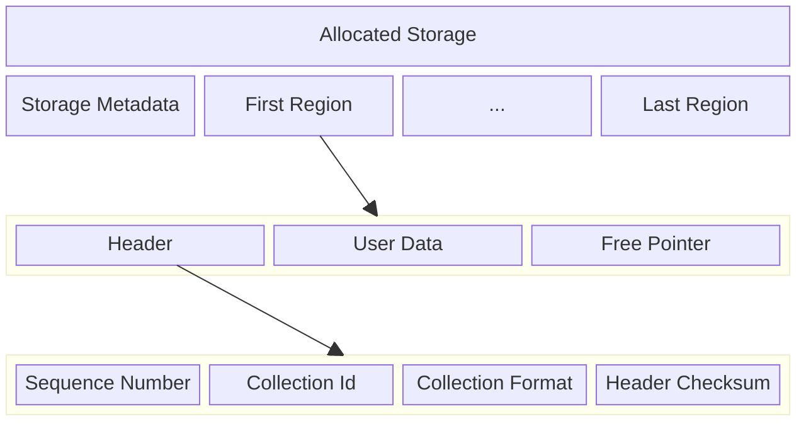

# Low Level Storage

## Motivation

When using built-in flash storage on small microcontrollers, some
kind of database or file system is needed. This allows management of
multiple objects in flash and enables wear leveling to increase
storage longevity.

Some RTOSes include file systems and there are embedded databases
such as [ekv](https://github.com/embassy-rs/ekv),
[tickv](https://github.com/tock/tock/tree/master/libraries/tickv), and
[sequential-storage](https://github.com/tweedegolf/sequential-storage),
but none of these options fit the needs of
[finder](https://github.com/moore/finder).

For finder we need to support many instances of many collection types:
maps, queues, sets, logs, etc. For each of these types we require
efficient queries, allocations, and truncation.

If we used an RTOS this might be achievable with a file system, but
finder is planned for an embassy/bare-metal approach without that
option.

## Overview

To solve these challenges, borromean divides flash into equal-size
regions. Each collection is implemented as an append-only data
structure where new writes are added to the head region and data can
only be freed by truncating the tail. For each collection, borromean
tracks a collection id and current head.

Before being written to storage, updates to a collection are kept in
memory. To persist mutations before a full region flush or snapshot,
each mutation is also written to a global write-ahead log (WAL)
shared by all collections.
Per-collection WAL entries contain a stable collection id and opaque
bytes. Collection ids are opaque 64-bit nonces that are assigned when
a collection is created by `new_collection(collection_id)`. Collection
id `0` is reserved for the WAL; all user collection ids are nonzero
and are not recycled.

A collection head may refer either to
a committed region or to a WAL-resident snapshot. The data payload in
each region is defined by the collection type implementation.

A collection can be flushed either as a full region write or
as a partial state snapshot into the WAL. A WAL snapshot is a durable
staging point: when that collection is mutated again, the snapshot is
loaded into RAM, later mutations are still appended to the WAL as
`update` records, and the in-memory state is allowed to accumulate
enough change to eventually justify writing a full region. Allowing
snapshots to the WAL prevents many partially filled regions and low
effective storage utilization because partial snapshots can be
intermixed with other WAL entries and more easily collected when
stale.

Further snapshotting to the WAL allows bounded RAM usage with an
unbounded number of collections. If an update
targets a collection that does not currently have a free in-memory
buffer, the system may evict the least-frequently-used buffered
collection by flushing its current state snapshot to the WAL and
marking that WAL snapshot as the collection's current head.

When a WAL region is filled, its last record points to the next WAL
region.

A WAL region can be reclaimed when the number of live records drops
below a configurable threshold. During reclaim, we write the current
live state for each affected uncommitted collection into a new WAL
region by snapshotting that collection into the WAL head region. If a
collection's data is not in memory, that implies its current snapshot
is already in the WAL. If a current snapshot is in the region being
collected, it can be copied directly to the WAL tail while updating
the head pointer to the new location.

Once collection data is flushed from a WAL head being reclaimed, any
current head records are moved to the WAL tail, a normal
`head(collection_id = 0, region_id = new_head)` record is written
pointing to the new WAL head, and the old WAL head is added to the
free list. The WAL does not have a separate WAL-only head-record type;
it uses the same `head` record as every other collection.

Any reclaim that frees a region is a WAL-tracked transaction. Before
removing a region from live collection or WAL state, borromean writes
and syncs `reclaim_begin(region_id)`. After the region is no longer
live, it is appended to the free list. Reclaim completes only after
`reclaim_end(region_id)` is written and synced. Startup replay treats
any `reclaim_begin` without a matching `reclaim_end` as an incomplete,
idempotent reclaim operation that must either be completed or proven
unnecessary before open succeeds.

The storage system also keeps a free list of regions that are
available to satisfy new allocations. This list is FIFO (First In,
First Out), to support wear leveling. The durable free-list head
is tracked in WAL replay order so every durable allocator-head change
is replayed exactly once. Allocations advance the durable free-list
head through `alloc_begin(..., free_list_head_after)`. Reclaim or
recovery steps that make a region the new free-list head without
consuming one use an explicit `free_list_head(region_id_or_none)`
record. Any WAL command that writes a newly allocated region must
persist the post-allocation free-list head in the same WAL record,
otherwise that region write and its allocation are not considered
durable.

### Storage Structure

Storage starts with a static metadata region that describes the
version and configuration parameters that cannot change after
initialization.

The rest of the database is made up of regions. Each region has a
header, user data, and a free pointer. The header describes the
region's sequence number, collection id, collection format, and a
checksum over the header itself.

The sequence number is a monotonically increasing value assigned each
time a new region is written. This lets us scan regions and identify
the newest region for each collection. This is primarily used to find
the head and tail of the WAL when opening the database.

The collection format defines how user data is encoded in the user
data section. Storing the format in each region allows format
evolution over time.

The free pointer stores the location of the next free region for
regions that have been freed, so the region in question is in the free
list. This field is written not when the region is freed, but when the
next region is freed. This is the mechanism used to make the free list
a FIFO. A free region whose free-pointer slot is still uninitialized
(for example, left in the erased state) is the current free-list tail.


```mermaid
block-beta
 columns 4
 Storage["Allocated Storage"]:4
 Meta["Storage Metadata"]
 R1["First Region"]
 e1["..."]
 R2["Last Region"]
 space:4
 block:exp:4
  h1["Header"]
  d1["User Data"]
  a1["Free Pointer"]
 end
 space:4
 block:header:4
  s1["Sequence Number"]
  cid["Collection Id"]
  type["Collection Format"]
  check["Header Checksum"]
 end
 R1 --> exp
 h1 --> header
```

### Challenges

The core design constraint is that we cannot have any stable
locations that get repeatedly rewritten or those regions of the flash
will fail before the rest of the device. This leads to two main
conclusions:

 1. We should always attempt to free the oldest regions first.
 2. All data structures should be log structured/append only.

Freeing the oldest first must be performed on a per-collection basis,
as each collection is responsible for its own data and is
opaque to borromean at a high level.

The requirement that data structures be append only affects not
just the implementation of collection types but also the management
of:

 1. The current heads of each collection instance.
 2. The tracking of free regions.
 3. The tracking of the root of the database.

Each of these is solved by tracking this information in the WAL.
The WAL is collection 0. At startup we scan regions to find the WAL
region with the largest sequence number (the current WAL tail). The
start of each WAL region records the WAL head at the time that region
was created. We must also scan the tail region for any changes to the
head caused by reclaiming the WAL head region; those changes are
represented by ordinary `head` records with `collection_id = 0`.
Startup uses this metadata plus WAL replay to reconstruct uncommitted
state in memory and the current free-list head.

## WAL Record Types

All WAL records are append-only and ordered by physical write order
within the WAL region chain.

Each record includes:

1. `record_type`: one of `new_collection`, `update`, `snapshot`,
`alloc_begin`, `head`, `link`, `free_list_head`, `reclaim_begin`,
`reclaim_end`
2. `collection_id`: required for `new_collection`, `update`,
`snapshot`, and `head`
3. `payload_len`: payload size in bytes
4. `payload`: opaque bytes defined by `record_type`
5. `free_list_head_after`: required for `alloc_begin`; omitted for
`update`, `snapshot`, `head`, `link`, `free_list_head`,
`reclaim_begin`, and `reclaim_end`
6. `record_checksum`: checksum covering the full record

The record payloads are:

1. `new_collection`
Declares a new user collection with the given `collection_id`. Payload
is empty. The record is the durable basis decision for an empty
collection with no committed regions, no snapshots, and no updates in
its durable basis.

2. `update`
Collection-local mutation delta. Applied in WAL order during replay.

3. `snapshot`
Full logical state for one collection at a point in time. Supersedes
older `update` records for that collection that appear before the
snapshot.

4. `alloc_begin`
Reserves the current free-list head region for imminent use. The
payload contains the reserved `region_id`.
The record stores `free_list_head_after`, the next free region after
removing `region_id` from the free list. Once `alloc_begin` is
durable, allocator replay state advances even if the reserved region
is erased before a later `head` or `link` record uses it.

5. `head`
Commits a collection to a new durable region head. Payload contains
the target `region_id`. When `collection_id = 0`, this record commits a
new WAL head region; there is no distinct WAL-head record type.

6. `link`
Points from a full WAL region to the next WAL region. Payload contains
`next_region_id` and `expected_sequence` for the next WAL region
header.

7. `free_list_head`
Commits a new durable free-list head. Payload contains the new
`region_id` or `none` if the free list is empty. This record is used
when reclaim or crash recovery changes the durable allocator head
without consuming the prior head through `alloc_begin`.

8. `reclaim_begin`
Marks the start of reclaim for `region_id`. The payload contains the
region being freed. This record does not itself make the region free;
it only makes the reclaim intent durable before any live references to
that region are removed.

9. `reclaim_end`
Marks successful completion of reclaim for `region_id`. The payload
contains the same `region_id` as the matching `reclaim_begin`.

Ordering and validity rules:

1. A valid `new_collection(collection_id)` record is invalid if
`collection_id = 0` or if replay has already seen a prior valid
`new_collection(collection_id)` for a currently tracked collection.
2. A valid `snapshot` record is itself a durable WAL-snapshot head for
that collection.
3. A `head(region)` record is the commit point for a region flush.
4. A `link` is only valid as the last complete record in a WAL region.
When traversed, its target must have a valid WAL header with sequence
equal to `expected_sequence`.
5. For non-WAL collections (`collection_id != 0`), `update`,
`snapshot`, and `head(region)` are valid only if replay has already
seen a prior valid `new_collection(collection_id)`.
6. An `alloc_begin(region_id, free_list_head_after)` record is invalid
if `free_list_head_after` is missing or corrupt.
7. A `free_list_head(region_id_or_none)` record is invalid if the
payload is corrupt.
8. A `head(region_id)` or `link(next_region_id, ...)` record that
writes a newly allocated region is valid only if replay has already
seen a prior unmatched `alloc_begin` for the same region index.
9. Durable allocator-head advance happens at `alloc_begin` or
`free_list_head`, not at `head` or `link`.
10. Replay stops at the first invalid checksum or torn record in the
tail region.
11. `reclaim_begin(region_id)` and `reclaim_end(region_id)` must appear
in WAL order and are matched by `region_id`.
12. `reclaim_end(region_id)` is only valid if preceded by a valid
`reclaim_begin(region_id)`.

Assumptions for replay correctness:

1. A WAL region must be erased before reuse.
2. Replay's "stop at first invalid/torn record" rule depends on this
erase-before-reuse guarantee so stale bytes from prior use cannot be
misinterpreted as new valid records.
3. Any operation that consumes a free-list head must first make the
allocator advance durable with `alloc_begin(region_id,
free_list_head_after)`.
4. If replay ends with an unmatched `alloc_begin(region_id, ...)`, that
region is treated as a reserved `ready_region` for the next allocation
instead of being returned to the free list.

## Collection Head State Machine

Each user collection has exactly one logical current head after replay.

States:

1. `EmptyHead`
Latest durable basis is the empty collection created by a
`new_collection(collection_id)` record. The collection has no durable
region head, no durable WAL snapshot, and no updates in its durable
basis.

2. `InMemoryDirty`
Latest state is represented by a collection-defined in-memory
frontier layered over a durable basis. The frontier may be a full
materialization, but it may also be a compact delta or memtable that
supersedes data still stored in the durable basis.

3. `WALSnapshotHead`
Latest durable head points to a WAL `snapshot` record.

4. `RegionHead`
Latest durable head points to a committed collection region.

Transitions:

1. `NoCollection -> EmptyHead`
Write `new_collection(collection_id)`.
Durable after the `new_collection` record is durable. The collection
starts in memory with no region basis, no snapshot basis, and no
pending updates.

2. `EmptyHead -> InMemoryDirty`
Open a mutable empty working state for the collection and append new
updates to the WAL while updating that RAM state.

3. `InMemoryDirty -> WALSnapshotHead`
Write `snapshot`.
Durable after the `snapshot` record is durable.

4. `InMemoryDirty -> RegionHead`
Write `alloc_begin(region_id, free_list_head_after)`, write collection
region, then write `head(region_id)`.
Durable after the `head` record is durable.

5. `WALSnapshotHead -> InMemoryDirty`
Load the snapshot into RAM as the mutable working state, then append
new updates to the WAL while updating that RAM state.

6. `WALSnapshotHead -> RegionHead`
Write `alloc_begin(region_id, free_list_head_after)`, materialize
snapshot (plus any RAM updates) into that new region, then write
`head(region_id)`.

7. `RegionHead -> InMemoryDirty`
Open a mutable frontier over the committed region basis and apply new
updates without requiring the full region contents to be loaded into
RAM first.

Collection format responsibility:

1. Each collection format defines how reads merge the durable basis
with the in-memory frontier.
2. The frontier must take precedence over older values in the durable
basis.
3. Flush to `RegionHead` materializes the logical state produced by
that merge.
4. Formats such as append-only logs or LSM-like structures may keep
only recent mutable state in RAM while older immutable state remains
in committed regions.
5. A `WALSnapshotHead` must be loadable into RAM before that
collection accepts further mutations.

Invariants:

1. The active durable basis for a collection is the last valid basis
decision in replay order, where a basis decision is
`new_collection`, `snapshot`, or `head(region)`.
2. `new_collection`, `snapshot`, and `head(region)` records totally
order durable basis decisions per collection.
3. Any `new_collection`, `update`, or `snapshot` older than the active
basis for that collection is reclaimable.

## Startup Replay Algorithm

Startup recovery reconstructs five things:

1. Durable collection heads
2. In-memory working state for collections with uncommitted updates
3. Durable free-list head
4. Reserved `ready_region`, if an allocation was started but not yet
committed by `head` or `link`
5. Runtime `free_list_tail`, reconstructed from the free-pointer chain
after the durable free-list head is known

Algorithm:

1. Read `StorageMetadata` and validate static geometry (`region_size`,
`region_count`, and storage version support).
2. Scan all regions and collect candidate WAL regions
(`collection_id == 0`) with valid headers.
3. Select WAL tail as the WAL region with the largest valid sequence.
4. Read the WAL-head pointer stored at the start of that tail region as
the initial WAL-head candidate. Then scan valid records in that tail
region and let the last valid `head(collection_id = 0, region_id)`
record override that candidate.
5. Walk the WAL region chain from the resulting WAL head to tail using
`link` records.
If a `link` is missing/invalid before reaching the known tail, return
an error (corrupted WAL chain).
If the known tail contains a trailing `link` whose target header is
missing/corrupt or has the wrong sequence, treat this as an incomplete
rotation. Use the known tail as replay tail.
For incomplete rotation recovery, if the known tail ends with a durable
`link(next_region_id, expected_sequence)` and the target WAL header is
missing/corrupt/wrong sequence, finish initializing the target region:
erase target region if needed, write a valid WAL header with
`collection_id = 0` and `sequence = expected_sequence`, write WAL
region prologue metadata, and sync. If this recovery init fails,
startup fails with error. After successful recovery init, use the
target region as the active append tail.
6. Parse records in WAL order (region order, then offset order).
For the tail region, stop at first invalid checksum or torn record.
7. Maintain replay state:
per collection `last_head`, `basis_pos`, and `pending_updates`, plus
global `last_free_list_head`, optional reserved `ready_region`, and
ordered pending region reclaims.
8. On `new_collection(collection_id)`:
if `collection_id` is already tracked, return an error.
otherwise create replay state for that collection with durable basis
`EmptyHead`, set `basis_pos` to this record's WAL position, and start
with no pending updates.
9. On `update(collection_id)`:
if `collection_id` is not tracked, return an error.
append to `pending_updates` for that collection.
10. On `snapshot(collection_id)`:
set durable `last_head` to this snapshot, set `basis_pos` to this
record's WAL position, and clear older pending updates for that
collection at WAL positions up to and including this snapshot.
11. On `alloc_begin(region_id, free_list_head_after)`:
if `ready_region` is already set, return an error because replay found
two unmatched allocation reservations.
set durable `last_free_list_head` to `free_list_head_after`.
set `ready_region = region_id`.
12. On `head(collection_id, region_id)`:
set durable `last_head` to that region, set `basis_pos` to this
record's WAL position, and clear WAL updates/snapshots older than this
basis decision.
if `ready_region = region_id`, clear `ready_region`.
otherwise return an error because the region was never reserved by
`alloc_begin`.
13. On `link(next_region_id, expected_sequence)`:
if `ready_region = next_region_id`, clear `ready_region`.
otherwise return an error because the region was never reserved by
`alloc_begin`.
14. On `free_list_head(region_id_or_none)`:
set durable `last_free_list_head` to `region_id_or_none`.
15. On `reclaim_begin(region_id)`:
append `region_id` to pending reclaims unless a later matching
`reclaim_end` removes it.
16. On `reclaim_end(region_id)`:
mark the matching pending reclaim as finished.
17. After replay, for each collection:
reconstruct its durable basis from `last_head`. If `last_head` is
`empty`, the basis is the empty collection declared by
`new_collection`; if that collection has post-basis updates,
initialize empty mutable state in RAM and apply those
`pending_updates` in WAL order. If `last_head` is `region`, the basis
may remain in-place in flash. If `last_head` is `wal_snapshot` and the
collection has post-basis updates, load that snapshot into RAM and
apply the remaining `pending_updates` in WAL order to reconstruct
mutable working state. If `last_head` is `wal_snapshot` and there are
no post-basis updates, the snapshot may remain dormant until the next
mutation, but it must be loaded into RAM before accepting that
mutation.
18. Initialize allocator state from `last_free_list_head`.
19. Reconstruct runtime `free_list_tail` by following free-pointer
links starting at `last_free_list_head` until reaching a free region
whose free-pointer slot is uninitialized.
If `last_free_list_head = none`, then `free_list_tail = none`.
20. If `ready_region` is set, hold it in memory as the next region to
use before consuming another free-list entry.
21. For each pending reclaim in WAL order:
if the target region is still reachable from any live collection head
or the WAL chain, leave it allocated because the reclaim did not reach
the detach point durably.
If the target region is unreachable from live state and not yet in the
free-list chain, complete the free-list append using the Region
Reclaim procedure.
If the target region is already reachable from the free-list chain,
finish the reclaim transaction by appending `reclaim_end(region_id)`.


## no_std Tracker Types (Rust)

The replay and allocator terms above map to the following explicit
`no_std` tracker state. These structs are runtime state, not on-disk
layout. Region references in tracker state are indexes into the
configured region array, not opaque identifiers.

```rust
#![no_std]

use heapless::Vec;

#[derive(Clone, Copy, Debug, PartialEq, Eq)]
pub struct RegionIndex(pub u32);

#[derive(Clone, Copy, Debug, PartialEq, Eq)]
pub struct CollectionId(pub u64);

#[derive(Clone, Copy, Debug, PartialEq, Eq)]
pub struct WalSequence(pub u64);

#[derive(Clone, Copy, Debug, PartialEq, Eq)]
pub struct WalOffset(pub u32);

#[derive(Clone, Copy, Debug, PartialEq, Eq)]
pub struct WalPosition {
  pub region_index: RegionIndex,
  pub offset: WalOffset,
}

#[derive(Clone, Copy, Debug, PartialEq, Eq)]
pub enum DurableHead {
  Empty,
  Region { region_index: RegionIndex },
  WalSnapshot { wal_pos: WalPosition },
}

#[derive(Clone, Copy, Debug, PartialEq, Eq)]
pub struct CollectionReplayState {
  pub collection_id: CollectionId,
  pub last_head: DurableHead,
  // WAL position of the durable basis decision record that established
  // `last_head` (`new_collection`, `snapshot`, or `head`).
  pub basis_pos: WalPosition,
}

#[derive(Clone, Copy, Debug, PartialEq, Eq)]
pub struct PendingUpdateRef {
  pub collection_id: CollectionId,
  pub wal_pos: WalPosition,
}

#[derive(Clone, Copy, Debug, PartialEq, Eq)]
pub struct FreeListTracker {
  // Durable allocator cursor reconstructed from replay decisions.
  pub last_free_list_head: Option<RegionIndex>,
  // Region reserved by `alloc_begin` but not yet consumed by a durable
  // `head` or `link` record.
  pub ready_region: Option<RegionIndex>,
  // Runtime-only convenience for append-on-free operations.
  pub free_list_tail: Option<RegionIndex>,
}

pub struct ReplayTracker<
  const MAX_COLLECTIONS: usize,
  const MAX_PENDING_UPDATES: usize,
> {
  pub free_list: FreeListTracker,
  pub collections: Vec<CollectionReplayState, MAX_COLLECTIONS>,
  pub pending_updates: Vec<PendingUpdateRef, MAX_PENDING_UPDATES>,
}
```

`heapless` dependency form:

```toml
[dependencies]
heapless = { version = "0.8", default-features = false }
```

Field mapping to this spec:

1. `CollectionReplayState.last_head` maps to replay `last_head`.
2. `WalPosition` identifies a WAL record by WAL region index plus
byte offset within that region.
3. `CollectionReplayState.basis_pos` is `B(c)`, the WAL position of
the durable basis decision record for that collection.
4. `FreeListTracker.last_free_list_head` maps to replay
`last_free_list_head`.
5. `FreeListTracker.ready_region` maps to replay `ready_region`.
6. `FreeListTracker.free_list_tail` is runtime state reconstructed by
walking the free-pointer chain from `last_free_list_head`; reclaim uses
it to link `t_prev.next_tail = r`.

## WAL Reclaim Eligibility

Reclaim operates on WAL regions but correctness is defined per record.
A record is reclaimable only when replay no longer needs it to rebuild
the same `last_head`, `pending_updates`, and `last_free_list_head`
state.

Per-collection cutoff:

1. Let `H(c)` be the current durable logical head for collection `c`
(`EmptyHead`, `WalSnapshot`, or `RegionHead`).
2. Let `D(c)` be the WAL position of the last durable basis decision
record for collection `c` (`new_collection`, `snapshot`, or
`head(region)`).
3. `B(c) = D(c)` is the collection's durable basis position.

Per-record liveness rules:

1. `new_collection(collection_id)` record:
live only if it is the basis decision at `D(c)` for a collection whose
logical head `H(c)` is `EmptyHead`; otherwise reclaimable.
2. `head(region)` record:
live only if it is the decision record at `D(c)` for a collection
whose logical head `H(c)` is a `RegionHead`; older `head(region)`
records are reclaimable.
3. `snapshot` record:
live only if it is the decision record at `D(c)` for a collection
whose logical head `H(c)` is a `WalSnapshot`; otherwise reclaimable.
4. `update` record for collection `c`:
live only if its WAL position is greater than `B(c)`; updates at or
before `B(c)` are reclaimable.
5. `link` record:
live only while required to maintain a valid WAL chain from current
WAL head to current WAL tail.
6. `free_list_head(region_id_or_none)` record:
live only if it is the last valid explicit free-list-head decision in
replay order that has not been superseded by a later `alloc_begin` or
`free_list_head`.
7. `alloc_begin(region_id, free_list_head_after)` record:
live if either:
it is the last valid free-list-head decision in replay order; or
its reservation is still needed to recover unmatched `ready_region`.

WAL-region reclaim preconditions:

1. The candidate region is the head of the WAL.
2. For every live record in the candidate, an equivalent live state is
already represented durably outside the candidate (typically by newer
`snapshot`, or by `head(region)` plus newer updates).
3. After planned metadata updates, startup replay can still walk a
valid WAL chain from head to tail.

WAL-region reclaim postconditions:

1. No collection's `H(c)`, `B(c)`, or live post-basis updates depend on
bytes in the reclaimed region.
2. The recovered free-list head matches pre-reclaim allocator state.
3. WAL chain integrity remains valid (no broken `link` path).
4. The reclaimed region is erased before reuse.
5. If reclaim allocates any replacement WAL regions, replay-visible
`alloc_begin` records for those allocations carry
`free_list_head_after` so replay reconstructs the same allocator
position.

Safety invariant:

1. Reclaim must not change replay result: the recovered `last_head` and
`pending_updates` for every collection, the recovered
`last_free_list_head`, and the reconstructed `free_list_tail`, after
reclaim must match the pre-reclaim logical state.

Example timeline (`collection_id = 7`):

1. WAL appends `update(u1)`, `update(u2)`.
2. WAL appends `snapshot(s1)`.
`u1` and `u2` are now reclaimable.
3. WAL appends `update(u3)`.
`u3` is live because it is after basis `B(7) = pos(s1)`.
4. WAL appends `alloc_begin(r44, free_list_head_after=f9)`.
5. Collection flushes to region `r44`, then WAL appends
`head(region, r44)`.
Now `s1` and `u3` are reclaimable because
`head(region, r44)` becomes
the new basis.

## Durability and Crash Semantics

Durability boundary:

1. A write is durable only after both:
the bytes are written, and a sync/flush that covers those bytes
completes.
2. Write ordering without sync ordering is not sufficient for
durability guarantees.
3. Replay must treat partially written records as torn and ignore
them using checksum validation and tail truncation rules.

Notation:

1. `W(x)`: write bytes for `x`.
2. `S(x)`: sync/flush that guarantees durability for `x`.

Required write and sync ordering:

1. `update` durability:
`W(update_record) -> S(update_record) -> acknowledge update durable`.
2. `snapshot` head transition:
`W(snapshot) -> S(snapshot)`.
3. `region` head transition:
`W(alloc_begin(region_id, free_list_head_after)) -> S(alloc_begin) -> erase/init reserved region if needed -> W(region header+data) -> S(region) -> W(head(region, ref=region_id)) -> S(head)`.
4. WAL rotation:
`W(alloc_begin(next_region_id, free_list_head_after)) -> S(alloc_begin) -> W(link(next_region_id, expected_sequence)) -> S(link) -> W(new_wal_region_init(sequence=expected_sequence)) -> S(new_wal_region_init)`.
5. Reclaim:
`W(reclaim_begin(region_id)) -> S(reclaim_begin) -> W(replacement_live_state_and_new_links) -> S(replacement_state) -> append old region to free list (write+sync) -> W(reclaim_end(region_id)) -> S(reclaim_end)`.

General region-allocation rule:

1. Any operation that writes a newly allocated region must first make
`alloc_begin(region_id, free_list_head_after)` durable.
2. Erasing or initializing the reserved region is allowed only after
`S(alloc_begin)`.
3. If crash occurs after `S(alloc_begin)` but before a durable `head`
or `link` uses `region_id`, replay must preserve `region_id` as
`ready_region` and must not attempt to recover the old free-pointer
contents from flash.

Crash-cut outcomes:

1. Crash before `S(snapshot)`:
snapshot may be missing/torn and is ignored.
2. Crash after `S(snapshot)`:
snapshot transition is durable and acts as the collection WAL head.
3. Crash before `S(region)`:
new region is not considered durable.
If `alloc_begin` was already durable, replay still preserves the
reserved `ready_region`.
4. Crash after `S(region)` but before `S(head(region))`:
region exists but is not committed as collection head.
The allocator advance remains durable because `alloc_begin` already
committed it, so replay keeps `region_id` reserved as `ready_region`
unless a later durable `head` consumes it.
5. Crash after `S(head(region))`:
region head transition is durable and consumes the reserved
`ready_region`.
6. Crash after `W(link)` but before `S(link)`:
link may be torn/missing and old tail remains active, but the reserved
region remains tracked by `alloc_begin`.
7. Crash after `S(link)` but before `S(new_wal_region_init)`:
startup validates the link target sequence/header; if target is
missing/corrupt/wrong sequence, rotation is incomplete and startup
finishes initialization using `expected_sequence`.
8. Crash during tail-record write:
replay stops at first invalid/torn tail record; earlier complete
records remain valid.
9. Crash after `S(reclaim_begin)` but before the region is detached
from all live state:
startup sees an incomplete reclaim, but the region is still live and
must not be freed.
10. Crash after the region is detached from live state but before
`S(reclaim_end)`:
startup sees an incomplete reclaim and must complete the free-list
append idempotently if the region is not already free.

## Storage Metadata

```alloy
one sig StorageMetadata {
  storage_version: Int,
  region_size: Int,
  region_count: Int,
}
```

The `StorageMetadata` struct describes the version of the storage as
well as the size of each region in bytes and the number of regions in
the database.

## Header

```rust
struct Header {
  sequence: u64,
  collection_id: u64,
  collection_type: CollectionType,
  header_checksum: [u8; 32],
}
```

The `Header` is the first data in the region.

The `sequence` field is a monotonic value that is used to find the
newest header when the database is opened.

The `collection_id` defines which collection this region belongs to,
and the `collection_type` is the type of the collection. It is a stable
64-bit nonce, not a small reusable counter.

The `header_checksum` validates header integrity.

## Operations

### Init

When the database is initialized the metadata is written. All but the
first region have a dummy header written and their free pointers set
to build a list containing all but the first region. The first region
is initialized with a WAL collection type and a sequence of zero.

### Format Storage (On-Disk Initialization)

Formatting creates a valid empty store that can be opened by normal
startup replay without special recovery paths.

Preconditions:

1. Backing storage is writable and erasable at region granularity.
2. `region_count >= 1`.
3. Region `0` is reserved as the initial WAL region.

Procedure:

1. Erase metadata area and all data regions.
2. Write `StorageMetadata` (`storage_version`, `region_size`,
`region_count`) and sync metadata.
3. Initialize region `0` as WAL:
write valid `Header` with `collection_id = 0` and `sequence = 0`,
write WAL-region prologue with WAL head pointing to region `0`, then
sync region `0`.
4. For each region `r` in `[1, region_count - 1]`:
write a valid free-region header, write `r.free_pointer.next_tail`
to the next region index (`r + 1`) for every region except the last,
leave the last region's free-pointer slot uninitialized, and
sync `r`.
5. Formatting is complete only after metadata and all initialized
regions are durable.

Postconditions:

1. WAL head and WAL tail are both region `0`.
2. No user collection durable heads exist.
3. Free list contains every non-WAL region in ascending region-index
order.
4. If `region_count = 1`, the free list is empty.

### First Open After Fresh Format

Opening a freshly formatted store uses the same startup replay
algorithm as any other open.

Expected replay outcome on first open:

1. Region scan finds WAL tail at region `0` (`sequence = 0`).
2. WAL chain walk yields a single-region chain (`head = tail = 0`).
3. No `new_collection`, `update`, `snapshot`, `head`, `link`, or
`free_list_head` records are replayed.
4. Replay therefore yields:
no tracked user collections,
`pending_updates = empty`,
and no replay-driven `last_free_list_head` decision.

Initial in-memory tracker bootstrap (`ReplayTracker`) on this path:

1. `free_list.last_free_list_head = Some(1)` when `region_count > 1`,
otherwise `None`.
2. `free_list.ready_region = None`.
3. `free_list.free_list_tail = Some(region_count - 1)` when
`region_count > 1`, otherwise `None`.
4. `collections = empty`.
5. `pending_updates = empty`.

This bootstrap is only for the no-record fresh-format case. Once WAL
records exist, allocator and collection-head state must come from
normal replay decisions. On non-fresh opens, `free_list_tail` is
reconstructed by walking the free-pointer chain from the recovered
durable free-list head until a free region with an uninitialized
free-pointer slot is reached; it is not found by scanning WAL regions.

### Region Reclaim

Region reclaim appends a newly freed region to the tail of the free
list. If the free list was non-empty, reclaim must update the previous
tail region's `next_tail` pointer so the chain now ends at the newly
reclaimed region. Because reclaim removes a region from live metadata
before making it reachable from the free-list chain, it is always
modeled as a WAL-tracked transaction.

Normative append semantics:

1. Let `t_prev` be the value of `free_list_tail` before reclaim starts.
2. If `t_prev != none`, reclaim must durably write
`t_prev.free_pointer.next_tail = r` when freeing region `r`.
3. If `t_prev = none`, reclaim must not write any predecessor link and
must durably append `free_list_head(r)` and set `free_list_head = r`
and `free_list_tail = r`.
4. Reclaim is not complete until the predecessor-link write (when
required), or the `free_list_head(r)` record (when the free list was
empty), is durable; otherwise `r` is not yet a durable member of the
free list.

Preconditions:

1. `reclaim_begin(r)` is durable in the WAL before any live metadata is
updated to stop referencing `r`.
2. After the detach step, the reclaimed region `r` is no longer
reachable from any live collection head or live WAL state.
3. `r` is not already reachable from the free-list chain, unless this
procedure is being re-entered during crash recovery.
4. If a current free-list tail exists, call it `t_prev`.

Procedure:

1. Ensure `reclaim_begin(r)` is durable. On the initial reclaim
attempt this means append and sync `reclaim_begin(r)`. On recovery
re-entry the existing durable record satisfies this step.
2. Durably perform any collection-head or WAL-head updates needed so
that `r` has no remaining live references.
3. If recovery finds that `r` is already reachable from the free-list
chain, skip to step 10.
4. Erase region `r` before reuse.
5. Leave `r.free_pointer.next_tail` uninitialized so `r` is a valid
free-list tail once linked.
6. Sync `r` so its free-pointer state is durable before linking it.
7. If `t_prev` exists, write `t_prev.free_pointer.next_tail = r`.
This is the operation that links the previous free tail to the new
tail.
8. If `t_prev` exists, sync `t_prev` after writing `next_tail`.
9. If `t_prev` exists, update in-memory `free_list_tail = r`.
If no tail existed before step 7, append and sync `free_list_head(r)`,
then set both in-memory `free_list_head = r` and `free_list_tail = r`.
10. If recovery found `r` already reachable from the free-list chain,
update in-memory free-list state so it reflects `r` as the current
tail when needed.
11. Append and sync `reclaim_end(r)`.

Postconditions:

1. The free-list chain remains acyclic and FIFO-ordered.
2. Exactly one new region (`r`) is appended to the tail.
3. If a prior tail existed, its `next_tail` pointer now references
`r`.
4. `r.free_pointer.next_tail` remains uninitialized after reclaim.
5. If a prior tail existed, replay of free pointers follows
`... -> t_prev -> r`, and `r` is recognized as the tail because its
free-pointer slot is uninitialized.
6. If a prior tail existed, the only new durable predecessor link for
`r` is `t_prev.next_tail = r`, where `t_prev` is the free-list tail
from before reclaim.
7. Replay either finds a matching `reclaim_end(r)` or can safely
re-enter the procedure and derive the same result without duplicating
`r` in the free-list chain.

Crash-safety ordering requirement:

1. `reclaim_begin(r)` must be durable before any live metadata stops
referencing `r`.
2. `r` must be erased/initialized and synced before any durable write
that makes it reachable from `t_prev.next_tail`.
3. If `t_prev = none`, `free_list_head(r)` must be durable before
`reclaim_end(r)` is acknowledged.
4. If `t_prev` exists, the `t_prev.next_tail = r` write must be synced before
`reclaim_end(r)` is acknowledged.
5. The reclaim procedure must be idempotent across crashes between any
two steps above.
