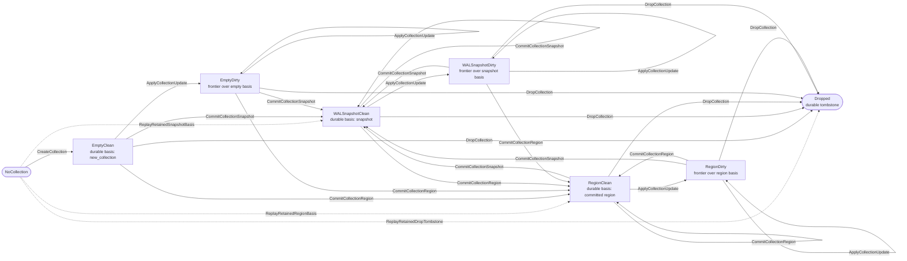

# Chapter 3: Collection Lifecycle

This chapter explains how a user collection moves between empty,
WAL-snapshot, committed-region, dirty-frontier, and dropped states.
Collection-specific formats own the payload interpretation, while the
ring owns the durable transition ordering.

Mechanism review:

- **Purpose**: keep user collections log-structured while allowing
  bounded in-memory frontiers and multiple durable basis forms.
- **State**: one collection submachine state per tracked collection,
  plus retained post-basis update references for dirty states.
- **Named operations**: `CreateCollection`, `ApplyCollectionUpdate`,
  `CommitCollectionSnapshot`, `CommitCollectionRegion`,
  `DropCollection`, and the retained-basis replay operations.
- **Durable edge sequence**: each foreground operation ends in the WAL
  record or committed-region head that establishes the target state.
- **Replay effect**: `ApplyWalRecord` reconstructs the same collection
  state from retained basis and update records.
- **Crash cuts**: a collection remains on the prior basis until the
  target basis record is durable.

## Collection Head State Machine

Each tracked user collection is in one explicit collection state. The
state name includes both the durable basis and whether a volatile
frontier exists over that basis, so transitions never rely on modifier
shorthand. Durable basis changes are driven by
`ApplyWalRecord`; foreground collection operations choose which WAL
record or committed region write to perform, but the replay-visible
collection effect is the same transition table used during startup.

Collection states:

1. `NoCollection`
No retained durable record establishes this collection id.

2. `EmptyClean`
Latest durable basis is the empty collection created by a
`new_collection(collection_id, collection_type)` record. The collection
has a tracked collection type, no durable region head, no durable WAL
snapshot, and no volatile frontier newer than that basis.

3. `EmptyDirty`
The durable basis is `EmptyClean`, plus a collection-defined volatile
frontier and retained post-basis `update` records newer than that empty
basis.

4. `WALSnapshotClean`
Latest durable basis points to a WAL `snapshot` record, with no volatile
frontier newer than that snapshot.

5. `WALSnapshotDirty`
The durable basis is `WALSnapshotClean`, plus a collection-defined
volatile frontier and retained post-basis `update` records newer than
that snapshot.

6. `RegionClean`
Latest durable basis points to a committed collection region, with no
volatile frontier newer than that region basis.

7. `RegionDirty`
The durable basis is `RegionClean`, plus a collection-defined volatile
frontier and retained post-basis `update` records newer than that
committed region basis.

8. `Dropped`
Latest durable basis is a `drop_collection(collection_id)` tombstone.
The collection id remains reserved and tracked, but the collection no
longer has a live durable basis, accepts no further mutations, and its
older durable bytes are reclaimable once physically detached. Any region
associated with the dropped collection may be appended to the free list
if it is not already present there.

Collection transitions:

1. `NoCollection --CreateCollection--> EmptyClean`
`CreateCollection(collection_id, collection_type)` appends the
`new_collection` record through its named durable edge.
Durable after the `new_collection` record is durable. The collection
starts with tracked `collection_type`, no region basis, no snapshot
basis, no pending updates, and no dirty volatile frontier.

2. `NoCollection --ReplayRetainedSnapshotBasis--> WALSnapshotClean`
Retained replay basis only. `ReplayRetainedSnapshotBasis` applies a
retained `snapshot` record after WAL-head reclaim has removed the
historical `new_collection` record, so startup replay can reconstruct a
live collection directly from that retained snapshot basis.

3. `NoCollection --ReplayRetainedRegionBasis--> RegionClean`
Retained replay basis only. `ReplayRetainedRegionBasis` applies a
retained user `head` record after WAL-head reclaim has removed the
historical `new_collection` record, so startup replay can reconstruct a
live collection directly from that retained committed-region basis.

4. `NoCollection --ReplayRetainedDropTombstone--> Dropped`
Retained replay basis only. `ReplayRetainedDropTombstone` applies a
retained `drop_collection` tombstone after WAL-head reclaim has removed
all earlier type-bearing records for that id, so startup replay can
preserve that id as dropped without reconstructing a live collection
type.

5. `EmptyClean --ApplyCollectionUpdate--> EmptyDirty`
`ApplyCollectionUpdate(collection_id, payload)` creates a mutable
frontier over the empty basis, appends an `update` record through
`AppendUpdate`, and applies that update to RAM.

6. `WALSnapshotClean --ApplyCollectionUpdate--> WALSnapshotDirty`
`ApplyCollectionUpdate(collection_id, payload)` loads the snapshot as
the mutable frontier, appends an `update` record through
`AppendUpdate`, and applies that update to RAM.

7. `RegionClean --ApplyCollectionUpdate--> RegionDirty`
`ApplyCollectionUpdate(collection_id, payload)` opens a mutable
frontier over the committed region basis, appends an `update` record
through `AppendUpdate`, and applies that update to RAM.

8. `EmptyDirty --ApplyCollectionUpdate--> EmptyDirty`,
`WALSnapshotDirty --ApplyCollectionUpdate--> WALSnapshotDirty`, or
`RegionDirty --ApplyCollectionUpdate--> RegionDirty`
`ApplyCollectionUpdate(collection_id, payload)` appends another
`update` record through `AppendUpdate` and applies that update to the
existing RAM frontier.

9. `EmptyClean | EmptyDirty | WALSnapshotClean | WALSnapshotDirty | RegionClean | RegionDirty
--CommitCollectionSnapshot--> WALSnapshotClean`
`CommitCollectionSnapshot(collection_id, payload)` appends a
`snapshot` record through `CommitSnapshotHead`.
Durable after the `snapshot` record is durable. The snapshot becomes the
new durable basis, older post-basis updates are superseded, and any
dirty frontier is clear. Clean-source snapshotting is allowed because a
collection operation may choose to rewrite its clean basis into a
different retained WAL snapshot without changing logical content.

10. `EmptyClean | EmptyDirty | WALSnapshotClean | WALSnapshotDirty | RegionClean | RegionDirty
--CommitCollectionRegion--> RegionClean`
`CommitCollectionRegion(collection_id, region_index, payload)` runs the
region-commit operation: reserve a target region as needed, write the
committed collection region, then append the user
`head(collection_id, collection_type, region_index)` through
`CommitRegionHead`.
Durable after the `head` record is durable. The committed region becomes
the new durable basis, older post-basis updates are superseded, and the
dirty frontier is clear. Clean-source committed writes are allowed for
snapshot materialization, manifest rewrite, or compaction where the
logical state is unchanged but the retained committed layout changes.
If the operation makes old regions unreachable, it uses a collection
transaction so the new basis is recovered only with the required cleanup
mode.

11. `EmptyClean | EmptyDirty | WALSnapshotClean | WALSnapshotDirty | RegionClean | RegionDirty
--DropCollection--> Dropped`
`DropCollection(collection_id)` appends `drop_collection(collection_id)`
through `CommitDropCollection`, inside a collection transaction when
old regions must be freed.
Durable after the `drop_collection` record is durable. Any pending WAL
updates and volatile frontier state for that collection are discarded
from the durable basis, the collection leaves the live namespace, and no
later WAL record for that collection id is valid.

Collection format responsibility:

1. `RING-FORMAT-001` Each non-WAL `collection_format` value is defined by the user
collection type that writes it; Borromean core stores that value in the
region header but does not assign it global meaning.
2. `RING-FORMAT-002` Each user collection format defines how reads merge the durable basis
with the in-memory frontier.
3. `RING-FORMAT-003` The frontier MUST take precedence over older values in the durable
basis.
4. `RING-FORMAT-004` Flush to `RegionClean` materializes the logical state produced by
that merge, either directly in the head region or through
collection-defined manifest state referenced by the head region.
5. `RING-FORMAT-005` Every user collection MUST remain log-structured:
flushing mutable state writes new immutable committed region state
instead of rewriting existing live region state in place. An LSM-style
layout with manifest-described immutable runs is one valid way to
satisfy this requirement.
6. `RING-FORMAT-006` A `WALSnapshotClean` basis MUST be loadable into RAM before that
collection accepts further mutations.
7. `RING-FORMAT-007` For live user collections, the replay-tracked collection type is
fixed by the earliest retained type-bearing record for that collection
(`new_collection`, `snapshot`, or `head`). Historically this begins at
`new_collection`, but WAL reclaim may later remove that record.
8. `RING-FORMAT-008` Every later retained type-bearing record for that collection MUST
carry the same `collection_type`, otherwise replay must treat the
mismatch as corruption.
9. `RING-FORMAT-009` When a user collection implementation loads a committed region
basis, it validates that region's `collection_format` according to its
own rules.
10. `RING-FORMAT-010` Borromean core reserves two canonical private
`collection_format` values under `collection_id = 0`:
`main_wal_v2` for the main WAL and `transaction_log_v2` for transaction
logs. These identifiers are not user-definable.
11. `RING-FORMAT-011` Per-region format evolution remains allowed because region headers
carry `collection_format` independently of the collection's stable
type.
12. `RING-FORMAT-012` Every non-WAL `collection_type` that may appear
durably on disk MUST have a corresponding normative collection
specification.
13. `RING-FORMAT-013` That collection specification MUST define, at
minimum: the empty logical state established by `new_collection`; the
exact bytes and interpretation of every supported committed-region
`collection_format`; the exact bytes and interpretation of `snapshot`
payloads; the exact bytes and interpretation of `update` payloads; the
rules for applying updates and merging a durable basis with the
in-memory frontier; and the collection-specific validation rules used
when loading a basis or replaying WAL payloads.
14. `RING-FORMAT-014` For non-WAL collections, the pair
`(collection_type, collection_format)` MUST identify a unique committed
region payload format.
15. `RING-FORMAT-015` An implementation MUST NOT open a database
successfully if replay yields a live collection whose
`collection_type` is unsupported by that implementation.

Storage open validates the shared ring, WAL, allocator, and storage
ownership structure. Typed collection open or load validates
collection-defined payloads.

16. `RING-FORMAT-016` Shared storage validation MUST reject a live retained committed-region
basis whose referenced region header does not belong to that collection.
17. `RING-FORMAT-016A` Typed collection open or load MUST fail if retained
committed-region payloads, retained `snapshot` payloads, or retained
post-basis `update` payloads are unsupported or invalid under that
collection's normative specification.
18. `RING-FORMAT-017` A dropped tombstone for an unsupported
collection type may remain as inert replay state. Support for that old
collection type is not required unless a live basis or retained
post-basis updates still exist for it.

Invariants:

1. `RING-INVARIANT-001` The active durable basis for a collection is the last valid basis
decision in replay order, where a basis decision is
`new_collection`, `snapshot`,
`drop_collection`, or
`head(collection_id, collection_type, region_index)`.
2. `RING-INVARIANT-002` `new_collection`, `snapshot`,
`drop_collection`, and
`head(collection_id, collection_type, region_index)` records totally
order durable basis decisions per collection.
3. `RING-INVARIANT-003` Any `new_collection`, `update`, `snapshot`, or `head` older than the
active basis for that collection is reclaimable.
4. `RING-INVARIANT-004` If the active basis for a collection is `drop_collection`, then that
collection is logically absent from the live namespace and any older
durable basis or update bytes for that collection are reclaimable once
they are no longer physically reachable. Any region associated with
that dropped collection may then be added to the free list if it is
not already in the free-list chain, using
`free_region(collection_id, region_index)`.
5. `RING-INVARIANT-005` Historical append validity and retained replay basis are distinct:
`new_collection` is required before later user-collection records are
appended, but reclaim may later remove it so replay reconstructs from
the earliest retained basis record instead.
