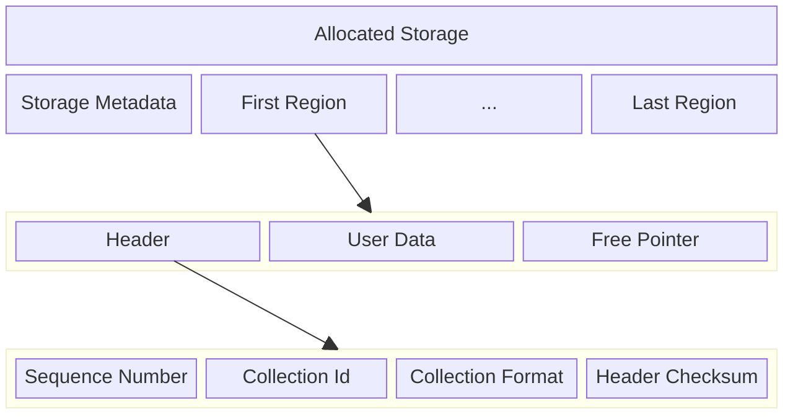

# Chapter 5: Region And Disk Format

This chapter defines the physical storage layout after the logical model
is established: static metadata, region headers, committed payload
areas, free-pointer footers, and WAL-region prologues.

Mechanism review:

- **Purpose**: define the bytes that survive reset and make independent
  implementations agree on the same media image.
- **State**: storage metadata, region header sequence and ownership,
  user payload area, free-pointer footer, and WAL-region prologue.
- **Named operations**: `FormatStorage`, `CommitCollectionRegion`,
  `RotateWalTail`, `FreeRegion`, and `OpenStorage` all depend on these
  physical layouts.
- **Durable edge sequence**: physical structures are written and synced
  by the durable edges named in the state-machine chapter.
- **Replay effect**: startup trusts locally valid checksums at the layer
  defined by this spec and reconstructs higher-level state from WAL
  records and region metadata.
- **Crash cuts**: incomplete physical writes are detected by checksum or
  erased-state rules and are interpreted only through the corresponding
  recovery procedure.

## Storage Structure

Storage starts with a static metadata region that describes the
version and configuration parameters that cannot change after
initialization.

The rest of the database is made up of regions. Each region has a
header, user data, and a free pointer. The header describes the
region's sequence number, collection id, collection format, and a
checksum over the header itself.

The sequence number is a monotonically increasing value assigned each
time a new region is written. This lets startup identify the newest WAL
region and order physical region writes. Logical collection heads are
recovered from WAL `head(...)` records rather than by choosing the
newest region for a collection. During startup region scanning,
Borromean records `max_seen_sequence`, the largest `sequence` value
found in any valid region header. Each newly allocated region, whether
for a user collection or for a newly initialized WAL region, must use
`sequence = max_seen_sequence + 1`, after which that new value becomes
the new `max_seen_sequence` in memory. Crashes or abandoned allocations
may leave gaps in the observed sequence values, but the values used by
successful later region writes must remain strictly monotonic.

The collection format defines how user data is encoded in the user
data section. For user collections, the meaning of non-WAL
`collection_format` values is owned by the corresponding
`collection_type` implementation rather than by Borromean core. This
spec reserves exactly one canonical core-defined format identifier,
`wal_v1`, for WAL regions; no user collection may use that identifier.
Storing the format in each region still allows per-collection format
evolution over time.

The free pointer stores the location of the next free region for
regions that have been freed, so the region in question is in the free
list. This field is written not when the region is freed, but when the
next region is freed. This is the mechanism used to make the free list
a FIFO. A free region whose free-pointer slot is still uninitialized
(for example, left in the erased state) is the current free-list tail.
A free region is defined by membership in the durable free-list chain,
not by a distinct on-disk header encoding. Free regions may still
contain stale header and payload bytes from their prior use; those
bytes are ignored while the region is free. The free-pointer footer of
a region must not be written while that region is allocated for live
use. Allocation first erases the region, then writes the region header
and collection payload, leaving the free-pointer area untouched. When a
region is later added to the durable free-list chain, that is when its
free-pointer footer becomes meaningful. For a newly appended free-list
tail, `free_pointer.next_tail` remains uninitialized, typically because
the erased state left from allocation already represents "no
successor". After a region is durably reachable from the free-list
chain, it must not be erased until it is allocated for reuse, because
the free-pointer chain is stored inside the free regions themselves.

Deployment sizing guideline: choose `region_size` so the fixed
per-region header plus free-pointer footer consume less than 10% of the
region. WAL regions also carry `WalRegionPrologue`, so practical WAL
deployments normally need additional slack beyond that rule of thumb.
This is guidance only, not a validity rule.

A WAL region is a region whose valid header has `collection_id = 0`
and `collection_format = wal_v1`.

## Storage Requirements

1. `RING-STORAGE-001` Storage MUST begin with a static metadata region
that records version and configuration parameters that do not change
after initialization.
2. `RING-STORAGE-002` Every region header MUST record the region
`sequence`, `collection_id`, `collection_format`, and a checksum over
the header itself.
3. `RING-STORAGE-003` Each newly allocated region, whether for a user
collection or a newly initialized WAL region, MUST use
`sequence = max_seen_sequence + 1`, after which that value becomes the
new in-memory `max_seen_sequence`.
4. `RING-STORAGE-004` Successful later region writes MUST preserve a
strictly monotonic `sequence` ordering even if crashes or abandoned
allocations leave gaps.
5. `RING-STORAGE-005` Borromean core MUST reserve the canonical
`collection_format` value `wal_v1` for WAL regions, and user
collections MUST NOT use that identifier.
6. `RING-STORAGE-006` A free region MUST be defined by membership in
the durable free-list chain rather than by a distinct on-disk header
encoding.
7. `RING-STORAGE-007` The free-pointer footer of a region MUST NOT be
written while that region is allocated for live use.
8. `RING-STORAGE-008` After a region is durably reachable from the
free-list chain, that region MUST NOT be erased until it is allocated
for reuse.
9. `RING-STORAGE-009` A WAL region MUST have `collection_id = 0` and
`collection_format = wal_v1`.
10. `RING-STORAGE-010` The metadata region MUST occupy exactly one
`region_size` span at storage offset `0`, MUST NOT be counted in
`region_count`, and data region `0` MUST begin immediately after that
metadata region.

## Canonical On-Disk Encoding

Borromean defines one canonical byte-level encoding so independently
written implementations can interoperate on the same media image.

1. `RING-DISK-001` All fixed-width integer fields in `StorageMetadata`,
`Header`, `WalRegionPrologue`, free-pointer footers, and logical WAL
records MUST be encoded little-endian.
2. `RING-DISK-002` The canonical scalar widths are:
`region_index: u32`, `region_size: u32`, `region_count: u32`,
`min_free_regions: u32`, `wal_write_granule: u32`,
`collection_id: u64`, `sequence: u64`, `payload_len: u32`,
`collection_type: u16`, `collection_format: u16`,
`erased_byte: u8`, and `wal_record_magic: u8`.
3. `RING-DISK-003` `collection_type` is a stable global `u16`
namespace recorded durably in WAL records. Borromean core reserves
`0x0000` for `wal`, `0x0001` for `channel`, `0x0002` for `map`,
`0x0003..0x00ff` for future core-defined collection types,
`0x0100..0x7fff` for public extension collection types, and
`0x8000..0xffff` for private deployment-local collection types that are
not required to interoperate across deployments.
4. `RING-DISK-004` `collection_format` is a stable per-region `u16`
namespace recorded durably in region headers. The pair
`(collection_type, collection_format)` identifies a concrete committed
region payload encoding. Borromean core reserves `collection_format =
0x0000` globally for `wal_v1`; every non-WAL collection format MUST be
nonzero. For any non-WAL collection type, `0x0001..0x7fff` are stable
public format identifiers and `0x8000..0xffff` are private
deployment-local format identifiers.
5. `RING-DISK-005` Optional region indexes carried inside logical WAL
records MUST be encoded as `OptRegionIndex`, a one-byte tag followed,
when the tag is `1`, by a `u32 region_index`. Tag `0` means `none`;
any other tag value is corruption.
6. `RING-DISK-006` `metadata_checksum`, `header_checksum`,
`prologue_checksum`, `footer_checksum`, and `record_checksum` MUST all use the standard
CRC-32C (Castagnoli) parameters (`poly = 0x1edc6f41`,
`init = 0xffffffff`, `refin = true`, `refout = true`,
`xorout = 0xffffffff`) and MUST be stored little-endian.
7. `RING-DISK-007` Unless a structure explicitly says otherwise, the
checksum for that structure MUST cover the exact logical bytes of every
earlier field in that structure, in on-disk order, and MUST exclude the
checksum field itself and any later padding.
8. `RING-DISK-008` Struct-like layouts in this specification are exact
byte sequences with no implicit padding; the field order shown is the
on-disk order.

For WAL regions, the user-data area begins with a fixed
`WalRegionPrologue`. That prologue records the WAL head that was
current when the WAL region was initialized. WAL records do not begin
immediately after the region `Header`; they begin at the first
`wal_write_granule`-aligned byte after the end of the
`WalRegionPrologue`.



## Storage Metadata

```rust
struct StorageMetadata {
  storage_version: u32,
  region_size: u32,
  region_count: u32,
  min_free_regions: u32,
  wal_write_granule: u32,
  erased_byte: u8,
  wal_record_magic: u8,
  metadata_checksum: u32,
}
```

The `StorageMetadata` struct describes the version of the storage as
well as the size of each region in bytes, the number of regions in the
database, the configured `min_free_regions` reserve, the erased-flash
byte value, the minimum writable granule used to align WAL records, and
the WAL record magic byte. The stored `wal_record_magic` must differ
from `erased_byte`.

1. `RING-META-001` The canonical on-disk `storage_version` defined by
this specification MUST be `1`.
2. `RING-META-002` `StorageMetadata` MUST be encoded as the exact byte
sequence of the fields shown above, in that order, with no implicit
padding.
3. `RING-META-003` `metadata_checksum` MUST be CRC-32C over every
earlier `StorageMetadata` field in on-disk order.
4. `RING-META-004` Startup MUST reject the store if
`metadata_checksum` is invalid or if `storage_version` is unsupported.
5. `RING-META-005` Any bytes in the metadata region after the encoded
`StorageMetadata` are reserved, MUST be left erased by formatting, and
MUST be ignored on read.

## Header

```rust
struct Header {
  sequence: u64,
  collection_id: u64,
  collection_format: u16,
  header_checksum: u32,
}
```

The `Header` is the first data in the region.

The `sequence` field is a monotonic value that is used to find the
newest header when the database is opened.

The `collection_id` defines which collection this region belongs to,
and is a stable 64-bit nonce, not a small reusable counter. The
`collection_format` defines the per-region encoding format for replay
and read semantics. For user collections, non-WAL
`collection_format` values are defined by the corresponding
`collection_type` implementation rather than by Borromean core, and may
evolve across regions over time without changing the collection's
stable `collection_type`. Borromean core reserves one canonical format
identifier, `wal_v1`, for WAL regions.

The `header_checksum` validates header integrity.

1. `RING-HEADER-001` `Header` MUST be encoded as the exact byte
sequence of the fields shown above, in that order, with no implicit
padding.
2. `RING-HEADER-002` `header_checksum` MUST be CRC-32C over `sequence`,
`collection_id`, and `collection_format` in on-disk order.

## Free-Pointer Footer

```rust
struct FreePointerFooter {
  next_tail: u32,
  footer_checksum: u32,
}
```

The free-pointer footer occupies the final eight bytes of every data
region. It is interpreted only when the region is durably reachable
from the free-list chain.

1. `RING-FREE-001` The free-pointer footer MUST occupy the final eight
bytes of the region.
2. `RING-FREE-002` If all eight footer bytes equal `erased_byte`, the
footer is uninitialized and represents `next_tail = none`.
3. `RING-FREE-003` Otherwise the footer MUST decode as
`next_tail:u32, footer_checksum:u32`, both little-endian, with
`footer_checksum` equal to CRC-32C over `next_tail`.
4. `RING-FREE-004` A checksum-valid non-erased footer MUST decode to a
`u32 region_index` strictly less than `region_count`; any other value is
malformed.
5. `RING-FREE-005` Wherever this specification says
`r.free_pointer.next_tail = x`, it means writing a complete
`FreePointerFooter` with `next_tail = x` and a matching
`footer_checksum`.
6. `RING-FREE-006` While a region is allocated for live use, the bytes
in its free-pointer footer are uninterpreted stale data and MUST NOT be
used to infer free-list membership.

## WAL Region Prologue

```rust
struct WalRegionPrologue {
  wal_head_region_index: u32,
  prologue_checksum: u32,
}
```

`WalRegionPrologue` is present only in WAL regions (regions whose valid
header has `collection_id = 0` and `collection_format = wal_v1`) and
occupies the first bytes of the region user-data area immediately after
the region `Header`.

`wal_head_region_index` is the durable WAL head that was current when
that WAL region was initialized. It must name a region index strictly
less than `region_count`. If startup finishes an incomplete WAL
rotation by initializing a missing/corrupt target region, it must write
the same already-determined WAL head into this field rather than
choosing a new value during recovery.

`prologue_checksum` validates the logical prologue contents. It covers
`wal_head_region_index` in the same byte order used on disk.

1. `RING-PROLOGUE-001` `WalRegionPrologue` MUST be encoded as the exact
byte sequence of the fields shown above, in that order, with no
implicit padding.
2. `RING-PROLOGUE-002` `prologue_checksum` MUST be CRC-32C over
`wal_head_region_index`.
3. `RING-PROLOGUE-003` `wal_head_region_index` MUST be strictly less
than `region_count`.

Let `wal_record_area_offset` be the first offset within a WAL region
that is both greater than or equal to the end of `Header` plus
`WalRegionPrologue`, and aligned to `wal_write_granule`.
Replay scans candidate WAL record starts only at aligned offsets
greater than or equal to `wal_record_area_offset`, and new WAL appends
must begin at such offsets as well.
