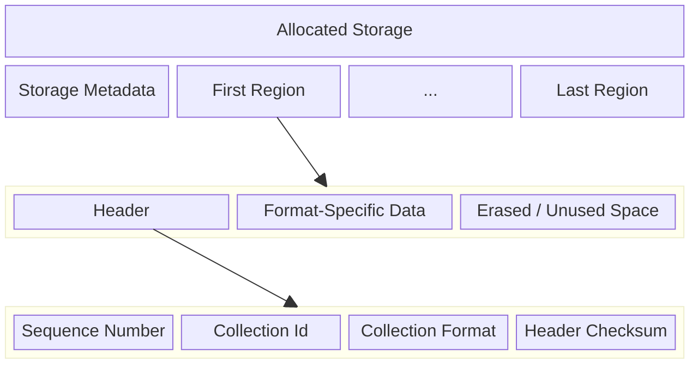

# Chapter 5: Region And Disk Format

This chapter defines the physical storage layout after the logical model
is established: static metadata, region headers, committed payload
areas, private free-space collection metadata regions, and private
log-region prologues.

Mechanism review:

- **Purpose**: define the bytes that survive reset and make independent
  implementations agree on the same media image.
- **State**: storage metadata, region header sequence and ownership,
  user payload area, free-space collection metadata, and private
  log-region prologue.
- **Named operations**: `FormatStorage`, `CommitCollectionRegion`,
  `RotateWalTail`, `FreeRegion`, and `OpenStorage` all depend on these
  physical layouts.
- **Durable edge sequence**: physical structures are written and synced
  by the durable edges named in the state-machine chapter.
- **Replay effect**: startup trusts locally valid checksums at the layer
  defined by this spec and reconstructs higher-level state from WAL
  records and region metadata.
- **Crash cuts**: incomplete physical writes are detected by checksum or
  erased-state rules and are interpreted only through the corresponding
  recovery procedure.

## Storage Structure

Storage starts with a static metadata region that describes the
version and configuration parameters that cannot change after
initialization.

The rest of the database is made up of regions. Each written region has
a header followed by region-format-specific data. The header describes
the region's sequence number, collection id, collection format, and a
checksum over the header itself.

The sequence number is a monotonically increasing value assigned each
time a new region is written. This lets startup identify the newest WAL
region and order physical region writes. Logical collection heads are
recovered from WAL `head(...)` records rather than by choosing the
newest region for a collection. During startup region scanning,
Borromean records `max_seen_sequence`, the largest `sequence` value
found in any valid region header. Each newly allocated region, whether
for a user collection or for a newly initialized private log region, must use
`sequence = max_seen_sequence + 1`, after which that new value becomes
the new `max_seen_sequence` in memory. Crashes or abandoned allocations
may leave gaps in the observed sequence values, but the values used by
successful later region writes must remain strictly monotonic.

The collection format defines how user data is encoded in the user
data section. For user collections, the meaning of non-log
`collection_format` values is owned by the corresponding
`collection_type` implementation rather than by Borromean core. This
spec reserves three canonical core-defined format identifiers for
private storage regions: `main_wal_v2` for the ordinary WAL,
`transaction_log_v2` for transaction-log chains, and `free_space_v2` for
materialized free-space collection state. No user collection may use any
of those identifiers. Storing the format in each region still allows
per-collection format evolution over time.

Free regions are defined by membership in the storage-private
free-space collection, not by bytes stored in the free region itself. A
free region may still contain stale header and payload bytes from its
prior use. Those bytes are ignored while the region is named by the
free-space collection. Allocator links and queue cursors live only in
WAL records, private log prologues, and `free_space_v2` metadata
regions. A free region can be erased by explicit erase maintenance
before the ready-boundary advance is published; after that publication
the region is ready for allocation.

Deployment sizing guideline: choose `region_size` so the fixed
per-region header plus the largest private prologue used by a configured
format leaves useful payload. Private log regions carry
`LogRegionPrologue`, and free-space metadata regions carry
`FreeSpaceRegionPrologue`, so practical deployments need slack beyond
the user collection payload alone. This is guidance only, not a validity
rule.

A main WAL region is a region whose valid header has
`collection_id = 0` and `collection_format = main_wal_v2`. A
transaction-log region is a region whose valid header has
`collection_id = 0` and `collection_format = transaction_log_v2`. A
free-space metadata region is a region whose valid header has
`collection_id = 0` and `collection_format = free_space_v2`.

## Storage Requirements

1. `RING-STORAGE-001` Storage MUST begin with a static metadata region
that records version and configuration parameters that do not change
after initialization.
2. `RING-STORAGE-002` Every region header MUST record the region
`sequence`, `collection_id`, `collection_format`, and a checksum over
the header itself.
3. `RING-STORAGE-003` Each newly allocated region, whether for a user
collection or a newly initialized private log region, MUST use
`sequence = max_seen_sequence + 1`, after which that value becomes the
new in-memory `max_seen_sequence`.
4. `RING-STORAGE-004` Successful later region writes MUST preserve a
strictly monotonic `sequence` ordering even if crashes or abandoned
allocations leave gaps.
5. `RING-STORAGE-005` Borromean core MUST reserve the canonical
`collection_format` values `main_wal_v2`, `transaction_log_v2`, and
`free_space_v2` for private storage regions, and user collections MUST
NOT use any of those identifiers.
6. `RING-STORAGE-006` A free region MUST be defined by membership in
the storage-private free-space collection rather than by a distinct
on-disk header encoding or by allocator links stored in that free
region.
7. `RING-STORAGE-007` Allocator queue links and cursor state MUST NOT
be stored in freed data regions; they MUST be stored in WAL records,
private log prologues, or `free_space_v2` metadata regions.
8. `RING-STORAGE-008` A dirty free-space entry MUST NOT enter the ready
range until the named region has been erased and the corresponding
`erase_free_region_span` record or equivalent materialized state is
durable.
9. `RING-STORAGE-009` A main WAL region MUST have `collection_id = 0`
and `collection_format = main_wal_v2`; a transaction-log region MUST
have `collection_id = 0` and
`collection_format = transaction_log_v2`; a free-space metadata region
MUST have `collection_id = 0` and
`collection_format = free_space_v2`.
10. `RING-STORAGE-010` The metadata region MUST occupy exactly one
`region_size` span at storage offset `0`, MUST NOT be counted in
`region_count`, and data region `0` MUST begin immediately after that
metadata region.

## Canonical On-Disk Encoding

Borromean defines one canonical byte-level encoding so independently
written implementations can interoperate on the same media image.

1. `RING-DISK-001` All fixed-width integer fields in `StorageMetadata`,
`Header`, `LogRegionPrologue`, `FreeSpaceRegionPrologue`,
`FreeQueuePosition`, `FreeSpaceEntry`, and logical WAL records MUST be
encoded little-endian.
2. `RING-DISK-002` The canonical scalar widths are:
`region_index: u32`, `region_size: u32`, `region_count: u32`,
`min_free_regions: u32`, `transaction_log_count: u32`,
`transaction_log_id: u32`, `offset: u32`,
`wal_write_granule: u32`, `collection_id: u64`, `sequence: u64`,
`free_queue_position: u64`, `free_space_entry_count: u32`,
`observed_collection_generation: u64`,
`payload_len: u32`, `collection_type: u16`,
`collection_format: u16`, `erased_byte: u8`, and
`wal_record_magic: u8`.
3. `RING-DISK-003` `collection_type` is a stable global `u16`
namespace recorded durably in WAL records. Borromean core reserves
`0x0000` for `main_wal_v2`, `0x0001` for `channel`,
`0x0002` for `map`, `0x0003` for `free_space_v2`,
`0x0004..0x00ff` for future core-defined collection types,
`0x0100..0x7fff` for public extension collection types, and
`0x8000..0xffff` for private deployment-local collection types that are
not required to interoperate across deployments.
4. `RING-DISK-004` `collection_format` is a stable per-region `u16`
namespace recorded durably in region headers. The pair
`(collection_type, collection_format)` identifies a concrete committed
region payload encoding for user collections. Borromean core reserves
`collection_format = 0x0000` globally for `main_wal_v2`,
`collection_format = 0x0001` globally for `transaction_log_v2`, and
`collection_format = 0x0002` globally for `free_space_v2`; every
user-collection format MUST be none of those values. For any
user-collection type, `0x0003..0x7fff` are stable public format
identifiers and `0x8000..0xffff` are private deployment-local format
identifiers.
5. `RING-DISK-005` Optional region indexes carried inside logical WAL
records MUST be encoded as `OptRegionIndex`, a one-byte tag followed,
when the tag is `1`, by a `u32 region_index`. Tag `0` means `none`;
any other tag value is corruption.
6. `RING-DISK-006` `metadata_checksum`, `header_checksum`,
`prologue_checksum`, and `record_checksum` MUST all use the standard
CRC-32C (Castagnoli) parameters (`poly = 0x1edc6f41`,
`init = 0xffffffff`, `refin = true`, `refout = true`,
`xorout = 0xffffffff`) and MUST be stored little-endian.
7. `RING-DISK-007` Unless a structure explicitly says otherwise, the
checksum for that structure MUST cover the exact logical bytes of every
earlier field in that structure, in on-disk order, and MUST exclude the
checksum field itself and any later padding.
8. `RING-DISK-008` Struct-like layouts in this specification are exact
byte sequences with no implicit padding; the field order shown is the
on-disk order.

For main WAL and transaction-log regions, the user-data area begins
with a fixed `LogRegionPrologue`. That prologue records the head of
the corresponding log chain and the allocator cursors that were current
when the log segment was initialized. WAL records do not begin
immediately after the region `Header`; they begin at the first
`wal_write_granule`-aligned byte after the end of the
`LogRegionPrologue`.



## Storage Metadata

```rust
struct StorageMetadata {
  storage_version: u32,
  region_size: u32,
  region_count: u32,
  min_free_regions: u32,
  transaction_log_count: u32,
  wal_write_granule: u32,
  erased_byte: u8,
  wal_record_magic: u8,
  metadata_checksum: u32,
}
```

The `StorageMetadata` struct describes the version of the storage as
well as the size of each region in bytes, the number of regions in the
database, the configured `min_free_regions` reserve, the configured
number of transaction logs, the erased-flash byte value, the minimum
writable granule used to align WAL records, and the WAL record magic
byte. The stored `wal_record_magic` must differ from `erased_byte`.

1. `RING-META-001` The canonical on-disk `storage_version` defined by
this specification MUST be `2`.
2. `RING-META-002` `StorageMetadata` MUST be encoded as the exact byte
sequence of the fields shown above, in that order, with no implicit
padding.
3. `RING-META-003` `metadata_checksum` MUST be CRC-32C over every
earlier `StorageMetadata` field in on-disk order.
4. `RING-META-004` Startup MUST reject the store if
`metadata_checksum` is invalid or if `storage_version` is unsupported.
5. `RING-META-005` Any bytes in the metadata region after the encoded
`StorageMetadata` are reserved, MUST be left erased by formatting, and
MUST be ignored on read.
6. `RING-META-006` `transaction_log_count` MUST be at least `1`.
7. `RING-META-007` Opening MUST reject media whose
`transaction_log_count` does not equal the configured transaction slot
count for this implementation.

## Header

```rust
struct Header {
  sequence: u64,
  collection_id: u64,
  collection_format: u16,
  header_checksum: u32,
}
```

The `Header` is the first data in the region.

The `sequence` field is a monotonic value that is used to find the
newest header when the database is opened.

The `collection_id` defines which collection this region belongs to,
and is a stable 64-bit nonce, not a small reusable counter. The
`collection_format` defines the per-region encoding format for replay
and read semantics. For user collections, non-WAL
`collection_format` values are defined by the corresponding
`collection_type` implementation rather than by Borromean core, and may
evolve across regions over time without changing the collection's
stable `collection_type`. Borromean core reserves canonical format
identifiers `main_wal_v2`, `transaction_log_v2`, and `free_space_v2`
for private storage formats.

The `header_checksum` validates header integrity.

1. `RING-HEADER-001` `Header` MUST be encoded as the exact byte
sequence of the fields shown above, in that order, with no implicit
padding.
2. `RING-HEADER-002` `header_checksum` MUST be CRC-32C over `sequence`,
`collection_id`, and `collection_format` in on-disk order.

## Free-Space Collection Regions

```rust
struct FreeQueuePosition {
  queue_index: u64,
}

struct FreeSpaceRegionPrologue {
  allocation_head: FreeQueuePosition,
  ready_boundary: FreeQueuePosition,
  append_tail: FreeQueuePosition,
  first_queue_position: FreeQueuePosition,
  next_metadata_region: OptRegionIndex,
  entry_count: u32,
  entries_checksum: u32,
  prologue_checksum: u32,
}

struct FreeSpaceEntry {
  region_index: u32,
}
```

`FreeQueuePosition` is a logical monotonic FIFO position. The next
queue position after position `p` is `p + 1`; positions do not name
physical metadata regions or entry slots.

`FreeSpaceRegionPrologue` is present only in `free_space_v2` metadata
regions. Its three queue positions checkpoint the allocator cursors for
the materialized free-space collection state represented by that
metadata chain. `first_queue_position` is the logical queue position of
this metadata region's first `FreeSpaceEntry`; subsequent initialized
entries occupy consecutive positions. `next_metadata_region` links one
free-space metadata region to the next metadata region; it never links
through a freed data region. In a materialized free-space basis, the
chain rooted by the retained free-space `head` record, or by the
initial formatted root before any retained free-space basis exists,
contains exactly the logical positions
`[allocation_head, append_tail)`. Entries in
`[allocation_head, ready_boundary)` are ready; entries in
`[ready_boundary, append_tail)` are dirty. `entry_count` names how many
`FreeSpaceEntry` values in this metadata region are initialized.
`entries_checksum` validates those entries. `FreeSpaceEntry` stores the
physical region index for one free-space FIFO entry.

1. `RING-FREE-001` `FreeQueuePosition` MUST be encoded as the exact byte
sequence of the fields shown above, in that order, with no implicit
padding.
2. `RING-FREE-002` `FreeSpaceRegionPrologue` MUST be encoded as the
exact byte sequence of the fields shown above, in that order, with no
implicit padding.
3. `RING-FREE-003` `FreeSpaceEntry` MUST be encoded as the exact byte
sequence of the fields shown above, in that order, with no implicit
padding.
4. `RING-FREE-004` `prologue_checksum` MUST be CRC-32C over
`allocation_head`, `ready_boundary`, `append_tail`,
`first_queue_position`, `next_metadata_region`, `entry_count`, and
`entries_checksum` in on-disk order.
5. `RING-FREE-005` The cursor invariant
`allocation_head <= ready_boundary <= append_tail` MUST hold in the
logical free-space collection order.
6. `RING-FREE-006` Every `FreeSpaceEntry.region_index` and every
present `next_metadata_region` MUST name a region index strictly less
than `region_count`.
7. `RING-FREE-007` A free-space metadata link MUST point only to a
region with a valid `Header` whose `collection_id = 0` and
`collection_format = free_space_v2`.
8. `RING-FREE-008` `entry_count` MUST be less than or equal to the
number of `FreeSpaceEntry` values that fit after
`FreeSpaceRegionPrologue` in the region's format-specific data area.
9. `RING-FREE-009` `entries_checksum` MUST be CRC-32C over the exact
encoded bytes of the first `entry_count` `FreeSpaceEntry` values in
that metadata region. Bytes after those entries are reserved and MUST
be ignored by replay.
10. `RING-FREE-010` A materialized free-space basis MUST cover exactly
the logical positions `[allocation_head, append_tail)`. The first
metadata region's `first_queue_position` MUST equal `allocation_head`,
and each following metadata region's `first_queue_position` MUST equal
the previous region's `first_queue_position + entry_count`.

## Log Region Prologue

```rust
struct LogRegionPrologue {
  log_head_region_index: u32,
  allocation_head: FreeQueuePosition,
  ready_boundary: FreeQueuePosition,
  append_tail: FreeQueuePosition,
  prologue_checksum: u32,
}
```

`LogRegionPrologue` is present only in private storage log regions:
main WAL regions whose valid header has `collection_id = 0` and
`collection_format = main_wal_v2`, and transaction-log regions whose
valid header has `collection_id = 0` and
`collection_format = transaction_log_v2`. It occupies the first bytes
of the region user-data area immediately after the region `Header`.

`log_head_region_index` is the durable head of the log chain that was
current when that log segment was initialized. For a main WAL region it
names the main WAL head; for a transaction-log region it names that
transaction log's head. It must name a region index strictly less than
`region_count`. If startup finishes an incomplete log rotation by
initializing a missing/corrupt target region, it must write the same
already-determined log head into this field rather than choosing a new
value during recovery.

`allocation_head`, `ready_boundary`, and `append_tail` checkpoint the
free-space collection cursors that were current when the log segment
was initialized. The checkpoint is not a complete free-space basis
because it does not carry queue entries. Replay uses it to validate the
retained free-space basis and later complete free-space collection
commands. A torn or truncated allocator command after the checkpoint
does not advance the recovered cursors.

`prologue_checksum` validates the logical prologue contents. It covers
`log_head_region_index`, `allocation_head`, `ready_boundary`, and
`append_tail` in the same byte order used on disk.

1. `RING-PROLOGUE-001` `LogRegionPrologue` MUST be encoded as the exact
byte sequence of the fields shown above, in that order, with no
implicit padding.
2. `RING-PROLOGUE-002` `prologue_checksum` MUST be CRC-32C over
`log_head_region_index`, `allocation_head`, `ready_boundary`, and
`append_tail`.
3. `RING-PROLOGUE-003` `log_head_region_index` MUST be strictly less
than `region_count`.
4. `RING-PROLOGUE-004` The checkpointed free-space cursors MUST satisfy
`allocation_head <= ready_boundary <= append_tail` in logical
free-space collection order.

Let `wal_record_area_offset` be the first offset within a private log region
that is both greater than or equal to the end of `Header` plus
`LogRegionPrologue`, and aligned to `wal_write_granule`.
Replay scans candidate WAL record starts only at aligned offsets
greater than or equal to `wal_record_area_offset`, and new WAL appends
must begin at such offsets as well.

## Transaction Log Segment Layout

`transaction_log_v2` is experimental until implemented. The normative
layout in this section replaces any earlier prototype layout using a
plain WAL-record stream for transaction-log allocation recovery.

A transaction-log region begins with the same `Header` and
`LogRegionPrologue` as other private log regions. After that prologue,
the transaction-log segment is split into two logical areas:

```text
TransactionLogSegment =
  Header
  LogRegionPrologue
  allocation_entries:[TransactionAllocationEntry]
  [TransactionSegmentSeal if this is not the final segment]
  private_suffix:[TransactionPrivateSuffixEntry]
  erased_tail
```

The allocation-entry area starts at `wal_record_area_offset`. It grows
upward in aligned `wal_write_granule` slots. Every transaction
allocation writes one `TransactionAllocationEntry` and syncs it before
the recovered allocator state may advance. Transaction-private
collection data and free intents are not written incrementally; they
are buffered until a segment is sealed or the transaction commits.

```rust
struct TransactionAllocationEntry {
  region_index: u32,
  allocation_head_after: FreeQueuePosition,
  purpose: u8,
  entry_checksum: u32,
}

enum TransactionAllocationPurpose {
  data_region = 0x01,
  transaction_segment = 0x02,
}
```

`entry_checksum` is CRC-32C over `region_index`,
`allocation_head_after`, and `purpose` in canonical disk byte order.
The encoded entry is padded to `wal_write_granule`; padding bytes are
reserved and ignored after checksum validation. The entries form a
contiguous valid prefix. At startup, a checksum-invalid or torn entry at
the next aligned allocation slot ends the durable allocation prefix for
that open transaction segment; any later non-erased allocation entry in
the same prefix area is corruption.

When a transaction needs to continue in another segment, the current
segment must first be sealed with a transaction-segment seal:

```rust
struct TransactionSegmentSeal {
  next_region_index: u32,
  expected_sequence: u64,
  free_intent_start: u32,
  segment_end: u32,
  seal_checksum: u32,
}
```

`next_region_index` and `expected_sequence` identify the next
transaction-log segment. `free_intent_start` is the first byte of the
sealed private suffix in this segment, and `segment_end` is the first
byte after that suffix. `seal_checksum` is CRC-32C over the prior
fields. The seal is written and synced before any allocation entry or
private suffix byte in the next transaction-log segment may become
durable. A sealed non-final segment remains transaction-private; the
seal only makes its private suffix eligible for import if a later
main-WAL `commit_transaction` imports the transaction.

The final transaction-log segment has no `TransactionSegmentSeal`.
Instead, the main-WAL `commit_transaction` record supplies that final
segment's `free_intent_start` and `segment_end`.

The private suffix is a typed stream. Its bytes are ignored unless the
segment is sealed by a `TransactionSegmentSeal` or, for the final
segment, by the matching `commit_transaction` record. Implementations
may pack suffix entries without `wal_write_granule` alignment.

```rust
struct TransactionPrivateSuffixEntry {
  suffix_type: u8,
  collection_id: u64,
  payload_len: u32,
  payload: [u8; payload_len],
  entry_checksum: u32,
}
```

`suffix_type` identifies an enrolled-collection marker, a private
collection record, or a `free_intent`. `entry_checksum` is CRC-32C over
the entry through the payload. The suffix stream is self-delimiting
from `free_intent_start` to `segment_end`; replay rejects malformed,
truncated, or checksum-invalid entries inside a sealed suffix.

1. `RING-TXLOG-SEG-001` A `transaction_log_v2` segment MUST use the
allocation-entry and private-suffix layout in this section; a
transaction-log region that uses the old plain-WAL-record prototype
layout is unsupported experimental media.
2. `RING-TXLOG-SEG-002` Every transaction allocation MUST write and
sync exactly one valid `TransactionAllocationEntry` before advancing
the recovered free-space `allocation_head`.
3. `RING-TXLOG-SEG-003` A transaction allocation entry with
`purpose = data_region` is transaction-owned until
`commit_transaction` publishes it as collection-owned or rollback
cleanup frees it.
4. `RING-TXLOG-SEG-004` A transaction allocation entry with
`purpose = transaction_segment` keeps a transaction-log segment
reachable until `transaction_finished` releases the retained
transaction-log range.
5. `RING-TXLOG-SEG-005` Private suffix bytes MUST NOT be replay-visible
unless their segment is sealed by a valid `TransactionSegmentSeal` or,
for the final segment, by the matching main-WAL `commit_transaction`
record.
6. `RING-TXLOG-SEG-006` A transaction-log implementation MUST reserve
enough unwritten space in the current segment for all buffered private
suffix entries plus either a `TransactionSegmentSeal` or the final
commit seal before it appends another allocation entry.
