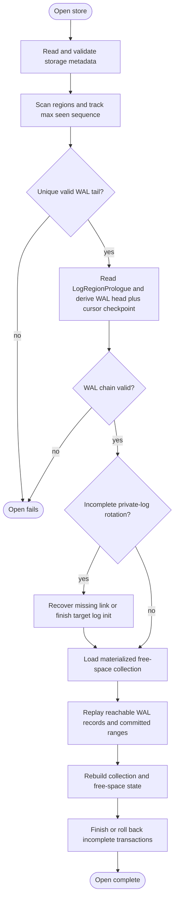

# Chapter 6: Startup And Replay

This chapter describes `Opening(OpenMode)`: scan media, recover any
incomplete private-log rotation, replay retained WAL records through
the shared state-machine rules, validate live collection data, and
finish pending recovery work.

Mechanism review:

- **Purpose**: turn durable media into stable runtime state without
  inventing recovery-specific collection or allocator semantics.
- **State**: scanned region headers, WAL chains, free-space collection
  cursors, pending WAL-recovery boundary, transaction recovery state,
  and live collection validation state.
- **Named operations**: `OpenStorage` orchestrates replay and may invoke
  recovery sub-operations such as `RotateWalTail` completion,
  transaction recovery, inline transaction recovery, and erase
  maintenance.
- **Durable edge sequence**: normal replay is read-only; recovery writes
  only the edges required to finish an incomplete rotation, close a WAL
  recovery boundary, close incomplete transaction work, or re-publish
  idempotent allocator cleanup.
- **Replay effect**: retained WAL records are applied by the same
  `ApplyWalRecord` table used by foreground operation.
- **Crash cuts**: opening can be retried after reset because every
  recovery write either preserves the previous replay result or moves to
  another replayable prefix.

## Startup Replay Algorithm

Startup recovery is the concrete `Opening(OpenMode)` procedure. It
reconstructs stable runtime state by scanning durable media, walking the
private log chains, and applying each retained WAL record through
`ApplyWalRecord`. The detailed steps below define validation,
discovery, and recovery behavior that surrounds those shared per-record
transitions.

Startup recovery reconstructs these things:

1. `RING-STARTUP-RESULT-001` Durable collection states: live heads,
   retained WAL snapshots, pending post-basis updates, and dropped
   tombstones.
2. `RING-STARTUP-RESULT-002` In-memory working state for collections
   with committed updates that must be materialized at open.
3. `RING-STARTUP-RESULT-003` Free-space collection state:
   `allocation_head`, `ready_boundary`, `append_tail`, and the FIFO
   entries reachable from the materialized `free_space_v2` metadata
   regions plus retained WAL commands.
4. `RING-STARTUP-RESULT-004` Any storage-core private allocation
   reservation, if a private-log rotation allocation was durable but not
   yet consumed by `link`.
5. `RING-STARTUP-RESULT-005` Runtime `max_seen_sequence`, initially the
   largest `sequence` observed in any valid region header during region
   scan, then advanced if startup recovery initializes an incomplete
   private-log rotation.
6. `RING-STARTUP-RESULT-006` Transaction-log cursors,
   live-prefix boundaries, active transaction descriptors, inline
   transaction descriptors, and incomplete recovery work.
7. `RING-STARTUP-RESULT-007` Transaction terminal records written
   during recovery, if recovery needed to close an incomplete full or
   inline transaction range.

Algorithm:

1. `RING-STARTUP-001` Read `StorageMetadata`, validate
`metadata_checksum`, and validate static geometry (`region_size`,
`region_count`, `min_free_regions`, `erased_byte`,
`wal_write_granule`, `wal_record_magic`, and storage version support).
2. `RING-STARTUP-002` Scan all regions, collect candidate main WAL
regions (`collection_id == 0` plus `collection_format = main_wal_v2`),
candidate transaction-log regions (`collection_id == 0` plus
`collection_format = transaction_log_v2`), and candidate free-space
metadata regions (`collection_id == 0` plus
`collection_format = free_space_v2`) with valid headers. Track
`max_seen_sequence` as the largest `sequence` value seen in any valid
region header.
3. `RING-STARTUP-003` Select the main WAL tail as the unique candidate
main WAL region with the largest valid sequence. If no candidate main
WAL region exists, or if multiple candidate main WAL regions share that
largest valid sequence, return an error. For each configured
transaction log, recover its chain only when a retained main-WAL
transaction-control record references it or when a live transaction
descriptor requires it.
4. `RING-STARTUP-004` Read and validate the `LogRegionPrologue` stored
at the start of the main WAL tail region's user-data area. Use its
`log_head_region_index` as the initial WAL-head candidate and its
free-space cursor checkpoint as the allocator baseline for this WAL
chain. Then scan that tail region using the aligned candidate-start and
record-validation rules defined below, and let the last valid
`head(collection_id = 0, collection_type = wal, region_index)` record
override the head candidate.
5. `RING-STARTUP-005` Walk the WAL region chain from the resulting WAL
head to tail using `link` records. If a `link` is missing or invalid
before reaching the known tail, return an error.

   If the known tail contains a trailing `link(next_region_index,
   expected_sequence)` whose target header is missing, corrupt, or has
   the wrong sequence, treat this as an incomplete rotation after
   `link`.

   If instead the known tail's last valid record is the storage-core
   `allocate_region(next_region_index, allocation_head_after)` whose
   aligned end offset leaves at least `wal_link_reserve` and fewer than
   `wal_rotation_reserve` unwritten bytes in that region, treat this as
   an incomplete rotation before `link`. That reserve-window placement
   is what makes the durable allocation unambiguously the
   WAL-rotation-start record.

   For incomplete rotation recovery: if a durable trailing `link` is
   already present, use that `expected_sequence`; otherwise let
   `expected_sequence = max_seen_sequence + 1`, append and sync the
   missing `link(next_region_index, expected_sequence)` into the
   reserved tail space, and treat any failure of that recovery append as
   a startup error.

   Then finish initializing the target private log region: erase target
   region if needed, write a valid header with `collection_id = 0`,
   the appropriate private log `collection_format`, and
   `sequence = expected_sequence`, then write a valid
   `LogRegionPrologue` whose `log_head_region_index` equals the already
   determined head for that log chain and whose free-space cursor fields
   equal the current recovered allocator cursors. Sync the initialized
   target region, set `max_seen_sequence = expected_sequence`, and use
   the target region as the active append tail. If this recovery init
   fails, startup fails with error.

   Transaction-log chain traversal uses the same `link`,
   `LogRegionPrologue`, and incomplete-rotation recovery rules for each
   referenced transaction log, except initialized target regions use
   `collection_format = transaction_log_v2`.
6. `RING-STARTUP-006` Initialize the free-space collection from the
materialized `free_space_v2` metadata region chain named by the
effective log prologue checkpoint. Validate each
`FreeSpaceRegionPrologue`, each `FreeSpaceEntry`, and the cursor
invariant `allocation_head <= ready_boundary <= append_tail`. The
materialized queue supplies the initial FIFO entries and cursor
positions; later retained WAL allocator commands update that state.
7. `RING-STARTUP-007` Parse records in WAL order: region order, then
offset order. Record parsing begins only at offsets aligned to
`wal_write_granule` and greater than or equal to
`wal_record_area_offset` within each private log region. Maintain a
replay-local `pending_wal_recovery_boundary`, initially clear.

   If an aligned candidate start byte equals `erased_byte`, treat that
   slot as currently unwritten and stop scanning that private log
   region. If the aligned start byte equals `wal_record_magic`, parse
   the record. If parsing or checksum validation fails, treat that
   aligned slot as corrupt/torn WAL bytes, set
   `pending_wal_recovery_boundary`, and keep scanning forward in aligned
   `wal_write_granule` steps. If the aligned start byte is neither
   `erased_byte` nor `wal_record_magic`, use the same corrupt/torn
   handling. If a later valid record is found while the boundary is set,
   that record must be `wal_recovery`; otherwise return an error. At
   the end of each reachable non-tail private log region, the boundary
   must be clear. After scanning the tail region, recover the append
   point as the first aligned slot whose first byte is `erased_byte`
   after the last valid replayed tail record.
8. `RING-STARTUP-008` Maintain replay state:
per collection optional live `collection_type`, explicit collection
state, `basis_pos`, `pending_updates`, and committed state generation;
free-space collection queue and cursors; optional storage-core private
allocation reservation; transaction-log cursors and live-prefix
boundaries; full and inline transaction descriptors; and the replay
local WAL-recovery boundary.
9. `RING-STARTUP-009` On
`new_collection(collection_id, collection_type)`: if `collection_id` is
already tracked, return an error. Otherwise create replay state for
that collection with durable basis `EmptyClean`, set tracked
`collection_type` from the record, set `basis_pos` to this record's WAL
position, and start with no pending updates.
10. `RING-STARTUP-010` On `update(collection_id)`: if `collection_id`
is not tracked or is tracked as `Dropped`, return an error. Otherwise
append to `pending_updates` for that collection.
11. `RING-STARTUP-011` On
`snapshot(collection_id, collection_type)`: if `collection_id` is not
tracked, create replay state because older basis records may have been
reclaimed and set tracked `collection_type` from this record. If the
collection is dropped or this record's type conflicts with the tracked
type, return an error. Set collection state to `WALSnapshotClean`, set
`basis_pos`, and clear older pending updates for that collection.
12. `RING-STARTUP-012` On
`free_region(region_index, append_tail_after)`: verify that
`region_index` is detached from live reachability, is not already in the
free-space collection, and that `append_tail_after` is the next queue
position after the current `append_tail`. Append the entry to the dirty
range and set `append_tail = append_tail_after`.
13. `RING-STARTUP-013` On
`erase_free_region_span(count, ready_boundary_after)`: verify that the
dirty range has at least `count` entries and that
`ready_boundary_after` is reached by advancing from the current
`ready_boundary` by `count` entries. Treat the corresponding entries as
ready and set `ready_boundary = ready_boundary_after`.
14. `RING-STARTUP-014` On
`allocate_region(region_index, allocation_head_after)`: verify that the
ready range is non-empty, the current `allocation_head` entry names
`region_index`, and `allocation_head_after` is the next queue position.
Set `allocation_head = allocation_head_after`. If the command is in a
committed full transaction or committed inline transaction, apply the
pop at the commit replay position. If it is in an uncommitted range,
scan it only for cleanup. If it is a privileged storage-core command,
record the private allocation reservation until the matching private-log
consumer appears.
15. `RING-STARTUP-015` Transaction-log records are not applied by
ordinary log-chain traversal. Startup scans a transaction-log range only
when a retained main-WAL `commit_transaction`, `rollback_transaction`,
`transaction_finished`, or active recovery descriptor references that
range. Records inside an imported committed range are applied at the
main-WAL commit record's replay position. Records inside an uncommitted
rollback range are scanned only for cleanup and recovery effects and do
not become visible collection or allocator state.
16. `RING-STARTUP-016` Inline transaction body records are validated
when encountered in the main WAL but ignored until the matching
`commit_inline_transaction` is durable. If replay reaches WAL end with a
bounded inline transaction that has no commit, startup runs idempotent
cleanup for any transaction-owned allocations in that bounded range and
may append `rollback_inline_transaction(record_count)`.
17. `RING-STARTUP-017` On
`commit_inline_transaction(record_count)`: verify that it closes the
current bounded inline transaction, then apply the body records
atomically at this commit position. Advance committed state generation
for any affected collection and apply allocator pops, frees, and erase
publishes in body order.
18. `RING-STARTUP-018` On
`rollback_inline_transaction(record_count)`: verify that it closes a
known uncommitted inline range and do not apply the body records.
19. `RING-STARTUP-019` On
`head(collection_id, collection_type, region_index)`: if
`collection_id = 0`, this is a WAL-head control record. Its replay
effect was already consumed while determining the WAL-head candidate
from the tail region. If `collection_type != wal`, return an error;
otherwise ignore this record during the main per-record replay pass.

   For user collections, create replay state if older records may have
   been reclaimed, validate type consistency, reject dropped
   collections, validate that the target region header names the same
   collection id, set collection state to `RegionClean`, set
   `basis_pos`, and clear older WAL updates/snapshots for that
   collection.
20. `RING-STARTUP-020` On
`link(next_region_index, expected_sequence)`: preserve private-log
reachability. If `next_region_index` matches the current storage-core
private allocation reservation, consume that reservation; otherwise the
link may refer to a retained log region whose historical allocation
command was already represented by a checkpoint or reclaimed record.
21. `RING-STARTUP-021` On `drop_collection(collection_id)`: if the
collection is not tracked, create dropped replay state because older
records may already have been reclaimed. If it is already dropped,
return an error. Otherwise set state to `Dropped`, set `basis_pos`, and
clear pending updates for that collection.
22. `RING-STARTUP-022` On
`begin_transaction(transaction_log_id, start)`: create an active full
transaction descriptor for `transaction_log_id` at `start`. If that
transaction log already has an open descriptor, return an error.
23. `RING-STARTUP-023` On
`commit_transaction(transaction_log_id, range)`: verify that the id and
range match an active descriptor or a recoverable committed range. Scan
the transaction-log range; if any record inside the range is torn,
malformed, or invalid, return an error. Apply the range's enrolled
collection mutations and allocator commands at this main-WAL commit
position, advance committed generation for every enrolled collection,
and record that committed cleanup may still be required until a
matching `transaction_finished` is retained.
24. `RING-STARTUP-024` On
`add_transaction_collection(collection_id, observed_generation)` while
importing a committed range: record the collection as enrolled in the
imported transaction range. The stored generation is not rechecked
during recovery because the retained main-WAL commit record is durable
evidence that foreground conflict checking succeeded before commit.
25. `RING-STARTUP-025` On
`rollback_transaction(transaction_log_id, range)`: scan the referenced
range for transaction-owned allocations and cleanup effects, confirm
rollback recovery has made those effects non-visible and reclaimable,
and do not apply collection mutations or allocator pops from the range.
26. `RING-STARTUP-026` On `wal_recovery()`: if
`pending_wal_recovery_boundary` is clear, return an error. Otherwise
clear the boundary.
27. `RING-STARTUP-027` If replay reaches WAL end with an active full
transaction descriptor and no durable `commit_transaction`, run
idempotent rollback recovery for that transaction-log range. Any region
popped by `allocate_region` in the uncommitted range returns to the
dirty range, because it may have been written before the crash. Append
`rollback_transaction(transaction_log_id, range)` after cleanup.
28. `RING-STARTUP-028` If replay reaches WAL end after
`commit_transaction(transaction_log_id, range)` but before
`transaction_finished(transaction_log_id, range)`, preserve the imported
collection and allocator state, finish cleanup frees derived from the
committed range, and append `transaction_finished(transaction_log_id,
range)`.
29. `RING-STARTUP-029` Startup replay MUST NOT silently apply an
uncommitted transaction-log range or inline transaction range that lacks
a retained commit marker.
30. `RING-STARTUP-030` After replay and transaction recovery, for each
collection: reconstruct its durable basis from the collection state. If
the state is empty or WAL-snapshot based and has post-basis updates,
materialize mutable RAM state and apply those updates in WAL order. If
the state is committed-region based, the basis may remain in place
until a read or mutation needs to materialize it. Dropped collections do
not reconstruct mutable state and do not accept later mutations.
31. `RING-STARTUP-031` After replay and recovery, validate that
`allocation_head <= ready_boundary <= append_tail`, that the ready range
has enough entries to satisfy the ready-region reserve, and that no live
collection, private log chain, or private allocation reservation names a
region that is also present in the free-space collection.
32. `RING-STARTUP-032` Keep `max_seen_sequence` as the runtime source
of the next region sequence. The next newly initialized region must use
`max_seen_sequence + 1` as its header `sequence`, then update
`max_seen_sequence` in memory to that new value.
33. `RING-STARTUP-033` If replay encountered a torn or
checksum-invalid tail record, retain all state recovered from earlier
complete records. The WAL head is unchanged. Replay may still recover
and apply later valid tail records that begin after the torn bytes, but
the first such later valid record must be `wal_recovery`. The recovered
append point is the first aligned slot whose first byte is
`erased_byte` after the last valid replayed tail record.
34. `RING-STARTUP-034` If replay yields a live collection whose
`collection_type` is unsupported by the implementation, startup MUST
fail before transaction cleanup frees any region based on collection
reachability.
35. `RING-STARTUP-035` If replay yields a live collection with
unsupported or invalid retained collection data under that collection's
normative specification, startup MUST fail before open succeeds and
before transaction cleanup frees any region based on collection
reachability.
36. `RING-STARTUP-036` A dropped tombstone whose old
`collection_type` is unsupported MAY remain as inert metadata and does
not by itself require startup failure.

## Startup Replay Implementation Requirements

These requirements cover implemented startup replay edge cases and
validation helpers.

1. `RING-IMPL-REGRESSION-046` Startup tail selection MUST ignore
   regions with nonzero collection id even when their format is a
   private log format while still tracking max seen sequence.
2. `RING-IMPL-REGRESSION-047` Startup replay MUST preserve transaction
   recovery state when a WAL head-control record is replayed.
3. `RING-IMPL-REGRESSION-048` Startup replay MUST preserve transaction
   recovery state when non-map collection head and drop records are
   replayed.
4. `RING-IMPL-REGRESSION-049` Startup replay MUST count multiple live
   collections independently.
5. `RING-IMPL-REGRESSION-050` Startup replay MUST accept a
   committed-region head basis and recover the collection basis,
   collection type, and max seen sequence from that region.
6. `RING-IMPL-REGRESSION-051` Startup replay MUST accept a replaced
   historical head and recover the live replacement head with no
   incomplete transaction work.
7. `RING-IMPL-REGRESSION-052` Startup replay MUST track pending updates
   on an empty collection basis and preserve their count.
8. `RING-IMPL-REGRESSION-053` Startup replay MUST reject update records
   that appear after a collection drop tombstone for the same
   collection.
9. `RING-IMPL-REGRESSION-054` Strict private-log region reads MUST
   reject regions whose collection id is nonzero even if
   collection_format is a private log format.
10. `RING-IMPL-REGRESSION-055` WAL target validation MUST require
    collection id 0 and the expected private log collection_format.
11. `RING-IMPL-REGRESSION-056` Live committed-region basis validation
    MUST reject a region whose header belongs to a different collection.
12. `RING-IMPL-REGRESSION-057` Region index validation MUST reject a
    region index equal to `region_count`.
13. `RING-IMPL-REGRESSION-058` Startup replay MUST recover a WAL
    rotation after a durable `link` by selecting the linked tail,
    resetting tail append offset, preserving free-space cursor state,
    and advancing max sequence.
14. `RING-IMPL-REGRESSION-059` Startup replay MUST recover a WAL
    rotation when `allocate_region` is durable but `link` is absent and
    only rotation reserve remains.
15. `RING-IMPL-REGRESSION-060` Startup replay MUST recover a WAL
    rotation when only the `link` record fits after the rotation
    allocation at the tail boundary.
16. `RING-IMPL-REGRESSION-061` Startup replay MUST reject an
    unrecovered corrupt boundary in a non-tail WAL region as a broken
    WAL chain.
17. `RING-IMPL-REGRESSION-062` Opening a freshly formatted store MUST
    initialize free-space cursors and queue entries from the formatted
    `free_space_v2` metadata region.



## Why Reclaimed Regions Cannot Confuse Startup

Startup region scan may encounter stale headers in regions that are
currently named by the free-space collection. Those stale bytes do not
let a reclaimed private log region take over bootstrap.

1. `RING-BOOTSTRAP-001` Startup chooses the WAL tail as the candidate
WAL region with the largest valid `sequence`.
2. `RING-BOOTSTRAP-002` Each newly initialized region uses
`sequence = max_seen_sequence + 1`, then advances `max_seen_sequence`
in memory.
3. `RING-BOOTSTRAP-003` Therefore, once a WAL region has been
superseded by a later live WAL tail or by any later successful region
initialization, that reclaimed region's stale `sequence` is permanently
older than the current maximum durable sequence seen at startup.
4. `RING-BOOTSTRAP-004` A reclaimed former WAL region may still be
discovered during region scan, but it cannot win WAL-tail selection
unless the monotonic sequence rule has already been violated.
5. `RING-BOOTSTRAP-005` Startup derives the WAL head only from the
selected tail's `LogRegionPrologue` plus any later
`head(collection_id = 0, ...)` records found in that same tail region.
Stale headers in free-space member regions therefore do not influence
WAL-head recovery once they lose tail selection.

## no_std Tracker Types (Rust)

The replay and allocator terms above map to the following explicit
`no_std` tracker state. These structs are runtime state, not on-disk
layout. Region references in tracker state are indexes into the
configured region array.

```rust
#![no_std]

use heapless::Vec;

#[derive(Clone, Copy, Debug, PartialEq, Eq)]
pub struct RegionIndex(pub u32);

#[derive(Clone, Copy, Debug, PartialEq, Eq)]
pub struct CollectionId(pub u64);

#[derive(Clone, Copy, Debug, PartialEq, Eq)]
pub struct CollectionType(pub u16);

#[derive(Clone, Copy, Debug, PartialEq, Eq)]
pub struct RegionSequence(pub u64);

#[derive(Clone, Copy, Debug, PartialEq, Eq)]
pub struct WalOffset(pub u32);

#[derive(Clone, Copy, Debug, PartialEq, Eq)]
pub struct WalPosition {
  pub region_index: RegionIndex,
  pub offset: WalOffset,
}

#[derive(Clone, Copy, Debug, PartialEq, Eq)]
pub struct FreeQueuePosition {
  pub metadata_region: RegionIndex,
  pub entry_index: u32,
}

#[derive(Clone, Copy, Debug, PartialEq, Eq)]
pub enum CollectionMachineState {
  EmptyClean,
  EmptyDirty,
  RegionClean { region_index: RegionIndex },
  RegionDirty { region_index: RegionIndex },
  WALSnapshotClean { wal_pos: WalPosition },
  WALSnapshotDirty { wal_pos: WalPosition },
  Dropped,
}

#[derive(Clone, Copy, Debug, PartialEq, Eq)]
pub struct CollectionReplayState {
  pub collection_id: CollectionId,
  // `None` is used only for a retained drop-only tombstone whose older
  // type-bearing records were reclaimed.
  pub collection_type: Option<CollectionType>,
  pub state: CollectionMachineState,
  pub basis_pos: WalPosition,
}

#[derive(Clone, Copy, Debug, PartialEq, Eq)]
pub struct PendingUpdateRef {
  pub collection_id: CollectionId,
  pub wal_pos: WalPosition,
}

#[derive(Clone, Copy, Debug, PartialEq, Eq)]
pub struct FreeSpaceTracker {
  pub allocation_head: FreeQueuePosition,
  pub ready_boundary: FreeQueuePosition,
  pub append_tail: FreeQueuePosition,
  pub private_allocation: Option<RegionIndex>,
}

#[derive(Clone, Copy, Debug, PartialEq, Eq)]
pub enum TransactionTerminal {
  Finished,
  RolledBack,
  WalEnd,
}

#[derive(Clone, Copy, Debug, PartialEq, Eq)]
pub struct TransactionReplayState {
  pub transaction_log_id: u32,
  pub begin_pos: WalPosition,
  pub commit_seen: bool,
  pub terminal: TransactionTerminal,
}

pub struct ReplayTracker<
  const MAX_COLLECTIONS: usize,
  const MAX_PENDING_UPDATES: usize,
> {
  pub free_space: FreeSpaceTracker,
  pub max_seen_sequence: RegionSequence,
  pub collections: Vec<CollectionReplayState, MAX_COLLECTIONS>,
  pub pending_updates: Vec<PendingUpdateRef, MAX_PENDING_UPDATES>,
  pub transaction: Option<TransactionReplayState>,
}
```

`heapless` dependency form:

```toml
[dependencies]
heapless = { version = "0.8", default-features = false }
```

Field mapping to this spec:

1. `CollectionReplayState.state` maps to the explicit collection
submachine state for a tracked collection. `NoCollection` is represented
by the absence of a tracker entry for that collection id.
2. `WalPosition` identifies a WAL record by WAL region index plus byte
offset within that region.
3. `CollectionReplayState.basis_pos` is `B(c)`, the WAL position of the
durable basis decision record for that collection's current clean or
dirty basis.
4. `CollectionReplayState.collection_type` is the replay-tracked
collection type established by the earliest retained valid type-bearing
record for that collection and validated by later type-bearing records.
It is `None` only for a drop-only retained tombstone whose older
type-bearing records were reclaimed.
5. `FreeSpaceTracker` maps to the replayed free-space collection
cursors and the optional storage-core private allocation reservation.
6. `ReplayTracker.transaction` maps to an incomplete full transaction
interval found during replay.
7. `ReplayTracker.max_seen_sequence` is initialized from the largest
region `sequence` value observed during startup region scan, and may be
advanced further if startup recovery initializes an incomplete private
log rotation. Each newly initialized region uses the next value
(`max_seen_sequence + 1`), then updates this runtime field.
