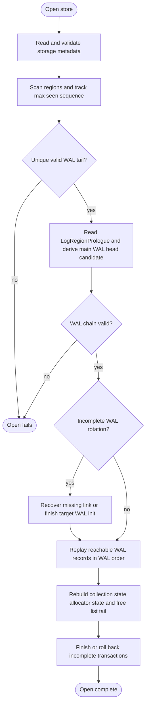

# Chapter 6: Startup And Replay

This chapter describes `Opening(OpenMode)`: scan media, recover any
incomplete WAL rotation, replay retained WAL records through the shared
state-machine rules, validate live collection data, and finish pending
recovery work.

Mechanism review:

- **Purpose**: turn durable media into stable runtime state without
  inventing recovery-specific collection or allocator semantics.
- **State**: scanned region headers, WAL chain, replay tracker,
  pending WAL-recovery boundary, transaction recovery state, and live
  collection validation state.
- **Named operations**: `OpenStorage` orchestrates replay and may invoke
  recovery sub-operations such as `RotateWalTail` completion and
  transaction recovery.
- **Durable edge sequence**: normal replay is read-only; recovery writes
  only the edges required to finish an incomplete rotation, close a WAL
  recovery boundary, or close incomplete transaction work.
- **Replay effect**: retained WAL records are applied by the same
  `ApplyWalRecord` table used by foreground operation.
- **Crash cuts**: opening can be retried after reset because every
  recovery write either preserves the previous replay result or moves to
  another replayable prefix.

## Startup Replay Algorithm

Startup recovery is the concrete `Opening(OpenMode)` procedure. It
reconstructs stable runtime state by scanning durable media,
walking the WAL chain, and applying each retained WAL record through
`ApplyWalRecord`. The detailed steps below define validation,
discovery, and recovery behavior that surrounds those shared
per-record transitions.

Startup recovery reconstructs eight things:

1. `RING-STARTUP-RESULT-001` Durable collection states (live heads plus dropped tombstones)
2. `RING-STARTUP-RESULT-002` In-memory working state for collections with uncommitted updates
3. `RING-STARTUP-RESULT-003` Durable free-list head and global allocation sequence
4. `RING-STARTUP-RESULT-004` Reserved `ready_region`, if WAL rotation allocation was started but
not yet committed by `link`
5. `RING-STARTUP-RESULT-005` Runtime `free_list_tail`, reconstructed from the free-pointer chain
after the durable free-list head is known
6. `RING-STARTUP-RESULT-006` Runtime `max_seen_sequence`, initially the largest `sequence`
observed in any valid region header during region scan, then advanced
further if startup recovery initializes an incomplete WAL rotation
7. `RING-STARTUP-RESULT-007` Transaction-log cursors, live-prefix boundaries, active transaction
descriptors, and incomplete transaction recovery work
8. `RING-STARTUP-RESULT-008` Transaction terminal records written during recovery, if recovery
needed to close an incomplete transaction-log range

Algorithm:

1. `RING-STARTUP-001` Read `StorageMetadata`, validate
`metadata_checksum`, and validate static geometry (`region_size`,
`region_count`, `min_free_regions`, `erased_byte`,
`wal_write_granule`, `wal_record_magic`, and storage version support).
2. `RING-STARTUP-002` Scan all regions, collect candidate main WAL
regions (`collection_id == 0` plus `collection_format = main_wal_v2`)
and candidate transaction-log regions (`collection_id == 0` plus
`collection_format = transaction_log_v2`) with valid headers, and track
`max_seen_sequence` as the largest `sequence` value seen in any valid
region header.
3. `RING-STARTUP-003` Select main WAL tail as the unique candidate main
WAL region with the largest valid sequence. If no candidate main WAL
region exists, or if multiple candidate main WAL regions share that
largest valid sequence, return an error. For each configured
transaction log, select its tail from main-WAL transaction-control
records and retained transaction-log metadata; startup MUST reject a
transaction-log id with no recoverable cursor when a retained main-WAL
record references it.
4. `RING-STARTUP-004` Read and validate the `LogRegionPrologue` stored at the start of the
main WAL tail region's user-data area, and use its
`log_head_region_index` as the initial WAL-head candidate. Then scan that tail region using the
same aligned candidate-start and record-validation rules defined in
step 6, and let the last valid
`head(collection_id = 0, collection_type = wal, region_index)`
record override that candidate.
5. `RING-STARTUP-005` Walk the WAL region chain from the resulting WAL head to tail using
`link` records.
If a `link` is missing/invalid before reaching the known tail, return
an error (corrupted WAL chain).
If the known tail contains a trailing `link` whose target header is
missing/corrupt or has the wrong sequence, treat this as an incomplete
rotation after `link`. Use the known tail as replay tail until that
recovery finishes.
If instead the known tail's last valid record is an
`alloc_begin(collection_id = 0, next_region_index, allocation_sequence,
free_list_head_after)` whose aligned
end offset leaves at least `wal_link_reserve` and fewer than
`wal_rotation_reserve` unwritten bytes in that region, treat this as
an incomplete rotation before `link`. That reserve-window placement is
what makes this durable tail `alloc_begin` unambiguously the
WAL-rotation-start record rather than an ordinary allocation
reservation.
For incomplete rotation recovery:
if a durable trailing `link(next_region_index, expected_sequence)` is
already present, use that `expected_sequence`;
otherwise let `expected_sequence = max_seen_sequence + 1`, append and
sync the missing `link(next_region_index, expected_sequence)` into the
reserved tail space, and treat any failure of that recovery append as a
startup error.
Then finish initializing the target WAL region:
erase target region if needed, write a valid main WAL header with
`collection_id = 0`, `collection_format = main_wal_v2`, and
`sequence = expected_sequence`, then write a valid `LogRegionPrologue`
whose `log_head_region_index` equals the WAL head already determined
for this WAL chain before the incomplete rotation target is considered
and whose allocator cursor equals the current recovered allocator
cursor for the segment. Sync the initialized target region, set
in-memory `max_seen_sequence = expected_sequence`, and use the target
region as the active append tail. If this recovery init fails, startup
fails with error.
Transaction-log chain traversal uses the same `link`,
`LogRegionPrologue`, and incomplete-rotation recovery rules for each
referenced transaction log, except that initialized target regions use
`collection_format = transaction_log_v2` and the transaction log's
already-determined head in `log_head_region_index`.
6. `RING-STARTUP-006` Parse records in WAL order (region order, then offset order).
Record parsing begins only at offsets aligned to `wal_write_granule`
and greater than or equal to `wal_record_area_offset` within each WAL
region.
Maintain a replay-local flag `pending_wal_recovery_boundary`,
initially clear.
If an aligned candidate start byte equals `erased_byte`, treat that
slot as currently unwritten and stop scanning that WAL region.
If the aligned start byte equals `wal_record_magic`, parse the record.
If parsing or checksum validation fails, treat that aligned slot as a
corrupt/torn WAL slot, set `pending_wal_recovery_boundary`, and keep
scanning forward in aligned `wal_write_granule` steps.
If the aligned start byte is neither `erased_byte` nor
`wal_record_magic`, treat that aligned slot as corrupt/torn WAL bytes,
set `pending_wal_recovery_boundary`, and keep scanning forward in
aligned `wal_write_granule` steps. Do not attempt to decode or repair
those corrupt bytes.
If a later valid record is found while
`pending_wal_recovery_boundary` is set, that record must be
`wal_recovery`; otherwise return an error.
At the end of each reachable non-tail WAL region,
`pending_wal_recovery_boundary` must be clear; otherwise return an
error.
After scanning the tail region, recover the append point as the first
aligned slot whose first byte is `erased_byte` after the last valid
replayed tail record. If no such slot exists, the tail region is full.
7. `RING-STARTUP-007` Maintain replay state:
per collection optional live `collection_type`, explicit collection
state, `basis_pos`, `pending_updates`, and committed state generation;
global `last_free_list_head`, global `allocation_sequence`, optional
reserved WAL-rotation `ready_region`, transaction-log cursors and
live-prefix boundaries, active/recovery transaction descriptors, and
the replay-local `pending_wal_recovery_boundary`. Initialize
`last_free_list_head` and `allocation_sequence` from the effective main
WAL head segment's `LogRegionPrologue`. Replay may discover later
complete `alloc_begin` records from the main WAL and from referenced
transaction-log ranges in a different physical order than the allocator
used at runtime, so startup MUST validate and apply allocator-head
decisions in ascending `allocation_sequence` order. `free_region`
records still extend the free-list tail at their replay-visible
main-WAL position or imported committed-range position.
8. `RING-STARTUP-008` On `new_collection(collection_id, collection_type)`:
if `collection_id` is already tracked, return an error.
otherwise create replay state for that collection with durable basis
`EmptyClean`, set tracked `collection_type` from the record, set
`basis_pos` to this record's WAL position, and start with no pending
updates.
9. `RING-STARTUP-009` On `update(collection_id)`:
if `collection_id` is not tracked, return an error.
if that collection's collection state is `Dropped`, return an error.
append to `pending_updates` for that collection.
10. `RING-STARTUP-010` On `snapshot(collection_id, collection_type)`:
if `collection_id` is not tracked, create replay state for that
collection because an earlier `new_collection` may have been reclaimed,
and set tracked `collection_type` from this record.
if that collection's collection state is `Dropped`, return an error.
if this record's `collection_type` does not match the tracked
`collection_type`, return an error.
set collection state to `WALSnapshotClean`, set `basis_pos` to this
record's WAL position, and clear older pending updates for that
collection at WAL positions up to and including this snapshot.
11. `RING-STARTUP-011` On
`alloc_begin(collection_id, region_index, allocation_sequence, free_list_head_after)`:
if `last_free_list_head = none`, return an error because allocation
cannot consume an empty durable free list.
if `last_free_list_head != region_index`, return an error because
`alloc_begin` did not consume the current durable free-list head.
if `allocation_sequence` is not greater than the current replayed
allocator sequence once lower-sequence retained allocation decisions
have been applied, return an error because allocator decisions are not
globally ordered. Set durable `last_free_list_head` to
`free_list_head_after` and set the replayed allocator sequence to
`allocation_sequence`.
If `collection_id = 0`, also require `ready_region` to be clear and set
`ready_region = region_index` for WAL rotation recovery. If
`collection_id != 0`, do not set `ready_region`; the allocation belongs
to the open transaction-log transaction until commit or rollback
recovery classifies it.
12. `RING-STARTUP-011A` Transaction-log records are not applied by
ordinary log-chain traversal. Startup scans a transaction-log range only
when a retained main-WAL `commit_transaction(transaction_log_id, range)`,
`rollback_transaction(transaction_log_id, range)`,
`transaction_finished(transaction_log_id, range)`, or active recovery
descriptor references that range. Records inside an imported committed
range are applied at the main-WAL commit record's replay position;
records inside an uncommitted rollback range are scanned only for
cleanup/recovery effects and do not become visible collection state.
13. `RING-STARTUP-012` On `head(collection_id, collection_type, region_index)`:
if `collection_id = 0`, this is a WAL-head control record. Its replay
effect was already consumed in step 4 while determining the WAL-head
candidate from the tail region. If `collection_type != wal`, return an
error; otherwise ignore this record during the main per-record replay
pass.
otherwise, if `collection_id` is not tracked, create replay state for
that collection because an earlier `new_collection` may have been
reclaimed, and set tracked `collection_type` from this record.
if that collection's collection state is `Dropped`, return an
error.
if this record's `collection_type` does not match the tracked
`collection_type`, return an error.
if the target region header is missing, corrupt, or has a different
`collection_id`, return an error.
Core replay does not impose any further global `collection_format`
check for user collections; if that region is later loaded as a
committed basis, its collection implementation validates that the
stored `collection_format` is one it understands.
set collection state to `RegionClean`, set `basis_pos` to this
record's WAL position, and clear WAL updates/snapshots older than this
basis decision.
if `ready_region = region_index`, clear `ready_region`;
otherwise leave `ready_region` unchanged because this `head` retargeted
the collection to an already allocated existing region.
14. `RING-STARTUP-013` On `link(next_region_index, expected_sequence)`:
if `ready_region = next_region_index`, clear `ready_region`.
otherwise leave `ready_region` unchanged because this `link` may refer
to a WAL-region allocation whose historical `alloc_begin` was already
consumed and later reclaimed.
15. `RING-STARTUP-014` On `drop_collection(collection_id)`:
if `collection_id` is not tracked, create replay state for that
collection because older retained basis records may already have been
reclaimed; record this collection as durably `Dropped`, with no
retained live `collection_type`, set `basis_pos` to this record's WAL
position, and leave no pending updates.
otherwise if that collection's collection state is `Dropped`,
return an error.
otherwise set collection state to `Dropped`, set `basis_pos` to this
record's WAL position, and clear all pending updates for that
collection.
16. `RING-STARTUP-015` On `free_region(collection_id, region_index)`:
verify that the region was removed from the named collection's live
state before the free is applied. If the free list was non-empty,
validate that the previous free-list tail footer durably points to
`region_index`; if it was empty, set `last_free_list_head =
Some(region_index)`. In all cases update runtime free-list tail state
so `region_index` is the tail.
17. `RING-STARTUP-016` On `begin_transaction(transaction_log_id, start)`:
create an active transaction descriptor for `transaction_log_id` at
`start`. If that transaction log already has an open descriptor, return
an error because each transaction log supports only one open
transaction at a time.
18. `RING-STARTUP-017` On
`commit_transaction(transaction_log_id, range)`:
verify that `transaction_log_id` and `range` match an active
transaction descriptor or a recoverable committed range. Scan the
transaction-log range from `range.start` to `range.end`; if any record
inside the range is torn, malformed, or invalid, return an error. Apply
the range's enrolled collection mutations, allocation decisions, and
free decisions at this main-WAL commit position, advance the committed
generation for every enrolled collection, and record that committed
cleanup may still be required until a matching
`transaction_finished(transaction_log_id, range)` is retained.
19. `RING-STARTUP-018` On
`add_transaction_collection(collection_id, observed_generation)` while
importing a committed range:
record the collection as enrolled in the imported transaction range.
The stored `observed_generation` is not rechecked during recovery
because the retained main-WAL commit record is the durable evidence that
the foreground conflict check already succeeded before commit.
20. `RING-STARTUP-019` On
`rollback_transaction(transaction_log_id, range)`:
scan the referenced transaction-log range for transaction-owned
allocation and cleanup effects, confirm rollback recovery has made those
effects non-visible and reclaimable, and do not apply collection
mutations from the range.
21. `RING-STARTUP-020` On `wal_recovery()`:
if `pending_wal_recovery_boundary` is clear, return an error.
otherwise clear `pending_wal_recovery_boundary`.
22. `RING-STARTUP-021` If replay reaches WAL end with an active
transaction descriptor that has no committed range, run idempotent
rollback recovery by scanning that transaction-log range for
transaction-owned allocations, returning them through allocator
recovery, and appending
`rollback_transaction(transaction_log_id, range)`. If replay reaches
WAL end after `commit_transaction(transaction_log_id, range)` but
before `transaction_finished(transaction_log_id, range)`, preserve the
imported collection state, finish cleanup frees derived from the
committed range, and append
`transaction_finished(transaction_log_id, range)`.

    Rollback recovery may erase transaction-owned allocations before
    returning them because those regions never became committed
    collection state. Cleanup recovery after commit follows normal
    `free_region` semantics: it requires detached region footers to be
    unwritten and does not erase detached regions.
23. `RING-STARTUP-021A` Startup replay MUST NOT silently apply an
uncommitted transaction-log range that lacks a retained main-WAL commit
record.
24. `RING-STARTUP-022` After replay and transaction recovery, for each collection:
reconstruct its durable basis from the collection state. If the state
is `EmptyClean` or `EmptyDirty`, the basis is the empty collection
declared by `new_collection`; if that collection has post-basis
updates, initialize empty mutable state in RAM and apply those
`pending_updates` in WAL order. If the state is `RegionClean` or
`RegionDirty`, the basis may remain in-place in flash until a read or
mutation needs to materialize it. If the state is `WALSnapshotClean`
or `WALSnapshotDirty` and the collection has post-basis updates, load
that snapshot into RAM and apply the remaining `pending_updates` in
WAL order to reconstruct mutable working state. If the state is
`WALSnapshotClean` and there are no post-basis updates, the snapshot
may remain dormant until the next mutation, but it must be loaded into
RAM before accepting that mutation. If the state is `Dropped`, do not
reconstruct mutable state for that collection and do not accept
further mutations for that collection id.
25. `RING-STARTUP-023` Initialize allocator state from
`last_free_list_head` and the recovered global `allocation_sequence`.
26. `RING-STARTUP-024` Reconstruct runtime `free_list_tail` by following free-pointer
links starting at `last_free_list_head` until reaching a free region
whose free-pointer slot is uninitialized.
If this walk encounters a checksum-invalid or malformed free-pointer
footer, a region that is not
a valid member of that free-list chain, or exceeds `region_count`
visited regions before reaching an uninitialized tail slot, return an
error because the
durable free-list head does not name a valid free-list chain.
If `last_free_list_head = none`, then `free_list_tail = none`.
27. `RING-STARTUP-025` If `ready_region` is set, hold it in memory as the WAL-rotation target
before consuming another free-list entry for rotation.
28. `RING-STARTUP-026` Keep `max_seen_sequence` as the runtime source of the next region
sequence. The next newly allocated region must use
`max_seen_sequence + 1` as its header `sequence`, then update
`max_seen_sequence` in memory to that new value.
29. `RING-STARTUP-027` If replay encountered a torn or checksum-invalid tail record,
retain all state recovered from earlier complete records. The WAL head
is unchanged. Replay may still recover and apply later valid tail
records that begin after the torn bytes, but the first such later valid
record must be `wal_recovery`. The recovered append point is the first
aligned slot whose first byte is `erased_byte` after the last valid
replayed tail record, so later WAL appends may resume there while the
ignored corrupt span before that point remains uninterpreted until that
region is reclaimed or erased for reuse.
30. `RING-STARTUP-028` If replay yields a live collection whose
`collection_type` is unsupported by the implementation, startup MUST
fail before transaction cleanup frees any region based on collection
reachability.
31. `RING-STARTUP-029` If replay yields a live collection with unsupported or invalid retained
    collection data under that collection's normative specification, startup MUST fail before open
    succeeds and before transaction cleanup frees any region based on collection reachability.
32. `RING-STARTUP-030` A dropped tombstone whose old
`collection_type` is unsupported MAY remain as inert metadata and does
not by itself require startup failure.

## Startup Replay Implementation Requirements

These requirements cover implemented startup replay edge cases and validation helpers.

1. `RING-IMPL-REGRESSION-046` Startup tail selection MUST ignore regions with nonzero collection_id
   even when their format is a private log format while still tracking max seen sequence.
2. `RING-IMPL-REGRESSION-047` Startup replay MUST preserve transaction recovery state when a WAL
   head-control record is replayed.
3. `RING-IMPL-REGRESSION-048` Startup replay MUST preserve transaction recovery state when
   non-map collection head and drop records are replayed.
4. `RING-IMPL-REGRESSION-049` Startup replay MUST count multiple live collections independently.
5. `RING-IMPL-REGRESSION-050` Startup replay MUST accept a committed-region head basis and recover
   the collection basis, collection type, and max seen sequence from that region.
6. `RING-IMPL-REGRESSION-051` Startup replay MUST accept a replaced historical head and recover the
   live replacement head with no incomplete transaction work.
7. `RING-IMPL-REGRESSION-052` Startup replay MUST track pending updates on an empty collection
   basis and preserve their count.
8. `RING-IMPL-REGRESSION-053` Startup replay MUST reject update records that appear after a
   collection drop tombstone for the same collection.
9. `RING-IMPL-REGRESSION-054` Strict private-log region reads MUST reject regions whose
   collection_id is nonzero even if collection_format is a private log format.
10. `RING-IMPL-REGRESSION-055` WAL target validation MUST require collection_id 0 and
    the expected private log collection_format.
11. `RING-IMPL-REGRESSION-056` Live committed-region basis validation MUST reject a region whose
    header belongs to a different collection.
12. `RING-IMPL-REGRESSION-057` Region index validation MUST reject a region_index equal to
    region_count.
13. `RING-IMPL-REGRESSION-058` Startup replay MUST recover a WAL rotation after a durable link by
    selecting the linked tail, resetting tail append offset, updating allocator state, and advancing
    max sequence.
14. `RING-IMPL-REGRESSION-059` Startup replay MUST recover a WAL rotation when alloc_begin is
    durable but link is absent and only rotation reserve remains.
15. `RING-IMPL-REGRESSION-060` Startup replay MUST recover a WAL rotation when only the link record
    fits after alloc_begin at the tail boundary.
16. `RING-IMPL-REGRESSION-061` Startup replay MUST reject an unrecovered corrupt boundary in a
    non-tail WAL region as a broken WAL chain.
17. `RING-IMPL-REGRESSION-062` Opening a freshly formatted store MUST initialize allocator
    free-list head and tail from the formatted free-list chain.



## Why Reclaimed WAL Regions Cannot Confuse Startup

Startup region scan may encounter free-list regions whose stale header
bytes still look like old WAL headers. That does not let a reclaimed
WAL region take over bootstrap.

1. `RING-BOOTSTRAP-001` Startup chooses the WAL tail as the candidate WAL region with the
largest valid `sequence`.
2. `RING-BOOTSTRAP-002` Each newly allocated region uses `sequence = max_seen_sequence + 1`,
then advances `max_seen_sequence` in memory.
3. `RING-BOOTSTRAP-003` Therefore, once a WAL region has been superseded by a later live WAL
tail or by any later successful region allocation, that reclaimed
region's stale `sequence` is permanently older than the current maximum
durable sequence seen at startup.
4. `RING-BOOTSTRAP-004` A reclaimed former WAL region may still be discovered during region
scan, but it cannot win WAL-tail selection unless the monotonic
sequence rule has already been violated.
5. `RING-BOOTSTRAP-005` Startup derives the WAL head only from the selected tail's
`LogRegionPrologue` plus any later `head(collection_id = 0, ...)`
records found in that same tail region. Stale headers in free-list
regions therefore do not influence WAL-head recovery once they lose
tail selection.

Under the monotonic-sequence rule, stale free-list WAL headers may be
visible during scan, but they cannot outrank the live WAL tail and so
cannot redirect startup onto the wrong WAL chain.

## no_std Tracker Types (Rust)

The replay and allocator terms above map to the following explicit
`no_std` tracker state. These structs are runtime state, not on-disk
layout. Region references in tracker state are indexes into the
configured region array, not opaque identifiers.

```rust
#![no_std]

use heapless::Vec;

#[derive(Clone, Copy, Debug, PartialEq, Eq)]
pub struct RegionIndex(pub u32);

#[derive(Clone, Copy, Debug, PartialEq, Eq)]
pub struct CollectionId(pub u64);

#[derive(Clone, Copy, Debug, PartialEq, Eq)]
pub struct CollectionType(pub u16);

#[derive(Clone, Copy, Debug, PartialEq, Eq)]
pub struct RegionSequence(pub u64);

#[derive(Clone, Copy, Debug, PartialEq, Eq)]
pub struct WalOffset(pub u32);

#[derive(Clone, Copy, Debug, PartialEq, Eq)]
pub struct WalPosition {
  pub region_index: RegionIndex,
  pub offset: WalOffset,
}

#[derive(Clone, Copy, Debug, PartialEq, Eq)]
pub enum CollectionMachineState {
  EmptyClean,
  EmptyDirty,
  RegionClean { region_index: RegionIndex },
  RegionDirty { region_index: RegionIndex },
  WALSnapshotClean { wal_pos: WalPosition },
  WALSnapshotDirty { wal_pos: WalPosition },
  Dropped,
}

#[derive(Clone, Copy, Debug, PartialEq, Eq)]
pub struct CollectionReplayState {
  pub collection_id: CollectionId,
  // `None` is used only for a retained drop-only tombstone whose older
  // type-bearing records were reclaimed.
  pub collection_type: Option<CollectionType>,
  pub state: CollectionMachineState,
  // WAL position of the durable basis decision record that established
  // the current durable basis (`new_collection`, `snapshot`,
  // `drop_collection`, or `head`).
  pub basis_pos: WalPosition,
}

#[derive(Clone, Copy, Debug, PartialEq, Eq)]
pub struct PendingUpdateRef {
  pub collection_id: CollectionId,
  pub wal_pos: WalPosition,
}

#[derive(Clone, Copy, Debug, PartialEq, Eq)]
pub enum TransactionTerminal {
  Finished,
  RolledBack,
  WalEnd,
}

#[derive(Clone, Copy, Debug, PartialEq, Eq)]
pub struct TransactionReplayState {
  pub collection_id: CollectionId,
  pub begin_pos: WalPosition,
  pub commit_seen: bool,
  pub terminal: TransactionTerminal,
}

#[derive(Clone, Copy, Debug, PartialEq, Eq)]
pub struct FreeListTracker {
  // Durable allocator cursor reconstructed from replay decisions.
  pub last_free_list_head: Option<RegionIndex>,
  // Region reserved by `alloc_begin` but not yet consumed by a durable
  // `head` or `link` record.
  pub ready_region: Option<RegionIndex>,
  // Runtime-only convenience for append-on-free operations.
  pub free_list_tail: Option<RegionIndex>,
}

pub struct ReplayTracker<
  const MAX_COLLECTIONS: usize,
  const MAX_PENDING_UPDATES: usize,
> {
  pub free_list: FreeListTracker,
  pub max_seen_sequence: RegionSequence,
  pub collections: Vec<CollectionReplayState, MAX_COLLECTIONS>,
  pub pending_updates: Vec<PendingUpdateRef, MAX_PENDING_UPDATES>,
  pub transaction: Option<TransactionReplayState>,
}
```

`heapless` dependency form:

```toml
[dependencies]
heapless = { version = "0.8", default-features = false }
```

Field mapping to this spec:

1. `CollectionReplayState.state` maps to the explicit collection
submachine state for a tracked collection. `NoCollection` is represented
by the absence of a tracker entry for that collection id.
2. `WalPosition` identifies a WAL record by WAL region index plus
byte offset within that region.
3. `CollectionReplayState.basis_pos` is `B(c)`, the WAL position of
the durable basis decision record for that collection's current clean
or dirty basis.
4. `CollectionReplayState.collection_type` is the replay-tracked
collection type established by the earliest retained valid
type-bearing record for that collection and validated by later
type-bearing records. It is `None` only for a drop-only retained
tombstone whose older type-bearing records were reclaimed.
5. `FreeListTracker.last_free_list_head` maps to replay
`last_free_list_head`.
6. `FreeListTracker.ready_region` maps to replay `ready_region`.
7. `FreeListTracker.free_list_tail` is runtime state reconstructed by
walking the free-pointer chain from `last_free_list_head`; transaction
cleanup uses it to link `t_prev.next_tail = r`.
8. `ReplayTracker.transaction` maps to an incomplete transaction
interval found during replay.
9. `ReplayTracker.max_seen_sequence` is initialized from the largest
region `sequence` value observed during startup region scan, and may be
advanced further if startup recovery initializes an incomplete WAL
rotation. Each newly allocated region uses the next value
(`max_seen_sequence + 1`), then updates this runtime field.
