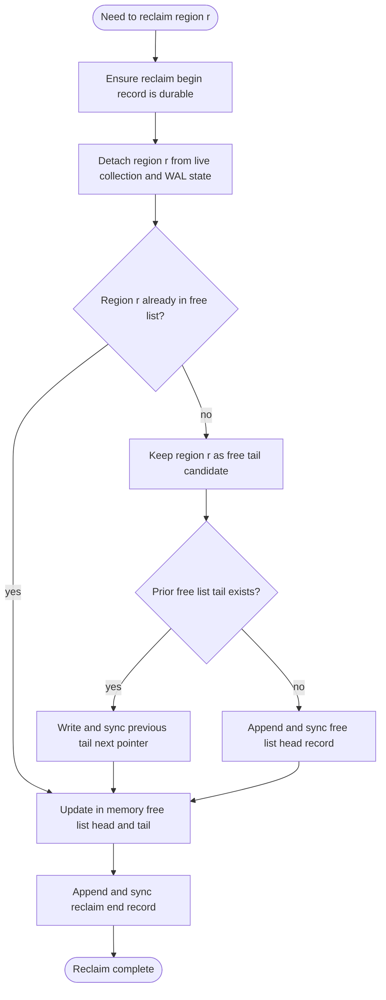

# Chapter 7: Reclaim And Freeing

This chapter groups the rules that make space reusable without losing
replayability: WAL-head reclaim decides which records remain live, and
region reclaim appends detached regions to the FIFO free-list chain.

Mechanism review:

- **Purpose**: reclaim obsolete WAL and data regions while preserving
  the exact replay result and FIFO free-list ordering.
- **State**: per-record WAL liveness, `ready_region`,
  `staged_regions`, pending reclaim records, free-list head/tail, and
  live collection/WAL reachability.
- **Named operations**: `ReclaimWalHead`, `ReclaimRegion`,
  `ReserveRegionForUse`, `StageReadyRegion`, and retained-basis replay
  operations.
- **Durable edge sequence**: reclaim begins with `BeginReclaim`,
  performs any replacement live-state edges, links the region into the
  free list, and ends with `EndReclaim`.
- **Replay effect**: replay either sees the same live state as before
  reclaim, or sees an incomplete reclaim that can be completed or
  discarded according to reachability.
- **Crash cuts**: every prefix between `BeginReclaim` and `EndReclaim`
  leaves either the old region live, the new representation live, or an
  idempotent free-list completion task.

## WAL Reclaim Eligibility

WAL-head reclaim is the `ReclaimingWalHead(WalHeadReclaimMode)`
operation. It operates on WAL regions, but correctness is defined per
record. A record is reclaimable only when replay no longer needs it to
rebuild the same collection submachine state, pending updates,
`last_free_list_head`, reserved `ready_region`, staged regions, and
ordered incomplete reclaim state produced by `ApplyWalRecord`.

Per-collection cutoff:

These cutoff terms apply only to user collections (`collection_id !=
0`). WAL-head bootstrap records for `collection_id = 0` are governed
separately below because startup step 4 reconstructs them only from the
current WAL tail region.

1. Let `H(c)` be the current clean durable-basis state for collection
`c` (`EmptyClean`, `WALSnapshotClean`, `RegionClean`, or `Dropped`).
2. Let `D(c)` be the WAL position of the last durable basis decision
record for collection `c` (`new_collection`, `snapshot`,
`drop_collection`, or
`head(collection_id, collection_type, region_index)`).
3. `B(c) = D(c)` is the collection's durable basis position.

Per-record liveness rules:

1. `RING-WAL-RECLAIM-001` `new_collection(collection_id, collection_type)` record:
live only if it is the basis decision at `D(c)` for a collection whose
logical head `H(c)` is `EmptyClean`; otherwise reclaimable.
2. `RING-WAL-RECLAIM-002` `head(collection_id = 0, collection_type = wal, region_index)`
record:
live only if startup step 4 would currently use it as the effective
WAL-head override for the current tail region. Equivalently, it must be
the last valid WAL-head control record in the current WAL tail region.
Any earlier such control record, or any such record in a non-tail WAL
region, is reclaimable once the same effective WAL head is preserved by
a later tail-local control record or by the current tail region's
`WalRegionPrologue`.
3. `RING-WAL-RECLAIM-003` `head(collection_id, collection_type, region_index)` record for a
user collection:
live only if it is the decision record at `D(c)` for a collection
whose logical head `H(c)` is `RegionClean`; older `head(...)` records
are reclaimable.
4. `RING-WAL-RECLAIM-004` `snapshot` record:
live only if it is the decision record at `D(c)` for a collection
whose logical head `H(c)` is `WALSnapshotClean`; otherwise reclaimable.
5. `RING-WAL-RECLAIM-005` `drop_collection(collection_id)` record:
live only if it is the decision record at `D(c)` for a collection
whose logical head `H(c)` is `Dropped`; older `drop_collection(...)`
records are reclaimable.
6. `RING-WAL-RECLAIM-006` `update` record for collection `c`:
live only if its WAL position is greater than `B(c)`; updates at or
before `B(c)` are reclaimable.
7. `RING-WAL-RECLAIM-007` `link` record:
live only while required to maintain a valid WAL chain from current
WAL head to current WAL tail.
8. `RING-WAL-RECLAIM-008` `free_list_head(region_index_or_none)` record:
live only if it is the last valid explicit free-list-head decision in
replay order that has not been superseded by a later `alloc_begin` or
`free_list_head`.
9. `RING-WAL-RECLAIM-009` `alloc_begin(region_index, free_list_head_after)` record:
live if either:
it is the last valid free-list-head decision in replay order; or
its reservation is still needed to recover unmatched `ready_region`.
Its reservation role exists only until `head`, `link`, or
`stage_region` durably consumes the allocated region; after that point,
retaining the record is no longer required for region-consumption
validity. It becomes reclaimable once both of the conditions above are
false.
10. `RING-WAL-RECLAIM-010` `reclaim_begin(region_index)` record:
live only if replay still needs it to reconstruct an incomplete reclaim
transaction for `region_index` that would remain pending after replay.
If a later durable `reclaim_end(region_index)` closes that transaction,
or replay can prove the reclaim was unnecessary because the region
never became durably detached from live state, the `reclaim_begin`
record is reclaimable.
11. `RING-WAL-RECLAIM-011` `reclaim_end(region_index)` record:
live only if replay still needs it to cancel a still-live
`reclaim_begin(region_index)` that would otherwise reconstruct as an
incomplete reclaim transaction. Once the matching `reclaim_begin`
becomes reclaimable, the matching `reclaim_end` is reclaimable too.
12. `RING-WAL-RECLAIM-012` `wal_recovery` record:
live only if replay still needs it to justify later valid WAL records
that appear after an ignored corrupt/torn span in that WAL region.
Once those later dependent records are reclaimable or have been
superseded by newer durable state, the `wal_recovery` record is
reclaimable too.
13. `RING-WAL-RECLAIM-013` `stage_region(region_index)` record:
live while replay needs it to reconstruct `region_index` as staged.
It becomes reclaimable only after a later retained `head`, `link`, or
`reclaim_begin` record consumes that staged state, or after an
equivalent manifest-aware reachability summary preserves the same
staged-region safety state outside the candidate WAL region.

WAL-region reclaim preconditions:

1. `RING-WAL-RECLAIM-PRE-001` The candidate region MUST be the head of the WAL.
2. `RING-WAL-RECLAIM-PRE-002` For every live record in the candidate, an equivalent live state MUST
   be
already represented durably outside the candidate (typically by newer
`snapshot`, `drop_collection`, or by
`head(collection_id, collection_type, region_index)` plus newer
updates). A live `stage_region` record must either be preserved by an
equivalent retained record or block WAL-head reclaim until
manifest-aware reachability can replace it safely.
3. `RING-WAL-RECLAIM-PRE-003` After planned metadata updates, startup replay MUST still be able to
   walk a
valid WAL chain from head to tail.

WAL-region reclaim postconditions:

1. `RING-WAL-RECLAIM-POST-001` A collection's `H(c)`, `B(c)`, and live
post-basis updates MUST NOT depend on bytes in the reclaimed region.
2. `RING-WAL-RECLAIM-POST-002` The recovered free-list head MUST match pre-reclaim allocator state.
3. `RING-WAL-RECLAIM-POST-003` The recovered `ready_region`, if any, MUST match pre-reclaim
   allocator
state.
4. `RING-WAL-RECLAIM-POST-004` The ordered staged regions and the
ordered set of incomplete reclaim transactions that replay would
continue MUST match pre-reclaim crash-recovery state.
5. `RING-WAL-RECLAIM-POST-005` Startup step 4 MUST recover the same effective WAL head after
reclaim as before reclaim, using the current tail region's
`WalRegionPrologue` plus the last valid tail-local
`head(collection_id = 0, collection_type = wal, region_index = ...)`
override, if any.
6. `RING-WAL-RECLAIM-POST-006` WAL chain integrity MUST remain valid with no broken `link` path.
7. `RING-WAL-RECLAIM-POST-007` The reclaimed region MUST be erased before reuse.
8. `RING-WAL-RECLAIM-POST-008` If reclaim allocates any replacement WAL regions, replay-visible
`alloc_begin` records for those allocations carry
`free_list_head_after` so replay reconstructs the same allocator
position.

Safety invariant:

1. `RING-WAL-RECLAIM-SAFE-001` Reclaim MUST NOT change replay result: the recovered collection
submachine state and pending updates for every collection, the recovered
`last_free_list_head`, reserved `ready_region`, ordered staged regions,
ordered incomplete reclaim state, and reconstructed `free_list_tail`,
after reclaim must match the pre-reclaim logical state.

Example timeline for an already-live collection (`collection_id = 7`):

1. WAL appends `update(u1)`, `update(u2)`.
2. WAL appends `snapshot(s1)`.
`u1` and `u2` are now reclaimable.
3. WAL appends `update(u3)`.
`u3` is live because it is after basis `B(7) = pos(s1)`.
4. WAL appends `alloc_begin(r44, free_list_head_after=f9)`.
5. Collection flushes to region `r44`, then WAL appends
`head(collection_id = 7, collection_type = T, region_index = r44)`.
Now `s1` and `u3` are reclaimable because
`head(collection_id = 7, collection_type = T, region_index = r44)` becomes
the new basis.

## Region Reclaim

Region reclaim is the `ReclaimingRegion(RegionReclaimMode)`
operation. It appends a newly freed region to the tail of the free
list. If the free list was non-empty, reclaim must update the previous
tail region's `next_tail` pointer so the chain now ends at the newly
reclaimed region. Because reclaim removes a region from live metadata
before making it reachable from the free-list chain, it is always
modeled as a WAL-tracked transaction.

Normative append semantics:

1. `RING-REGION-RECLAIM-SEM-001` Let `t_prev` be the value of `free_list_tail` before reclaim
   starts.
2. `RING-REGION-RECLAIM-SEM-002` If `t_prev != none`, reclaim MUST durably write
`t_prev.free_pointer.next_tail = r` when freeing region `r`.
3. `RING-REGION-RECLAIM-SEM-003` If `t_prev = none`, reclaim MUST NOT write any predecessor link and
MUST durably append `free_list_head(r)` and set `free_list_head = r`
and `free_list_tail = r`.
4. `RING-REGION-RECLAIM-SEM-004` Reclaim is not complete until the predecessor-link write (when
required), or the `free_list_head(r)` record (when the free list was
empty), is durable; otherwise `r` is not yet a durable member of the
free list.

Preconditions:

1. `RING-REGION-RECLAIM-PRE-001` `reclaim_begin(r)` MUST be durable in the WAL before any live
   metadata is
updated to stop referencing `r`.
2. `RING-REGION-RECLAIM-PRE-002` After the detach step, the reclaimed region `r` MUST no longer be
reachable from any live collection head or live WAL state.
3. `RING-REGION-RECLAIM-PRE-003` `r` MUST NOT already be reachable from the free-list chain, unless
   this
procedure is being re-entered during crash recovery.
4. `RING-REGION-RECLAIM-PRE-004` If a current free-list tail exists, call it `t_prev`.

Procedure:

1. `RING-REGION-RECLAIM-001` Ensure `reclaim_begin(r)` is durable. On the initial reclaim
attempt this means append and sync `reclaim_begin(r)`. On recovery
re-entry the existing durable record satisfies this step.
2. `RING-REGION-RECLAIM-002` Durably perform any collection-head or WAL-head updates needed so
that `r` has no remaining live references.
3. `RING-REGION-RECLAIM-003` If recovery finds that `r` is already reachable from the free-list
chain, skip to step 8.
4. `RING-REGION-RECLAIM-004` Establish `r` as a free region without erasing it. In particular,
`r.free_pointer.next_tail` MUST still be uninitialized when `r` is
about to become the new free-list tail. If the region still has the
erased footer state from when it was allocated, no additional write to
`r` is required for this step.
5. `RING-REGION-RECLAIM-005` If `t_prev` exists, write `t_prev.free_pointer.next_tail = r`.
This is the operation that links the previous free tail to the new
tail.
6. `RING-REGION-RECLAIM-006` If `t_prev` exists, sync `t_prev` after writing `next_tail`.
7. `RING-REGION-RECLAIM-007` If `t_prev` exists, update in-memory `free_list_tail = r`.
If no tail existed before step 5, append and sync `free_list_head(r)`,
then set both in-memory `free_list_head = r` and `free_list_tail = r`.
8. `RING-REGION-RECLAIM-008` If recovery found `r` already reachable from the free-list chain,
update in-memory free-list state so it reflects `r` as the current
tail when needed.
9. `RING-REGION-RECLAIM-009` Append and sync `reclaim_end(r)`.

Postconditions:

1. `RING-REGION-RECLAIM-POST-001` The free-list chain MUST remain acyclic and FIFO-ordered.
2. `RING-REGION-RECLAIM-POST-002` Exactly one new region (`r`) MUST be appended to the tail.
3. `RING-REGION-RECLAIM-POST-003` If a prior tail existed, its `next_tail` pointer MUST now
   reference
`r`.
4. `RING-REGION-RECLAIM-POST-004` `r.free_pointer.next_tail` MUST remain uninitialized after
   reclaim.
5. `RING-REGION-RECLAIM-POST-005` If a prior tail existed, replay of free pointers MUST follow
`... -> t_prev -> r`, and `r` is recognized as the tail because its
free-pointer slot is uninitialized.
6. `RING-REGION-RECLAIM-POST-006` If a prior tail existed, the only new durable predecessor link for
`r` is `t_prev.next_tail = r`, where `t_prev` is the free-list tail
from before reclaim.
7. `RING-REGION-RECLAIM-POST-007` Replay either finds a matching `reclaim_end(r)` or can safely
re-enter the procedure and derive the same result without duplicating
`r` in the free-list chain.

Crash-safety ordering requirement:

1. `RING-REGION-RECLAIM-ORDER-001` `reclaim_begin(r)` MUST be durable before any live metadata stops
referencing `r`.
2. `RING-REGION-RECLAIM-ORDER-002` Before any durable write makes `r` reachable from
`t_prev.next_tail`,
the implementation MUST ensure that `r` already has the correct
free-list-tail footer state, namely an uninitialized
`r.free_pointer.next_tail`.
3. `RING-REGION-RECLAIM-ORDER-003` If `t_prev = none`, `free_list_head(r)` MUST be durable
before `reclaim_end(r)` is acknowledged.
4. `RING-REGION-RECLAIM-ORDER-004` If `t_prev` exists, the `t_prev.next_tail = r` write MUST be
synced before
`reclaim_end(r)` is acknowledged.
5. `RING-REGION-RECLAIM-ORDER-005` The reclaim procedure MUST be idempotent across crashes
between any two steps above.
