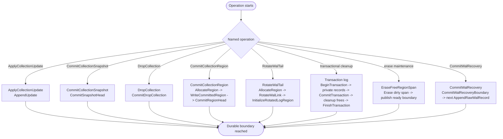

# Chapter 8: Durability, Crash Cuts, And Formatting

This chapter defines the write/sync cuts that make transitions durable,
the crash outcomes at those cuts, and the formatting/opening operations
that create or bootstrap a valid store.

Mechanism review:

- **Purpose**: state exactly when an operation becomes durable and what
  replay must do for each crash prefix.
- **State**: the operation-local write/sync sequence plus the stable
  runtime state prefix that has become replay-visible.
- **Named operations**: `ApplyCollectionUpdate`,
  `CommitCollectionSnapshot`, `CommitCollectionRegion`,
  `DropCollection`, `RotateWalTail`, `ReclaimWalHead`, `FreeRegion`,
  `EraseFreeRegionSpan`, `CommitWalRecovery`, `FormatStorage`, and
  `OpenStorage`.
- **Durable edge sequence**: each operation is expressed as ordered
  writes and syncs; write order alone is not a durability guarantee.
- **Replay effect**: replay observes only synced durable edges and
  reconstructs the state described by the operation's target or
  recovery prefix.
- **Crash cuts**: every crash rule names the last durable edge that may
  be visible and the state that startup must recover from it.

## Durability And Crash Semantics

Durability boundary:

1. `RING-DURABILITY-001` A write is durable only after both the bytes
are written and a sync/flush that covers those bytes completes.
2. `RING-DURABILITY-002` Write ordering without sync ordering is not
sufficient for durability guarantees.
3. `RING-DURABILITY-003` Replay MUST treat partially written records as
torn and ignore them using checksum validation and WAL tail recovery
rules.

Notation:

1. `W(x)`: write bytes for `x`.
2. `S(x)`: sync/flush that guarantees durability for `x`.

Required write and sync ordering:

1. `RING-ORDER-001` `ApplyCollectionUpdate` durability:
`W(update_record) -> S(update_record) -> acknowledge update durable`.
2. `RING-ORDER-002` `CommitCollectionSnapshot` transition:
`W(snapshot(collection_id, collection_type, payload)) -> S(snapshot)`.
3. `RING-ORDER-003` `DropCollection` transition:
`W(drop_collection(collection_id)) -> S(drop_collection)`.
4. `RING-ORDER-004` `CommitCollectionRegion` transition:
if the target is not already reserved by an enclosing full transaction
or storage-core operation, open a bounded inline transaction and include
both the allocation record and the user `head` record in that inline
range:
`W(begin_inline_transaction(record_count, encoded_len)) ->`
`S(begin_inline_transaction) ->`
`W(allocate_region(region_index, allocation_head_after)) ->`
`S(allocate_region) ->`
`erase/init reserved region if needed -> W(region header+data) ->`
`S(region) -> W(head(collection_id, collection_type, ref=region_index))`
`-> S(head) ->`
`W(commit_inline_transaction(record_count)) ->`
`S(commit_inline_transaction)`.
If the target is already reserved by a full transaction, the
`allocate_region` and `head` records belong to that full transaction's
range and become visible only at `commit_transaction`. If the target is
already reserved by a privileged storage-core operation, the user
`head` record must still be part of a transaction when it represents
ordinary user/data allocation.
5. `RING-ORDER-005` `RotateWalTail` transition:
`W(allocate_region(next_region_index, allocation_head_after)) ->`
`S(allocate_region) ->`
`W(link(next_region_index, expected_sequence)) -> S(link) ->`
`W(new_log_region_init(sequence=expected_sequence,
log_head_region_index=current_log_head, free-space cursors)) ->`
`S(new_log_region_init)`.
6. `RING-ORDER-006` full transaction transition for stable-head
replacement, drop cleanup, or `ReclaimWalHead`:
`W(main_wal begin_transaction(transaction_log_id, start)) ->`
`S(begin_transaction) ->`
`W(transaction_log add_transaction_collection and private mutation or allocator records) ->`
`S(transaction_log records) ->`
`check enrolled collection generations ->`
`W(main_wal commit_transaction(transaction_log_id, range)) ->`
`S(commit_transaction) ->`
`atomically install private frontiers as visible collection state ->`
`append cleanup frees ->`
`W(main_wal transaction_finished(transaction_log_id, range)) ->`
`S(transaction_finished)`.
7. `RING-ORDER-007` bounded inline transaction transition:
`reserve full encoded main-WAL range ->`
`W(begin_inline_transaction(record_count, encoded_len)) ->`
`S(begin_inline_transaction) ->`
`W(inline body records) -> S(inline body records) ->`
`W(commit_inline_transaction(record_count)) ->`
`S(commit_inline_transaction)`.
8. `RING-ORDER-008` `FreeRegion` transition:
`W(free_region(region_index, append_tail_after)) -> S(free_region)`.
9. `RING-ORDER-009` `EraseFreeRegionSpan` transition:
`erase every region in the dirty span ->`
`W(erase_free_region_span(count, ready_boundary_after)) ->`
`S(erase_free_region_span)`.
10. `RING-ORDER-010` `CommitWalRecovery` transition:
`W(wal_recovery()) -> S(wal_recovery) ->`
`W(next_normal_wal_record) -> S(next_normal_wal_record)`.

General region-allocation rule:

1. `RING-ALLOC-001` Any operation that writes a newly allocated region
MUST first make `allocate_region(region_index, allocation_head_after)`
durable in a full transaction, bounded inline transaction, or
privileged storage-core operation.
2. `RING-ALLOC-002` Erasing or initializing the reserved region is
allowed only after the corresponding `allocate_region` record has been
written and synced in its enclosing full transaction, bounded inline
transaction, or privileged storage-core operation. For transaction-owned
allocations, that synced record remains non-visible until the enclosing
commit marker is durable.
3. `RING-ALLOC-003` Ordinary user/data allocations are
transaction-owned. If their enclosing full or inline transaction rolls
back, the popped region returns to the dirty range even if foreground
code erased or partially wrote it before the crash.
4. `RING-ALLOC-004` A privileged storage-core allocation is valid only
for private log rotation, transaction-log growth, allocator metadata
growth, recovery, or erase maintenance. It MUST preserve the
ready-region reserve needed to make forward progress.
5. `RING-ALLOC-005` Ordinary allocation is invalid if consuming a ready
entry would reduce the ready range below `min_free_regions`.

Crash-cut outcomes:

1. `RING-CRASH-001` Crash before
`S(snapshot(collection_id, collection_type, payload))`:
snapshot may be missing/torn and is ignored.
2. `RING-CRASH-002` Crash after
`S(snapshot(collection_id, collection_type, payload))`:
snapshot transition is durable and acts as the collection WAL basis.
3. `RING-CRASH-003` Crash before `S(drop_collection(collection_id))`:
the collection drop may be missing/torn and is ignored.
4. `RING-CRASH-004` Crash after `S(drop_collection(collection_id))`:
the collection is durably dropped and no later WAL record for that
collection id may be accepted.
5. `RING-CRASH-005` Crash before an allocation command is durable:
the ready entry remains available because replay does not advance
`allocation_head`.
6. `RING-CRASH-006` Crash after a transaction-owned
`allocate_region(region_index, allocation_head_after)` is durable but
before the enclosing transaction commits:
startup ignores the transaction's visible effects, treats the popped
region as transaction-owned recovery work, and returns it to the dirty
range with `free_region(region_index, append_tail_after)`.
7. `RING-CRASH-007` Crash after `S(region)` but before
`S(head(collection_id, collection_type, region_index))`:
the physical region may exist, but it is not a committed collection
head. If the allocation's transaction does not commit, rollback returns
the region to the dirty range. If the transaction committed elsewhere,
cleanup recovery decides whether the region is still referenced or must
be freed.
8. `RING-CRASH-008` Crash after
`S(head(collection_id, collection_type, region_index))` inside an
uncommitted transaction:
the head record remains transaction-private and is ignored unless the
transaction commit marker is durable.
9. `RING-CRASH-009` Crash after
`S(commit_inline_transaction(record_count))` or
`S(commit_transaction(transaction_log_id, range))` but before cleanup
finishes:
startup imports the committed range atomically, preserves the committed
collection and allocator state, completes cleanup frees idempotently,
and writes the matching finish marker if required.
10. `RING-CRASH-010` Crash after a storage-core
`allocate_region(next_region_index, allocation_head_after)` in the WAL
rotation reserve window but before any durable matching `link`:
startup treats the region as a private log rotation target, appends and
syncs the missing `link(next_region_index, expected_sequence)` with
`expected_sequence = max_seen_sequence + 1`, then initializes and syncs
the target private log region. After recovery completes, the target
becomes the active log tail.
11. `RING-CRASH-011` Crash after `W(link)` but before `S(link)`:
link may be torn/missing and the old tail remains active, but the
storage-core allocation reservation remains replayable.
12. `RING-CRASH-012` Crash after `S(link)` but before
`S(new_log_region_init)`:
startup validates the link target header sequence and
`LogRegionPrologue`; if the header is missing/corrupt/wrong sequence,
or the prologue is missing/corrupt, rotation is incomplete and startup
finishes initialization using `expected_sequence`.
13. `RING-CRASH-013` Crash after
`S(free_region(region_index, append_tail_after))`:
the region is in the dirty range. It is not allocatable until erased and
published by `erase_free_region_span`.
14. `RING-CRASH-014` Crash after one or more dirty entries are erased
but before `S(erase_free_region_span(count, ready_boundary_after))`:
replay does not advance `ready_boundary`; the entries remain dirty and
maintenance may erase them again.
15. `RING-CRASH-015` Crash after
`S(erase_free_region_span(count, ready_boundary_after))`:
replay advances `ready_boundary` to `ready_boundary_after`; the erased
entries are in the ready range and may be allocated.
16. `RING-CRASH-016` Crash during tail-record write:
replay detects the torn/invalid tail record; earlier complete records
remain valid. Recovery ignores the torn record bytes and keeps scanning
in aligned `wal_write_granule` steps for later valid
`wal_record_magic` starts. If later WAL appends resume after the
recovered append point, the first durable later record must be
`wal_recovery()`.
17. `RING-CRASH-017` Crash after
`S(begin_transaction(transaction_log_id, start))` but before
`S(commit_transaction(transaction_log_id, range))`:
startup runs rollback recovery for the transaction-log range, preserves
the pre-transaction visible collection state, returns
transaction-owned allocations to the dirty range, and appends
`rollback_transaction(transaction_log_id, range)`.
18. `RING-CRASH-018` Crash after durable transaction-log private
records but before `S(commit_transaction(transaction_log_id, range))`:
startup treats the private records as non-visible, runs rollback
recovery for their transaction-owned storage effects, and appends
`rollback_transaction(transaction_log_id, range)`.
19. `RING-CRASH-019` Crash after
`S(commit_transaction(transaction_log_id, range))` but before private
frontiers are installed in memory:
startup imports the frozen transaction-log range at the main-WAL commit
position, reconstructs the committed collection state, completes cleanup
idempotently, and appends `transaction_finished(transaction_log_id,
range)` if needed.
20. `RING-CRASH-020` Crash after private frontiers are installed but
before `S(transaction_finished(transaction_log_id, range))`:
startup ignores the lost volatile install, imports the committed range
from durable media, completes cleanup idempotently, and appends
`transaction_finished(transaction_log_id, range)`.
21. `RING-CRASH-021` Crash after
`S(transaction_finished(transaction_log_id, range))`:
startup replays the main WAL commit record, imports the frozen range,
and observes no remaining transaction cleanup work for that range.
22. `RING-CRASH-022` Crash during transaction-log segment rotation:
startup uses the transaction log's `LogRegionPrologue`, link record,
and free-space cursor checkpoint rules to recover either the old
transaction-log tail or the initialized linked tail without making
private transaction records visible unless a retained main-WAL commit
imports them.
23. `RING-CRASH-023` If the ready-region reserve is exhausted while
dirty entries remain, ordinary allocation MUST stop. Storage may still
run erase maintenance and privileged storage-core operations using the
reserved WAL space and ready entries required to publish
`erase_free_region_span`, grow allocator metadata, rotate logs, or
record recovery terminals.

## Operations

### Init

Initialization is defined normatively by
`Format Storage (On-Disk Initialization)`. This section is informative
only.

### Format Storage (On-Disk Initialization)

Formatting creates a valid empty store that can be opened by normal
startup replay without special recovery paths.

Preconditions:

1. `RING-FORMAT-STORAGE-PRE-001` Backing storage MUST be writable and
   erasable at region granularity.
2. `RING-FORMAT-STORAGE-PRE-002` `region_count >= 2`.
3. `RING-FORMAT-STORAGE-PRE-003` Region `0` MUST be reserved as the
   initial main WAL region.
4. `RING-FORMAT-STORAGE-PRE-004` Formatting MUST choose an
   `initial_free_space_metadata_region_count >= 1` whose linked
   `free_space_v2` metadata regions can represent every initially ready
   region.
5. `RING-FORMAT-STORAGE-PRE-005` `wal_write_granule >= 1`.
6. `RING-FORMAT-STORAGE-PRE-006` `wal_record_magic != erased_byte`.
7. `RING-FORMAT-STORAGE-PRE-007` `transaction_log_count >= 1`.
8. `RING-FORMAT-STORAGE-PRE-008`
`region_count >= 1 + initial_free_space_metadata_region_count +
min_free_regions`. This guarantees that after reserving region `0` for
the main WAL and the initial free-space metadata chain, the freshly
formatted ready range can satisfy the configured reserve. There is
intentionally no normative minimum usable `region_size` enforced by
Borromean. As deployment guidance, choose `region_size` so the fixed
header plus the largest configured private prologue and reserve overhead
leave useful payload.

Procedure:

1. `RING-FORMAT-STORAGE-001` Erase metadata area and all data regions.
2. `RING-FORMAT-STORAGE-002` Write `StorageMetadata`
(`storage_version`, `region_size`, `region_count`,
`min_free_regions`, `transaction_log_count`, `wal_write_granule`,
`erased_byte`, `wal_record_magic`, `metadata_checksum`) and sync
metadata.
3. `RING-FORMAT-STORAGE-003` Initialize regions
`1..=initial_free_space_metadata_region_count` as a linked
`free_space_v2` metadata chain. In chain order, their headers MUST use
strictly increasing `sequence` values starting at `0`. The chain's
`FreeSpaceRegionPrologue` values MUST set `allocation_head`,
`ready_boundary`, and `append_tail` so every non-reserved data region
after the metadata chain is in the ready range. Its `FreeSpaceEntry`
arrays MUST list those ready regions in ascending region-index order.
Sync every initialized free-space metadata region.
4. `RING-FORMAT-STORAGE-004` Initialize region `0` as main WAL:
write a valid `Header` with `collection_id = 0`,
`collection_format = main_wal_v2`, and
`sequence = initial_free_space_metadata_region_count`; write a valid
`LogRegionPrologue` with `log_head_region_index = 0` and free-space
cursor fields matching the initialized free-space collection; then sync
region `0`.
5. `RING-FORMAT-STORAGE-005` Formatting MUST NOT initialize or reserve
transaction-log regions. `transaction_log_count` is a concurrency
ceiling; transaction-log regions are allocated lazily through normal
allocator records when a transaction log is first used.
6. `RING-FORMAT-STORAGE-006` Formatting is complete only after
metadata, the initial free-space metadata chain, and region `0` are
durable.

Postconditions:

1. `RING-FORMAT-STORAGE-POST-001` Main WAL head and tail MUST both be
region `0`, and every transaction-log slot MUST start uninitialized.
2. `RING-FORMAT-STORAGE-POST-002` A user collection durable head MUST
NOT exist after formatting.
3. `RING-FORMAT-STORAGE-POST-003` The free-space collection MUST
contain every region after the initial free-space metadata chain in
ascending region-index order.
4. `RING-FORMAT-STORAGE-POST-004` The ready range MUST initially
contain every formatted free-space entry, and the dirty range MUST be
empty.

### First Open After Fresh Format

Opening a freshly formatted store uses the same startup replay
algorithm as any other open.

Expected replay outcome on first open:

1. Region scan finds main WAL tail at region `0` and the initial
free-space metadata chain beginning at region `1`.
2. Main WAL chain walk yields a single-region chain (`head = tail = 0`).
3. No main WAL records or transaction-log records are replayed.
4. Replay loads the free-space collection from the initial metadata
chain: all entries after that chain are ready, no entries are dirty,
and no entries have been allocated.
5. Normal replay reconstruction then yields no tracked user
collections, no pending updates, no transaction recovery work, no
storage-core private allocation reservation, and a ready range that
satisfies `min_free_regions`.

This is not a special-case bootstrap. Replay starts with the
free-space cursor checkpoint in the effective main WAL head segment's
`LogRegionPrologue`, validates the materialized `free_space_v2`
metadata, and then applies later complete `free_region`,
`erase_free_region_span`, and `allocate_region` decisions.

