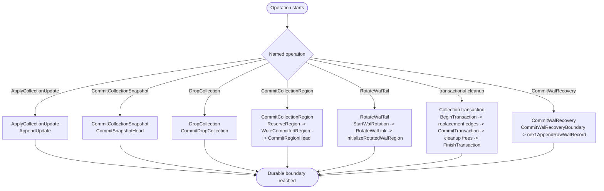

# Chapter 8: Durability, Crash Cuts, And Formatting

This chapter defines the write/sync cuts that make transitions durable,
the crash outcomes at those cuts, and the formatting/opening operations
that create or bootstrap a valid store.

Mechanism review:

- **Purpose**: state exactly when an operation becomes durable and what
  replay must do for each crash prefix.
- **State**: the operation-local write/sync sequence plus the stable
  runtime state prefix that has become replay-visible.
- **Named operations**: `ApplyCollectionUpdate`,
  `CommitCollectionSnapshot`, `CommitCollectionRegion`,
  `DropCollection`, `RotateWalTail`, `ReclaimWalHead`, `FreeRegion`,
  `CommitWalRecovery`, `FormatStorage`, and `OpenStorage`.
- **Durable edge sequence**: each operation is expressed as ordered
  writes and syncs; write order alone is not a durability guarantee.
- **Replay effect**: replay observes only synced durable edges and
  reconstructs the state described by the operation's target or
  recovery prefix.
- **Crash cuts**: every crash rule names the last durable edge that may
  be visible and the state that startup must recover from it.

## Durability and Crash Semantics

Durability boundary:

1. `RING-DURABILITY-001` A write is durable only after both:
the bytes are written, and a sync/flush that covers those bytes
completes.
2. `RING-DURABILITY-002` Write ordering without sync ordering is not sufficient for
durability guarantees.
3. `RING-DURABILITY-003` Replay MUST treat partially written records as torn and ignore
them using checksum validation and WAL tail recovery rules.

Notation:

1. `W(x)`: write bytes for `x`.
2. `S(x)`: sync/flush that guarantees durability for `x`.

Required write and sync ordering:

1. `RING-ORDER-001` `ApplyCollectionUpdate` durability:
`W(update_record) -> S(update_record) -> acknowledge update durable`.
2. `RING-ORDER-002` `CommitCollectionSnapshot` transition:
`W(snapshot(collection_id, collection_type, payload)) -> S(snapshot)`.
3. `RING-ORDER-003` `DropCollection` transition:
`W(drop_collection(collection_id)) -> S(drop_collection)`.
4. `RING-ORDER-004` `CommitCollectionRegion` transition:
if the target is not already reserved by an earlier stable operation,
`W(alloc_begin(collection_id, region_index, free_list_head_after)) -> S(alloc_begin) ->`;
in all cases,
`erase/init reserved region if needed -> W(region header+data) -> S(region) ->`
`W(head(collection_id, collection_type, ref=region_index)) -> S(head)`.
5. `RING-ORDER-005` `RotateWalTail` transition:
`W(alloc_begin(collection_id = 0, next_region_index, free_list_head_after)) -> S(alloc_begin) ->`
`W(link(next_region_index, expected_sequence)) -> S(link) ->`
`W(new_wal_region_init(sequence=expected_sequence, wal_head_region_index=current_wal_head)) ->`
`S(new_wal_region_init)`.
6. `RING-ORDER-006` transaction transition for stable-head replacement, drop cleanup, or
`ReclaimWalHead`:
`W(begin_transaction(collection_id)) -> S(begin_transaction) ->`
`W(replacement_live_state_and_new_links) -> S(replacement_state) ->`
`W(commit_transaction(collection_id)) -> S(commit_transaction) ->`
`append old regions to free list with free_region records ->`
`W(transaction_finished(collection_id)) -> S(transaction_finished)`.
7. `RING-ORDER-007` `CommitWalRecovery` transition:
`W(wal_recovery()) -> S(wal_recovery) -> W(next_normal_wal_record) -> S(next_normal_wal_record)`.

General region-allocation rule:

1. `RING-ALLOC-001` Any operation that writes a newly allocated region MUST first make
`alloc_begin(collection_id, region_index, free_list_head_after)` durable.
2. `RING-ALLOC-002` Erasing or initializing the reserved region is allowed only after
`S(alloc_begin)`.
3. `RING-ALLOC-003` If crash occurs after `S(alloc_begin)` but before a durable `head`
or `link` uses `region_index`, replay must preserve `region_index` as
`ready_region` and must not attempt to recover the old free-pointer
contents from flash.
4. `RING-ALLOC-004` Any allocation that is not itself part of reclaim or crash recovery
is invalid if consuming it would reduce the number of free regions
below `min_free_regions`.

Crash-cut outcomes:

1. `RING-CRASH-001` Crash before `S(snapshot(collection_id, collection_type, payload))`:
snapshot may be missing/torn and is ignored.
2. `RING-CRASH-002` Crash after `S(snapshot(collection_id, collection_type, payload))`:
snapshot transition is durable and acts as the collection WAL head.
3. `RING-CRASH-003` Crash before `S(drop_collection(collection_id))`:
the collection drop may be missing/torn and is ignored.
4. `RING-CRASH-004` Crash after `S(drop_collection(collection_id))`:
the collection is durably dropped and no later WAL record for that
collection id may be accepted.
5. `RING-CRASH-005` Crash before `S(region)`:
new region is not considered durable.
If `alloc_begin` was already durable, replay still preserves the
reserved `ready_region`.
6. `RING-CRASH-006` Crash after `S(region)` but before
`S(head(collection_id, collection_type, region_index))`:
region exists but is not committed as collection head.
The allocator advance remains durable because `alloc_begin` already
committed it, so replay keeps `region_index` reserved as `ready_region`
unless a later durable `head` consumes it.
7. `RING-CRASH-007` Crash after `S(head(collection_id, collection_type, region_index))`:
region head transition is durable and consumes the reserved
`ready_region`.
8. `RING-CRASH-008` Crash after
`S(alloc_begin(collection_id = 0, next_region_index, free_list_head_after))`
for WAL rotation but before any durable matching `link`:
if that `alloc_begin` occupies the reserve window that only a
rotation-start record may occupy, startup treats it as an incomplete
rotation before `link`. Recovery appends and syncs
`link(next_region_index, expected_sequence)` with
`expected_sequence = max_seen_sequence + 1`, then initializes and syncs
the target WAL region with that sequence and the current WAL head.
After that recovery completes, the target becomes the active WAL tail.
9. `RING-CRASH-009` Crash after `W(link)` but before `S(link)`:
link may be torn/missing and old tail remains active, but the reserved
region remains tracked by `alloc_begin`.
10. `RING-CRASH-010` Crash after `S(link)` but before `S(new_wal_region_init)`:
startup validates the link target header sequence and
`WalRegionPrologue`; if the header is missing/corrupt/wrong sequence,
or the `WalRegionPrologue` is missing/corrupt, rotation is incomplete
and startup finishes initialization using `expected_sequence`.
11. `RING-CRASH-011` Crash during tail-record write:
replay detects the torn/invalid tail record; earlier complete
records remain valid. Recovery ignores the torn record bytes and keeps
scanning in aligned `wal_write_granule` steps for later valid
`wal_record_magic` starts, so valid records written after the torn one
are still replayed. After open, the recovered append point is the first
aligned slot whose first byte is `erased_byte` after the last valid
replayed tail record. If later WAL appends resume after that recovered
append point, the first durable later record must be `wal_recovery()`.
An aligned tail slot whose first byte is still `erased_byte` is not a
torn record; it is an unwritten slot that marks end of the written
portion of the tail region.
12. `RING-CRASH-012` Crash after `S(begin_transaction(collection_id))`
but before `S(commit_transaction(collection_id))`:
startup runs data recovery for the transaction, preserves the
pre-transaction collection state, and appends
`rollback_transaction(collection_id)`.
13. `RING-CRASH-013` Crash after `S(commit_transaction(collection_id))`
but before `S(transaction_finished(collection_id))`:
startup preserves the committed collection state, completes cleanup
frees idempotently, and appends `transaction_finished(collection_id)`.
14. `RING-CRASH-014` Crash after
`S(transaction_finished(collection_id))`:
startup replays the full transaction interval in original order.

## Operations

### Init

Initialization is defined normatively by
`Format Storage (On-Disk Initialization)`. This section is informative
only.

### Format Storage (On-Disk Initialization)

Formatting creates a valid empty store that can be opened by normal
startup replay without special recovery paths.

Preconditions:

1. `RING-FORMAT-STORAGE-PRE-001` Backing storage MUST be writable and erasable at region
   granularity.
2. `RING-FORMAT-STORAGE-PRE-002` `region_count >= 1`.
3. `RING-FORMAT-STORAGE-PRE-003` Region `0` MUST be reserved as the initial WAL region.
4. `RING-FORMAT-STORAGE-PRE-004` `wal_write_granule >= 1`.
5. `RING-FORMAT-STORAGE-PRE-005` `wal_record_magic != erased_byte`.
6. `RING-FORMAT-STORAGE-PRE-006` `region_count >= 2 + min_free_regions`.
This guarantees that after reserving region `0` for the WAL and
preserving the configured `min_free_regions` reserve, a freshly
formatted store still has at least one non-reserved free region
available for ordinary allocations.
There is intentionally no normative minimum usable `region_size`
enforced by borromean. Geometries that are formally formatable but too
small to leave useful payload after `Header`, free-pointer footer, WAL
prologue, and WAL-reserve overhead are treated as deployment mistakes
rather than format errors. As deployment guidance, choose
`region_size` so the fixed header plus footer consume less than 10% of
the region, and leave enough remaining room for the intended WAL and
collection payloads.

Procedure:

1. `RING-FORMAT-STORAGE-001` Erase metadata area and all data regions.
2. `RING-FORMAT-STORAGE-002` Write `StorageMetadata` (`storage_version`,
`region_size`, `region_count`, `min_free_regions`,
`wal_write_granule`, `erased_byte`, `wal_record_magic`,
`metadata_checksum`) and sync metadata.
3. `RING-FORMAT-STORAGE-003` Initialize region `0` as WAL:
write valid `Header` with `collection_id = 0`,
`collection_format = wal_v1`, and `sequence = 0`,
write a valid `WalRegionPrologue` with `wal_head_region_index = 0`,
then sync region `0`.
4. `RING-FORMAT-STORAGE-004` For each region `r` in `[1, region_count - 1]`:
leave the erased header and payload bytes otherwise uninterpreted, write
valid `FreePointerFooter { next_tail = r + 1, footer_checksum }` bytes
for every region except the last, leave the last region's free-pointer
footer uninitialized, and
sync `r`.
5. `RING-FORMAT-STORAGE-005` Formatting is complete only after metadata and all initialized
regions are durable.

Postconditions:

1. `RING-FORMAT-STORAGE-POST-001` WAL head and WAL tail MUST both be region `0`.
2. `RING-FORMAT-STORAGE-POST-002` A user collection durable head MUST
NOT exist after formatting.
3. `RING-FORMAT-STORAGE-POST-003` The free list MUST contain every non-WAL region in ascending
   region-index
order.
4. `RING-FORMAT-STORAGE-POST-004` Because region `0` is reserved as the WAL, the initial durable
free-list head is region `1` iff `region_count >= 2`; otherwise the
durable free list is empty.

### First Open After Fresh Format

Opening a freshly formatted store uses the same startup replay
algorithm as any other open.

Expected replay outcome on first open:

1. Region scan finds WAL tail at region `0` (`sequence = 0`).
2. WAL chain walk yields a single-region chain (`head = tail = 0`).
3. No WAL records are replayed.
4. Replay therefore yields:
no tracked user collections,
`pending_updates = empty`,
no transaction recovery work,
and durable `last_free_list_head = Some(1)` iff `region_count >= 2`,
otherwise `None`, inherited from the formatted initial free-list root.
5. Normal replay reconstruction then yields
`free_list.ready_region = None`,
`free_list.free_list_tail = Some(region_count - 1)` iff
`region_count >= 2`, otherwise `None`,
`collections = empty`,
`pending_updates = empty`,
and no transaction recovery work.

This is not a special-case bootstrap. Replay always starts with the
formatted initial durable free-list head and then applies later
`alloc_begin` / `free_region` decisions in WAL order. `free_list_tail`
is always reconstructed by walking the free-pointer chain from the
recovered durable free-list head; it is not found by scanning WAL
regions.

